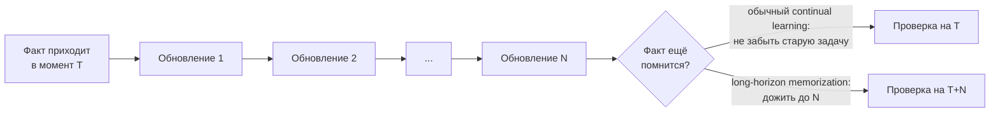
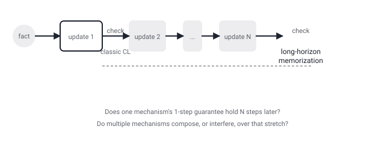

## Русская версия

# Long-horizon memorization: удержать факт не после одного обновления, а после многих

В сегодняшнем дайджесте — статья [«Continual Learning Mechanisms Compose for Long-Horizon Memorization»](https://huggingface.co/papers/2609.06986) (Zheyuan Zhang, Alvin Zhang, Daniel Khashabi, Tianmin Shu). Заявленная в аннотации задача: языковым моделям может требоваться усваивать информацию, которая поступает во времени, и удерживать её через множество последующих обновлений. Для изучения этого авторы вводят понятие long-horizon memorization — «настройку, в которой модель учится…» — и ровно на этом слове аннотация в дайджесте обрывается, так что конкретное определение бенчмарка и то, что именно измеряется, придётся смотреть в [самой статье](https://huggingface.co/papers/2609.06986).

Но даже по одной этой фразе понятен сдвиг постановки задачи относительно классического continual learning. Классическая проблема continual learning — catastrophic forgetting: модель, дообученная на задаче B после задачи A, часто резко теряет качество на задаче A, потому что градиенты новой задачи «перезаписывают» веса, важные для старой. Стандартные средства борьбы с этим — replay-буферы (хранить и подмешивать старые примеры), регуляризация весов (штрафовать изменение параметров, важных для прежних задач) и архитектурные приёмы (выделять модели новые параметры под новую задачу, не трогая старые). Обычно эффект этих мер измеряют сразу после следующего обновления — «не забыла ли модель то, что знала секунду назад».

Long-horizon memorization, судя по названию, ставит вопрос иначе: не «пережила ли информация одно следующее обновление», а «пережила ли она множество последующих обновлений подряд» — то есть горизонт проверки растягивается с одного шага на много шагов. Название статьи — «continual learning mechanisms compose» — намекает, что авторы изучают не один механизм по отдельности, а то, складывается ли эффект нескольких механизмов вместе (например, replay плюс регуляризация) при таком растянутом горизонте, или же они начинают мешать друг другу или терять эффективность за пределами того окна, для которого изначально проверялись. Это осмысленный вопрос: механизм, который хорошо защищает знание на один шаг вперёд, не обязан защищать его на сто шагов вперёд, и то, работает ли композиция нескольких механизмов лучше, чем любой из них по отдельности, — открытый эмпирический вопрос, ответ на который аннотация не даёт.

### Почему вам это важно

Если вы дообучаете модель на потоке данных, поступающих по расписанию (новые документы, новые тикеты, новые правила), и оцениваете устойчивость знаний только сразу после очередного обновления — этот класс работ подсказывает, что стоит проверять то же самое существенно позже, через много обновлений, потому что защита от забывания «на один шаг» и защита «на длинном горизонте» — разные гарантии, и вторая не следует автоматически из первой.

## English version

# Long-horizon memorization: surviving many updates, not just the next one

Today's digest includes the paper [«Continual Learning Mechanisms Compose for Long-Horizon Memorization»](https://huggingface.co/papers/2609.06986) (Zheyuan Zhang, Alvin Zhang, Daniel Khashabi, Tianmin Shu). The stated problem: language models may need to internalize information that arrives over time and retain it through many subsequent updates. To study this, the authors introduce long-horizon memorization — "a setting in which a model learns…" — and that's exactly where the digest's abstract snippet cuts off, so the precise benchmark definition and what's actually measured need to be checked in [the paper itself](https://huggingface.co/papers/2609.06986).

Even from that one sentence, though, the shift in framing relative to classic continual learning is clear. The classic problem in continual learning is catastrophic forgetting: a model finetuned on task B after task A often loses quality on task A sharply, because gradients from the new task overwrite weights that mattered for the old one. Standard countermeasures include replay buffers (storing and mixing in old examples), weight regularization (penalizing changes to parameters important for prior tasks), and architectural tricks (allocating new parameters for the new task while leaving old ones untouched). These are typically evaluated right after the next update — did the model forget what it knew a moment ago.

Long-horizon memorization, going by its name, asks a different question: not whether information survived the next update, but whether it survives many consecutive subsequent updates — stretching the evaluation horizon from one step to many. The paper's title — "continual learning mechanisms compose" — hints that the authors study not a single mechanism in isolation, but whether the effects of several mechanisms together (say, replay plus regularization) actually add up over that stretched horizon, or whether they start interfering with each other or losing effectiveness beyond the window they were originally validated on. That's a meaningful question: a mechanism that protects knowledge one step ahead has no obligation to protect it a hundred steps ahead, and whether composing multiple mechanisms beats any single one is an open empirical question the abstract doesn't answer.

### Why it matters

If you're finetuning a model on a scheduled stream of incoming data (new documents, new tickets, new policies) and you only check knowledge retention right after each update, this line of work is a reminder to check the same thing much later, after many updates — because "protected for one step" and "protected over a long horizon" are different guarantees, and the second doesn't automatically follow from the first.
