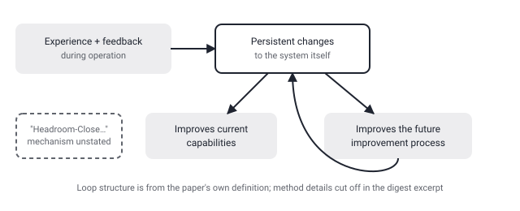

## Русская версия

# «Последний ИИ, построенный людьми»: что стоит за громким заголовком про рекурсивное самоулучшение

В сегодняшнем дайджесте — статья [«The Last AI Built by Humans: Toward Genuine Recursive Self-Improvement»](https://huggingface.co/papers/2609.11873) (Yi Duan, Ying Liu, Zirui Tang, Haodong Chen, Jun Zhou и другие). Название работает как крючок само по себе: если следующие модели строит уже не человек, а предыдущая модель, то нынешняя формально становится «последней, построенной людьми». Но интереснее не заголовок, а то, что авторы аккуратно определяют термин заранее: рекурсивное самоулучшение (RSI) — это способность ИИ-системы превращать опыт и обратную связь, полученные во время работы, в постоянные изменения, которые улучшают не только текущие возможности модели, но и сам процесс, по которому она будет улучшаться дальше. Это два разных эффекта в одном определении: обычное обучение улучшает результат, а RSI, по их описанию, должно улучшать ещё и механизм обучения.

Аннотация в дайджесте обрывается на словах «We first use the Headroom-Close…» — то есть авторы явно вводят какой-то конкретный метод или метрику с названием «Headroom-Close», но что именно она измеряет и как используется, текст дайджеста не сообщает. Здесь стоит остановиться и не додумывать: слово «headroom» в инженерном контексте обычно означает запас до предела (сколько ещё можно улучшить, прежде чем упрёшься в потолок), поэтому разумно предположить, что метод как-то связан с измерением того, насколько близко система подошла к своему пределу совершенствования — но это предположение по одному слову, а не пересказ метода. Какие эксперименты стоят за заявлением «genuine» (настоящее, в отличие от, видимо, каких-то более ранних или более слабых версий RSI), какие метрики подтверждают «постоянность» изменений и есть ли там вообще численные результаты — всё это скрыто за обрывом аннотации, и ответ есть только в [полном тексте статьи](https://huggingface.co/papers/2609.11873).

Стоит отдельно отметить дистанцию между названием и содержанием, которую видно уже на этом уровне: «последний ИИ, построенный людьми» — это философский тейк-хоум месседж, рассчитанный на резонанс, а «Headroom-Close» — это, судя по всему, конкретный инженерный инструмент. Разрыв между эффектным заголовком и сухим техническим ядром — обычное дело для препринтов, и здесь его стоит держать в уме, читая заголовок отдельно от содержания.

### Почему вам это важно

Если вы следите за темой автономных агентов и self-improving систем, отметьте эту работу как кандидата на прочтение целиком: заявка на «подлинное» рекурсивное самоулучшение — это ровно тот класс утверждений, которые нельзя оценивать по заголовку, нужно смотреть, что именно измеряет «Headroom-Close» и на каких задачах проверено, что изменения действительно постоянны, а не откатываются при следующем обновлении.

## English version

# "The Last AI Built by Humans": what's actually behind the headline about recursive self-improvement

Today's digest includes the paper [«The Last AI Built by Humans: Toward Genuine Recursive Self-Improvement»](https://huggingface.co/papers/2609.11873) (Yi Duan, Ying Liu, Zirui Tang, Haodong Chen, Jun Zhou, and others). The title is a hook on its own: if future models get built by a previous model rather than a human, the current one technically becomes "the last one humans built." But what's more interesting than the title is how carefully the authors define their term upfront: recursive self-improvement (RSI) is an AI system's ability to turn experience and feedback gathered during operation into persistent changes that improve not just its current capabilities, but the very process by which it will keep improving. That's two distinct effects packed into one definition — ordinary training improves output, while RSI, as they frame it, is supposed to also improve the improvement mechanism itself.

The digest's abstract snippet cuts off at "We first use the Headroom-Close…" — so the authors are clearly introducing some specific method or metric named "Headroom-Close," but what exactly it measures or how it's used isn't in the text we have. Worth pausing here rather than filling in the blank: "headroom," in an engineering context, usually refers to the remaining margin before hitting a ceiling, so it's reasonable to guess the method somehow measures how close a system has gotten to its own improvement limit — but that's an inference from one word, not a description of the method. What experiments back the claim of being "genuine" (as opposed to, presumably, earlier or weaker forms of RSI), what metrics establish that the changes are actually "persistent," and whether there are numerical results at all — all of that is hidden behind the cut-off abstract, and the answer lives only in [the full paper](https://huggingface.co/papers/2609.11873).

It's worth flagging the distance between title and content visible even at this level: "the last AI built by humans" is a philosophical takeaway line engineered for resonance, while "Headroom-Close" is, by the sound of it, a concrete engineering tool. The gap between a striking headline and a dry technical core is routine for preprints, and it's worth keeping in mind here — read the title separately from the substance.

### Why it matters

If you're tracking autonomous agents and self-improving systems, flag this one as a candidate for a full read: a claim of "genuine" recursive self-improvement is exactly the kind of statement that can't be judged from the headline — you need to see what "Headroom-Close" actually measures, on which tasks it was tested, and whether the changes truly persist rather than getting reset on the next update.
