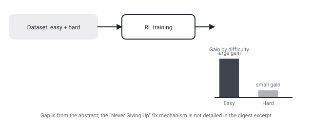

## Русская версия

# RL учит LLM решать лёгкие задачи лучше, чем трудные — и что с этим делать, судя по названию статьи

В сегодняшнем дайджесте — статья [«Learning to Solve Hard Problems in RL for LLMs by Never Giving Up»](https://huggingface.co/papers/2609.13443) (Michael Noukhovitch, Hamish Ivison, Nathan Lambert, Aaron Courville). Фактическая часть аннотации, попавшая в дайджест, звучит конкретно и без прикрас: обучение LLM с помощью RL не улучшает результаты равномерно по всему датасету. На задачах, которые модель уже неплохо решает («лёгких» для неё), RL даёт крупный прирост качества, а на задачах, которые она решает плохо («трудных»), прирост — маленький. Текст обрывается на слове «h…», так что дальше — вероятно «hard problems», но дословную формулировку причины дайджест не сохранил.

Это наблюдение само по себе важно и не требует домыслов: оно означает, что стандартный RL-файнтюнинг склонен «полировать» то, что модель и так почти умеет, а не подтягивать то, что ей действительно не даётся — то есть RL-градиент структурно смещён в сторону лёгких примеров, где уже есть частый сигнал успеха. Название статьи — «Never Giving Up» — намекает на конкретное решение этой проблемы, и слушателям, знакомым с историей RL, оно наверняка напомнит алгоритм исследовательского поведения «Never Give Up» (NGU), предложенный DeepMind ещё в 2020 году для задач с редким вознаграждением. Это реальная параллель из общей истории RL, а не то, что подтверждает сам дайджест: совпадение названий может быть осознанной отсылкой авторов, а может быть просто похожей метафорой «не сдаваться» на трудных задачах — какой конкретно метод они предлагают и работает ли он через управление исследованием, через перевзвешивание задач в батче или иначе, аннотация не раскрывает. Всё это — в [полном тексте статьи](https://huggingface.co/papers/2609.13443).

Важно и то, что авторы (среди них — Nathan Lambert, известный по работам об RLHF и открытых RL-рецептах для LLM) формулируют проблему как измеримый факт «RL неравномерен по трудности», а не как гипотезу — то есть у них, судя по всему, есть данные, разбитые по уровню сложности задач, а не общий средний балл. Именно такая гранулярность и отличает содержательную диагностику от общего утверждения «RL работает».

### Почему вам это важно

Если вы настраиваете RL-файнтюнинг для reasoning-моделей и меряете только средний прирост по бенчмарку, эта работа — повод пересчитать метрику по стратам сложности: возможно, ваш «средний прирост в 5%» на самом деле означает «плюс 15% на лёгком и почти ноль на трудном», а именно трудные задачи чаще всего и есть та причина, ради которой RL-этап вообще запускают.

## English version

# RL teaches LLMs to solve easy problems better than hard ones — and what the paper's title hints at doing about it

Today's digest includes the paper [«Learning to Solve Hard Problems in RL for LLMs by Never Giving Up»](https://huggingface.co/papers/2609.13443) (Michael Noukhovitch, Hamish Ivison, Nathan Lambert, Aaron Courville). The factual portion of the abstract that made it into the digest is specific and unadorned: training LLMs with RL does not improve performance equally across a dataset. On problems the model is already fairly good at ("easy" ones), RL delivers a large improvement; on problems it struggles with ("hard" ones), the improvement is small. The text cuts off at "h…", presumably continuing into "hard problems," but the digest didn't preserve the exact wording of the explanation.

That observation matters on its own and needs no embellishment: it means standard RL fine-tuning tends to "polish" what the model can already mostly do, rather than pulling up what it genuinely can't — the RL gradient is structurally biased toward easy examples, where a success signal is already frequent. The paper's title, "Never Giving Up," hints at a specific fix for this, and anyone familiar with RL history will likely recognize the echo of "Never Give Up" (NGU), DeepMind's exploration algorithm from 2020 built for sparse-reward settings. That's a real parallel drawn from RL's general history, not something the digest itself confirms — the name match could be a deliberate nod from the authors, or it could just be a similar "don't give up" metaphor applied to hard problems; whether the actual method works through managed exploration, batch re-weighting by difficulty, or something else entirely isn't in the abstract we have. All of that lives in [the full paper](https://huggingface.co/papers/2609.13443).

It's also worth noting that the authors (among them Nathan Lambert, known for work on RLHF and open RL recipes for LLMs) frame the problem as a measured fact — "RL is uneven across difficulty" — rather than a hypothesis, meaning they evidently have results broken down by problem difficulty, not just an overall average score. That granularity is what separates a substantive diagnosis from a generic "RL works" claim.

### Why it matters

If you're tuning RL fine-tuning for reasoning models and only track average benchmark gain, this paper is a reason to recompute your metric by difficulty stratum: your "average +5%" might actually mean "+15% on easy, nearly zero on hard" — and the hard problems are usually the whole reason you ran the RL stage in the first place.
