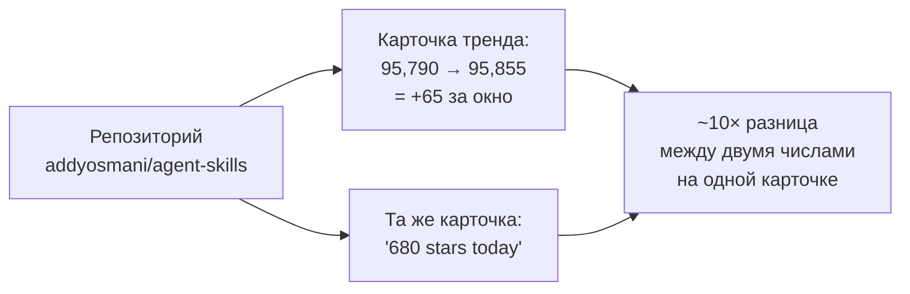
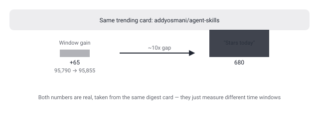

## Русская версия

# agent-skills от addyosmani: +65 звёзд за окно против «680 звёзд сегодня» — снова тот же разрыв в карточке

В сегодняшнем дайджесте на третьей строке трендов GitHub — репозиторий [addyosmani/agent-skills](https://github.com/addyosmani/agent-skills), описанный как «Production-grade engineering skills for AI coding agents» на JavaScript. Addy Osmani — известное имя: он много лет занимается инженерией и производительностью в вебе, и репозиторий с «production-grade» скиллами для агентов от такого автора — заметный сигнал сам по себе, тема ложится ровно в русло того, что канал уже разбирал через openai/skills (09-09) и i-have-adhd (09-09): формат «skill» становится единицей упаковки инструкций для агентов, независимо от того, чей это агент.

Но в самой карточке дайджеста — те же две цифры, которые здесь уже не в первый раз не сходятся между собой. С одной стороны, окно роста показано явно: 95,790 → 95,855 звёзд, то есть +65 за отслеживаемый период. С другой — та же строка утверждает «680 stars today» (680 звёзд сегодня). Разница почти на порядок между «столько прибавилось за окно» и «столько сегодня» — это не опечатка, а системная особенность того, как GitHub Trending и подобные агрегаторы считают звёзды: «сегодня» может означать календарные сутки с полуночи UTC, а окно снимка — произвольный интервал между двумя запусками скрипта дайджеста, который может быть короче суток. Это ровно тот же паттерн расхождения, что уже фиксировался у gods-eye-view 11 сентября и у security-audit-skill 17 сентября — то есть не баг конкретно этого дайджеста, а систематическая черта самого источника данных.

Что из этого следует практически: ни одно из двух чисел нельзя брать как «скорость роста репозитория» без уточнения, за какой именно период оно посчитано. 95,855 звёзд — реальное и проверяемое общее число на момент снимка, а вот динамику лучше смотреть напрямую на странице репозитория или через GitHub API с явным указанием временного окна, а не по строке в трендовой карточке.

### Почему вам это важно

Если вы используете подобные дайджесты или трендовые списки, чтобы решить, стоит ли репозиторий внимания прямо сейчас — не полагайтесь на цифру роста из карточки как есть: два числа на одной строке могут считаться по разным окнам и расходиться на порядок, а единственное надёжное число — общее количество звёзд на момент снимка.

## English version

# addyosmani's agent-skills: +65 stars for the window vs "680 stars today" — the same card-level gap again

In today's digest, third on the GitHub trending list, is [addyosmani/agent-skills](https://github.com/addyosmani/agent-skills), described as "Production-grade engineering skills for AI coding agents" in JavaScript. Addy Osmani is a well-known name — he's spent years working on web engineering and performance — and a "production-grade" skills repo from an author like that is a notable signal on its own; the topic sits right alongside what this channel already covered via openai/skills (09-09) and i-have-adhd (09-09): "skill" is becoming the unit for packaging instructions for agents, regardless of whose agent is running them.

But the digest card itself carries the same two numbers that, once again, don't reconcile. On one hand, the growth window is stated plainly: 95,790 → 95,855 stars, a gain of +65 over the tracked period. On the other, the same line claims "680 stars today." A near order-of-magnitude gap between "gained this much over the window" and "gained this much today" isn't a typo — it's a systematic quirk of how GitHub Trending and similar aggregators count stars: "today" may mean the calendar day since midnight UTC, while the snapshot window is an arbitrary interval between two runs of the digest script, which can be shorter than a full day. This is the exact same discrepancy pattern already flagged for gods-eye-view on September 11 and security-audit-skill on September 17 — not a bug specific to this digest, but a systematic trait of the underlying data source.

The practical takeaway: neither number should be taken as "the repo's growth rate" without knowing what period it's actually measured over. 95,855 stars is a real, verifiable total at snapshot time; for the actual growth trend, it's better to check the repository page directly or use the GitHub API with an explicit time window, rather than trust the trending card's line.

### Why it matters

If you use digests or trending lists like this one to decide whether a repo deserves attention right now, don't take the growth number on the card at face value: two numbers on the same line can be computed over different windows and diverge by an order of magnitude — the only reliably trustworthy number is the total star count at snapshot time.
