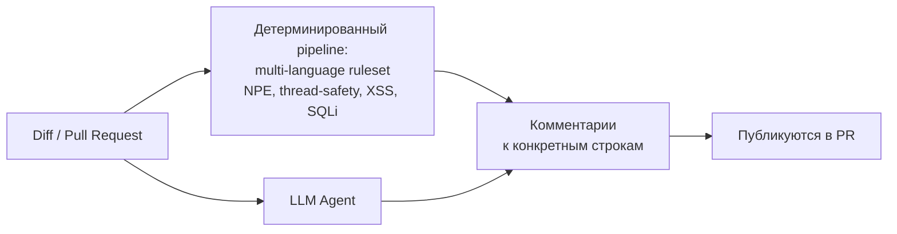
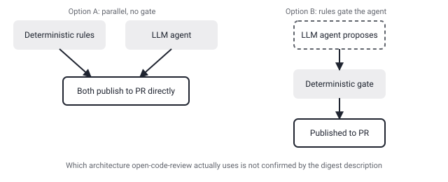

## Русская версия

# open-code-review от Alibaba снова #1: интересна не скорость роста, а где заканчивается детерминизм и начинается LLM-агент

В сегодняшнем дайджесте на первом месте трендов GitHub снова [alibaba/open-code-review](https://github.com/alibaba/open-code-review): 34,560 → 34,774 звёзд (+214 за окно). Этот репозиторий уже попадал в фокус канала 15 сентября, тогда он был на 25.5k звёзд и занимал #2 — то есть за три дня он и вырос почти на 9k, и поднялся на первую строчку. Тогда акцент был на отсутствии бенчмарков за фразой «battle-tested at Alibaba's scale». Сегодня стоит посмотреть на другую часть описания, которая раньше осталась в стороне: «Hybrid architecture code review tool: deterministic pipelines + LLM Agent, precise line-level comments, built-in multi-language ruleset (NPE, thread-safety, XSS, SQL injection)».

Здесь описана ровно та граница, которую этот канал системно отслеживает под «authorization boundary» — не «модель предложила X», а «X реально произошло»: комментарий появился на конкретной строке в конкретном pull request. Судя по формулировке, у инструмента два разных источника сигнала: детерминированный pipeline со встроенным набором правил под конкретные классы уязвимостей (null pointer exception, потокобезопасность, XSS, SQL-инъекции) и отдельно — LLM-агент, а результат — «precise line-level comments», то есть привязанные к точным строкам замечания, которые, видимо, публикуются в PR как настоящие ревью-комментарии. Текст в дайджесте обрывается на «OpenAI …», вероятно продолжаясь в сторону «OpenAI-compatible API» — но что именно это значит для архитектуры, не подтверждено.

Ключевой нераскрытый вопрос — как именно смешиваются два источника. Деterministic pipeline и LLM Agent могут работать параллельно (оба публикуют свои комментарии независимо), а могут — последовательно, когда детерминированные правила фильтруют или подтверждают то, что предложил агент, прежде чем комментарий реально уйдёт в PR. Разница огромна: во втором случае у нас есть настоящий gate между «предложением» и «публикацией», в первом — LLM-агент публикует напрямую, и вся ответственность за точность лежит на модели. Описание в дайджесте не говорит, какой из двух вариантов реализован, и это ровно то, что стоит проверить в исходниках, прежде чем давать инструменту право писать в реальные PR.

### Почему вам это важно

Если вы рассматриете такие гибридные ревью-инструменты для своего pipeline CI, главный вопрос — не «насколько хорош ruleset», а кто в итоге решает, публиковать ли конкретный комментарий LLM-агента: если это фильтр детерминированных правил, риск ложных срабатываний ниже; если агент публикует напрямую, вам нужен собственный уровень модерации поверх.

## English version

# Alibaba's open-code-review is #1 again — the interesting part isn't the growth rate, it's where determinism ends and the LLM agent begins

Today's digest has [alibaba/open-code-review](https://github.com/alibaba/open-code-review) back at #1 on GitHub trending: 34,560 → 34,774 stars (+214 for the window). This repo already got coverage here on September 15, when it sat at 25.5k stars and rank #2 — so in three days it's gained nearly 9k stars and climbed to the top spot. That earlier piece focused on the absence of benchmarks behind the phrase "battle-tested at Alibaba's scale." Today it's worth looking at a different part of the description that was set aside before: "Hybrid architecture code review tool: deterministic pipelines + LLM Agent, precise line-level comments, built-in multi-language ruleset (NPE, thread-safety, XSS, SQL injection)."

That description sits exactly on the boundary this channel tracks under "authorization boundary" — not "the model proposed X," but "X actually happened": a comment landed on a specific line of a specific pull request. Going by the wording, the tool has two distinct signal sources: a deterministic pipeline with a built-in ruleset for specific vulnerability classes (null pointer exceptions, thread safety, XSS, SQL injection), and separately, an LLM agent — with the output being "precise line-level comments," i.e. findings anchored to exact lines, apparently published into the PR as real review comments. The digest text cuts off at "OpenAI …", likely continuing into "OpenAI-compatible API," but what that means for the architecture isn't confirmed.

The key unstated question is how the two sources actually combine. The deterministic pipeline and the LLM agent could run in parallel, each publishing its own comments independently — or in sequence, with deterministic rules filtering or confirming what the agent proposes before a comment ever ships into the PR. The difference is huge: in the second case there's a real gate between "proposal" and "publication"; in the first, the LLM agent publishes directly and the model carries the full accuracy burden. The digest's description doesn't say which of the two is actually implemented, and that's precisely what's worth checking in the source before granting a tool like this write access to real PRs.

### Why it matters

If you're evaluating hybrid review tools like this for your CI pipeline, the main question isn't "how good is the ruleset" — it's who ultimately decides whether a given LLM-agent comment gets published: if it passes through a deterministic filter first, the false-positive risk is lower; if the agent publishes directly, you need your own moderation layer on top.
