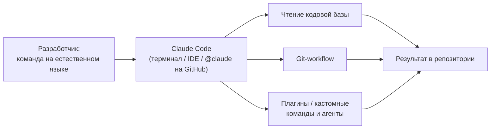
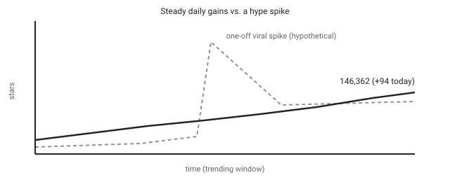

## Русская версия

# Claude Code снова #2 в трендах GitHub — что на самом деле держит терминальный агент на вершине

В сегодняшнем дайджесте [anthropics/claude-code](https://github.com/anthropics/claude-code) занимает второе место в рейтинге трендовых репозиториев: 146,268 → 146,362 звёзд за окно (+94), и это при уже накопленных 146 тысячах с лишним звёзд и почти 24 тысячах форков — то есть репозиторий не «вспыхнул», а стабильно держится в топе, прибавляя понемногу каждый день. Описание в дайджесте немногословно: агентный инструмент для кодинга, который живёт в терминале, понимает вашу кодовую базу и ускоряет работу за счёт выполнения рутинных задач, объяснения сложного кода и работы с git — всё через обычный естественный язык.

Что стоит за этой формулировкой, если посмотреть на README репозитория: Claude Code — не просто чат-бот поверх модели, а связка из нескольких конкретных возможностей. Во-первых, это доступ из разных точек входа — терминал, IDE-расширение или упоминание `@claude` прямо в GitHub-issue или PR, то есть один и тот же агент встроен в разные рабочие процессы, а не привязан к одному интерфейсу. Во-вторых, у него есть система плагинов — отдельная директория для кастомных команд и агентов, что превращает Claude Code в платформу, которую можно расширять под конкретный проект, а не только использовать «как есть». В-третьих, установка сделана нарочито простой — один shell-скрипт или менеджер пакетов (`brew`, `winget`) под каждую платформу, что явно снижает порог входа для команд, которые хотят просто попробовать.

Отдельно README упоминает практики приватности: ограниченный срок хранения данных и запрет на использование пользовательского кода для обучения моделей — деталь, которая имеет значение именно для корпоративных команд, решающих, пускать ли агентный инструмент в приватный код. Здесь стоит быть аккуратным: сам факт наличия таких формулировок в README не заменяет самостоятельной проверки политики хранения данных для вашей конкретной юрисдикции и контракта — это заявление вендора, а не независимый аудит.

Если сравнивать с вектором «граница авторизации» (the authorization boundary), который этот канал отслеживает у похожих инструментов: то, что делает Claude Code интересным именно с этой стороны — не просто способность предлагать правки, а встроенный git-workflow, то есть агент, который может довести изменение до коммита. Где именно проходит грань между «агент предложил» и «агент закоммитил» — вопрос настроек конкретного окружения, и README не расписывает это в деталях, так что тут остаётся зона для дальнейшего наблюдения.

### Почему вам это важно

Если вы выбираете агентный инструмент для кодинга внутри команды, устойчивый рост звёзд без резких скачков — более надёжный сигнал зрелости продукта, чем разовый вирусный всплеск: это означает, что люди продолжают пользоваться инструментом день за днём, а не просто один раз поставили звезду после анонса.

## English version

# Claude Code lands at #2 on GitHub trending again — what actually keeps a terminal agent on top

Today's digest puts [anthropics/claude-code](https://github.com/anthropics/claude-code) at rank #2 among trending repos: 146,268 → 146,362 stars for the window (+94), on top of an already-accumulated 146k+ stars and nearly 24k forks — so this isn't a repo that "spiked," it's one that's held a steady top spot, adding a bit more every day. The digest's own description is terse: an agentic coding tool that lives in your terminal, understands your codebase, and speeds up work by handling routine tasks, explaining complex code, and managing git — all through plain natural language.

What's behind that phrasing, going by the repo's README: Claude Code isn't just a chatbot layered on a model, it's a bundle of specific, concrete capabilities. First, it's reachable from multiple entry points — the terminal, an IDE extension, or tagging `@claude` directly inside a GitHub issue or PR — meaning the same agent plugs into different workflows rather than being locked to one interface. Second, it has a plugin system, with a dedicated directory for custom commands and agents, which turns Claude Code into something extensible per-project rather than a fixed, take-it-as-is tool. Third, installation is deliberately frictionless — a single shell script or a package manager (`brew`, `winget`) per platform, which visibly lowers the barrier for a team that just wants to try it.

The README separately calls out privacy practices: limited data retention windows and a restriction against using customer code to train models — a detail that matters specifically for enterprise teams deciding whether to let an agentic tool touch private code. Worth being careful here: the presence of that language in a README is not a substitute for checking your own jurisdiction's and contract's actual data-handling terms — it's a vendor statement, not an independent audit.

Measured against the "authorization boundary" vector this channel tracks for similar tools: what makes Claude Code interesting from that angle specifically isn't just its ability to propose edits, but its built-in git workflow — an agent that can carry a change all the way to a commit. Exactly where the line falls between "the agent proposed" and "the agent committed" depends on how a given environment is configured, and the README doesn't spell that out in detail, so it stays an area worth watching.

### Why it matters

If you're picking an agentic coding tool for your team, steady star growth without sharp spikes is a more reliable maturity signal than a one-time viral surge — it means people keep coming back to actually use the tool day after day, not just starring it once after a launch post.
