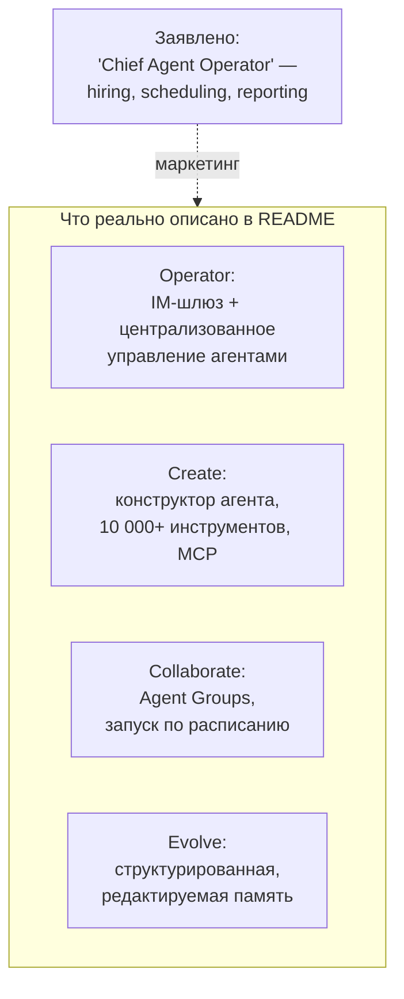
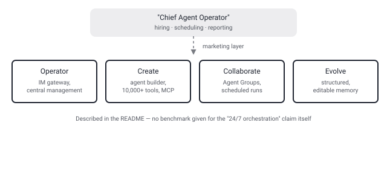

## Русская версия

# LobeHub — «Chief Agent Operator»: за громким титулом четыре вполне конкретные фичи

В сегодняшнем дайджесте [lobehub/lobehub](https://github.com/lobehub/lobehub) появляется как новая запись (🆕 NEW ENTRY) сразу на 9-м месте категории ChatGPT — 82,579 звёзд, 15,896 форков. Описание в дайджесте звучит почти как корпоративный слоган: «ваш Chief Agent Operator, который организует ваших агентов в режим работы 24/7 через найм, расписание и отчётность по всей вашей AI-команде». Формулировка нарочито персонифицирует софт — «найм», «команда», «оператор» — и именно такие метафоры этот канал уже не раз ловил на пустом месте, без единой цифры, подтверждающей заявление.

Здесь, однако, стоит разделить маркетинговый слой и то, что реально описано в README репозитория. За вывеской «Operator» скрывается вполне конкретная вещь: централизованное управление несколькими агентами через IM-шлюз, то есть доступ к агентам из мессенджеров, а не абстрактный «наём». «Create» — это конструктор агента с автонастройкой, заявленной поддержкой «более 10 000 инструментов» и MCP-совместимых плагинов — конкретная цифра, хотя дайджест не уточняет, откуда она взята и как считалась. «Collaborate» — это Agent Groups: несколько агентов работают параллельно над общим контекстом, с возможностью запускать их по расписанию и организовывать по проектам — то есть буквально то самое «scheduling» из слогана, только описанное как фича, а не как абстракция. «Evolve» — персональная память с редактируемой, структурированной формой, которая подстраивает поведение агента под паттерны пользователя.

Технически это self-hosted проект (Docker, Vercel, Zeabur, Alibaba Cloud), с поддержкой нескольких LLM-провайдеров (OpenAI, Claude, Gemini и другие) и активной разработкой — более 13,800 коммитов в истории репозитория. Ни в дайджесте, ни в README нет ни одного бенчмарка, сравнивающего заявленную «оркестрацию 24/7» с ручным управлением несколькими чат-сессиями, — то есть насколько «Chief Agent Operator» реально экономит время пользователя, остаётся неизмеренным утверждением, а не проверенным фактом.

Это ровно тот случай, который уже отмечался в этом канале применительно к другим репозиториям: яркая формулировка (здесь — «оператор», «найм», «24/7») и реальный список фич существуют параллельно, и первое не обязано доказывать второе. Хорошая новость в том, что у LobeHub, в отличие от некоторых прошлых кандидатов, за слоганом действительно стоят четыре описанные и, судя по всему, рабочие подсистемы — просто судить об их качестве по названиям не стоит.

### Почему вам это важно

Если вы оцениваете платформы для мультиагентной оркестрации, разбирайте маркетинговый слоган на конкретные подсистемы, как здесь — Operator/Create/Collaborate/Evolve, — и проверяйте каждую отдельно: заявленные «10 000+ инструментов» и «расписание запуска агентов» — это то, что можно протестировать самому, а «Chief Agent Operator» — нет.

## English version

# LobeHub's "Chief Agent Operator": four concrete features hiding behind a loud title

Today's digest surfaces [lobehub/lobehub](https://github.com/lobehub/lobehub) as a brand-new entry (🆕 NEW ENTRY), straight in at #9 in the ChatGPT category — 82,579 stars, 15,896 forks. The digest's description reads almost like a corporate tagline: "your Chief Agent Operator, organizing your agents into 7×24 operations by hiring, scheduling, and reporting on your entire AI team." The phrasing deliberately personifies the software — "hiring," "team," "operator" — and this channel has flagged that exact kind of metaphor before, standing on its own with no number attached to back it up.

Here, though, it's worth separating the marketing layer from what the repo's README actually describes. Behind the "Operator" label is something concrete: centralized management of multiple agents through an IM gateway — reachable from chat apps, not an abstract "hire." "Create" is an agent builder with auto-configuration and a claimed "10,000+ tools" plus MCP-compatible plugins — a specific number, though the digest doesn't say how it was counted or verified. "Collaborate" is Agent Groups: several agents working in parallel over a shared context, with the ability to run on a schedule and organize by project — literally the "scheduling" from the tagline, just described as an actual feature rather than an abstraction. "Evolve" is a personal memory system with an editable, structured form that adapts agent behavior to a user's patterns.

Technically it's a self-hosted project (Docker, Vercel, Zeabur, Alibaba Cloud), supporting multiple LLM providers (OpenAI, Claude, Gemini, and others), and actively developed — 13,800+ commits in the repo's history. Neither the digest nor the README carries a single benchmark comparing the claimed "24/7 orchestration" against manually juggling several chat sessions yourself — so how much time a "Chief Agent Operator" actually saves stays an unmeasured claim, not a verified fact.

This is exactly the pattern this channel has flagged before with other repos: a punchy tagline ("operator," "hiring," "24/7") and a real feature list coexist, and the first doesn't have to prove the second. The good news here is that, unlike some past candidates, LobeHub's slogan does sit on top of four described and apparently working subsystems — you just shouldn't judge their quality by the names alone.

### Why it matters

If you're evaluating multi-agent orchestration platforms, break the marketing tagline down into concrete subsystems the way this one does — Operator/Create/Collaborate/Evolve — and test each separately: a claimed "10,000+ tools" or "scheduled agent runs" is something you can verify yourself; a "Chief Agent Operator" title is not.
