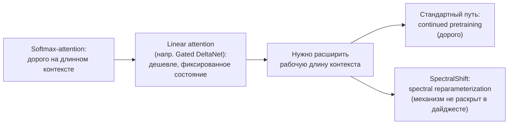
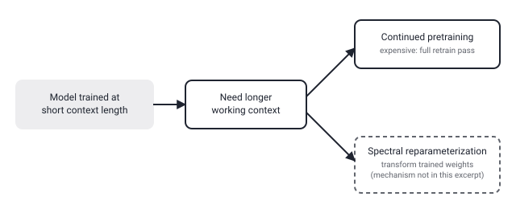

## Русская версия

# SpectralShift: расширение контекста для Gated DeltaNet без полного continued pretraining

В сегодняшнем дайджесте — статья [«SpectralShift: Effective Context Window Extension of Gated DeltaNet via Spectral Reparameterization»](https://huggingface.co/papers/2609.14320) (Zian Liu, Yiwen Hu, Zican Dong, Tian Xie, Wayne Xin Zhao и другие). Аннотация, попавшая в дайджест, обрывается ровно на самом интересном месте: «в последнее время линейные слои внимания всё чаще заменяют softmax-attention в моделях с длинным контекстом. Однако существующие подходы к расширению контекста обычно применяют continued pretrai…» — и текст обрывается на слове, которое почти наверняка продолжается как «pretraining» (продолженное предобучение). Что именно предлагает статья взамен, дайджест не сохранил — только название метода, «spectral reparameterization», и подчёркнутое во втором предложении слово «однако», которое явно вводит проблему со стандартным подходом.

Даже в таком урезанном виде здесь есть на что опереться без домыслов. Gated DeltaNet — это реальная, уже опубликованная в открытой литературе архитектура линейного внимания, соединяющая delta-rule обновление состояния с гейтингом (в духе линии работ, продолжающей Mamba2 и DeltaNet); в отличие от softmax-attention, где сложность растёт с квадратом длины последовательности, у линейных слоёв внимания состояние — фиксированного размера, что и делает их привлекательными для длинного контекста. Проблема, на которую намекает оборванная фраза, тоже хорошо известна независимо от этой конкретной статьи: модель, обученную на одной длине контекста, при переносе на бóльшую длину обычно приходится дообучать заново на длинных последовательностях — то есть повторно гонять дорогой этап предобучения, только с другим окном.

Слово «reparameterization» в названии метода намекает на другой класс решений: не переобучать модель на новых данных, а математически преобразовать уже обученные параметры так, чтобы они корректно работали на большей длине без полного повторного прохода по данным — а «spectral» обычно указывает на работу со спектральными свойствами матриц (например, с их собственными значениями), которые в рекуррентных и линейных архитектурах напрямую определяют, как быстро затухает или накапливается информация в состоянии со временем. Это осмысленное предположение о категории метода, основанное на терминологии в названии и общей области статьи, а не факт, подтверждённый текстом дайджеста — точный механизм и то, насколько дёшево на самом деле обходится это расширение по сравнению с continued pretraining, раскрыты только в [полном тексте статьи](https://huggingface.co/papers/2609.14320).

Для вектора «serving under real load», который отслеживает этот канал, важна именно постановка задачи: если авторы действительно предлагают способ раздвинуть контекстное окно линейного внимания без полного дообучения, это прямая экономия вычислений на этапе адаптации модели — тот самый компромисс между стоимостью и длиной контекста, который определяет, можно ли вообще развернуть такую модель под конкретную задачу.

### Почему вам это важно

Если вы работаете с моделями на линейном внимании (Mamba, DeltaNet и их варианты) и упираетесь в фиксированную длину контекста, на которой они обучены, стоит следить за подобными «reparameterization»-методами отдельно от обычных стратегий continued pretraining — они метят в принципиально другую точку компромисса между стоимостью адаптации и длиной контекста.

## English version

# SpectralShift: extending Gated DeltaNet's context without full continued pretraining

Today's digest includes the paper [«SpectralShift: Effective Context Window Extension of Gated DeltaNet via Spectral Reparameterization»](https://huggingface.co/papers/2609.14320) (Zian Liu, Yiwen Hu, Zican Dong, Tian Xie, Wayne Xin Zhao, and others). The abstract snippet that made it into the digest cuts off right at the interesting part: "linear attention layers have been increasingly adopted to replace softmax attention at scale for long-context modeling. However, existing context extension approaches typically apply continued pretrai…" — trailing off on a word that almost certainly continues as "pretraining." What the paper proposes instead, the digest didn't preserve — just the method's name, "spectral reparameterization," and the word "however" flagging a problem with the standard approach.

Even in this truncated form, there's real ground to stand on without guessing. Gated DeltaNet is a genuine, already-published linear-attention architecture that combines a delta-rule state update with gating (in the line of work following Mamba2 and DeltaNet); unlike softmax attention, whose compute grows quadratically with sequence length, linear-attention layers keep a fixed-size state, which is exactly what makes them attractive for long context. The problem the cut-off sentence is gesturing at is also well known independent of this specific paper: a model trained at one context length usually has to be re-trained on long sequences to work well at a longer one — meaning you re-run the expensive pretraining stage, just with a different window.

The word "reparameterization" in the method's name points toward a different class of solution: instead of retraining the model on new data, mathematically transform its already-trained parameters so they behave correctly at a longer length without a full new pass over data — and "spectral" typically means operating on a matrix's spectral properties (its eigenvalues, for instance), which in recurrent and linear architectures directly govern how fast information decays or accumulates in the state over time. That's an informed guess about the method's category, based on the terminology in the title and the paper's general area, not a fact confirmed by the digest text — the exact mechanism, and how cheap this extension really is relative to continued pretraining, are only in [the full paper](https://huggingface.co/papers/2609.14320).

For the "serving under real load" vector this channel tracks, the framing itself is what matters: if the authors really do offer a way to stretch a linear-attention model's context window without full retraining, that's a direct compute saving at the model-adaptation stage — exactly the cost-versus-context-length tradeoff that decides whether a model can be deployed for a given task at all.

### Why it matters

If you work with linear-attention models (Mamba, DeltaNet, and their variants) and hit the fixed context length they were trained at, it's worth tracking "reparameterization"-style methods like this one separately from ordinary continued-pretraining strategies — they're aiming at a fundamentally different point on the tradeoff between adaptation cost and context length.
