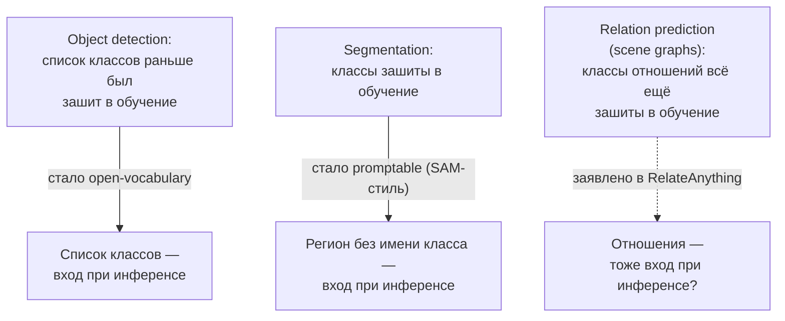
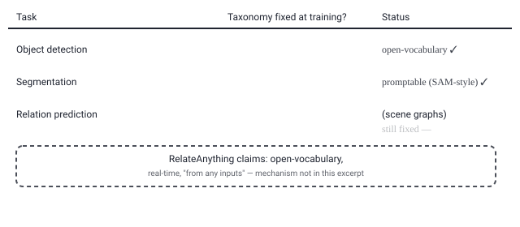

## Русская версия

# RelateAnything: последняя часть компьютерного зрения, где список категорий всё ещё зашит в обучение

Сегодняшний дайджест принёс статью [«RelateAnything: Real-Time Open-Vocabulary Relation Prediction From Any Inputs»](https://huggingface.co/papers/2609.12552) (Maëlic Neau). Сохранившаяся часть аннотации формулирует проблему на удивление чётко, без обрыва на середине мысли: «open-vocabulary detection принимает любой список классов на этапе инференса, а promptable segmentation возвращает регионы без имён классов — таксономия покинула модель и стала входными данными. Предсказание отношений — нет. Модели scene-graph всё ещё обучаются и оцениваются на…» — и здесь текст обрывается, но смысл понятен: на фиксированном, заранее заданном наборе типов отношений.

Чтобы оценить, почему это заявление вообще имеет вес, полезно вспомнить общий контекст области, не привязанный к конкретно этой статье. Object detection действительно прошёл путь от «модель обучена узнавать ровно эти N классов» к open-vocabulary-детекции, где список интересующих категорий передаётся как текстовый запрос прямо во время инференса — модели не нужно переобучаться под новый список. Аналогично promptable segmentation (в духе Segment Anything) научилась выделять произвольный регион изображения по клику или боксу, вообще не называя, что это за объект. В обоих случаях таксономия — то есть сам набор категорий — перестала быть частью весов модели и стала частью запроса.

Предсказание отношений между объектами (scene-graph generation — например, «человек едет на велосипеде», «чашка стоит на столе») — третья, менее известная широкой публике задача компьютерного зрения, и, судя по аннотации, именно она застряла на предыдущем этапе: набор возможных типов отношений по-прежнему фиксируется на этапе обучения и оценки, то есть модель, обученную распознавать «riding» и «on», нельзя на лету попросить искать отношение «pouring into», которого не было в обучающих данных. Название статьи заявляет решение именно этой проблемы — открытый словарь отношений, работающий в реальном времени и «от любых входов» (вероятно, имея в виду разные типы визуальных запросов или модальностей, но точный смысл фразы «from any inputs» аннотация не раскрывает).

Важная оговорка: слова «real-time» и «any inputs» в заголовке — это заявления авторов, а не проверенные дайджестом факты. Ни скорость инференса, ни то, какие именно входы поддерживаются, ни бенчмарки против существующих scene-graph моделей в сохранившемся тексте не приведены — это можно проверить только по [полной статье](https://huggingface.co/papers/2609.12552).

Если это заявление подтвердится, оно ровно вписывается в паттерн, который этот канал называет «the churn watch»: закрытый, зафиксированный на этапе обучения список категорий — это тот самый «default полугодовой давности», который одна за другой сдают разные задачи зрения, начиная с детекции.

### Почему вам это важно

Если ваш пайплайн строит scene graphs или анализирует отношения между объектами на изображении с фиксированным набором предикатов, стоит следить за тем, подтвердится ли заявление RelateAnything: переход к открытому словарю отношений избавил бы от необходимости переобучать модель каждый раз, когда в задаче появляется новый тип связи между объектами.

## English version

# RelateAnything: the one part of computer vision where the category list is still baked into training

Today's digest includes the paper [«RelateAnything: Real-Time Open-Vocabulary Relation Prediction From Any Inputs»](https://huggingface.co/papers/2609.12552) (Maëlic Neau). The abstract fragment that survived states the problem unusually cleanly, without cutting off mid-thought: "Open-vocabulary detection accepts any class list at inference, and promptable segmentation returns regions without class names: the taxonomy has left the model and become an input. Relation prediction has not. Scene-graph models are still trained and evaluated on…" — and there the text stops, though the meaning is clear enough: on a fixed, predetermined set of relation types.

To see why that claim carries any weight, it helps to recall the field's general background, independent of this specific paper. Object detection really has moved from "the model is trained to recognize exactly these N classes" to open-vocabulary detection, where the list of categories you care about is handed in as a text query at inference time — no retraining needed for a new list. Similarly, promptable segmentation (in the style of Segment Anything) learned to carve out an arbitrary region of an image from a click or a box, without ever naming what that object is. In both cases, the taxonomy — the set of categories itself — stopped being baked into the model's weights and became part of the query instead.

Predicting relations between objects (scene-graph generation — "a person riding a bike," "a cup sitting on a table") is a third, less publicly known computer-vision task, and per the abstract, it's the one stuck a step behind: the set of possible relation types is still fixed at training and evaluation time, meaning a model trained to recognize "riding" and "on" can't be asked on the fly to find a "pouring into" relation it never saw in training. The paper's title claims a fix for exactly this — an open vocabulary of relations, working in real time and "from any inputs" (likely referring to different kinds of visual queries or modalities, though the abstract doesn't spell out the precise meaning of that phrase).

One important caveat: "real-time" and "any inputs" in the title are author claims, not facts confirmed by the digest. Neither inference speed, nor exactly which inputs are supported, nor benchmarks against existing scene-graph models appear in the surviving text — that's only checkable in [the full paper](https://huggingface.co/papers/2609.12552).

If the claim holds up, it slots neatly into the pattern this channel calls "the churn watch": a category list closed and fixed at training time is exactly the kind of "six-month-old default" that vision tasks keep shedding, one after another, starting with detection.

### Why it matters

If your pipeline builds scene graphs or analyzes object relations from a fixed set of predicates, it's worth watching whether RelateAnything's claim holds up: moving to an open vocabulary of relations would remove the need to retrain the model every time your task needs a new kind of link between objects.
