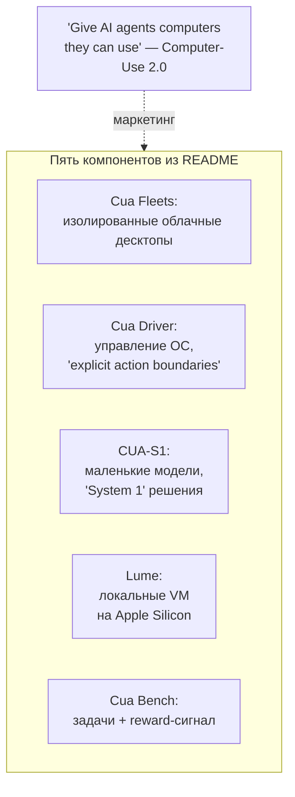
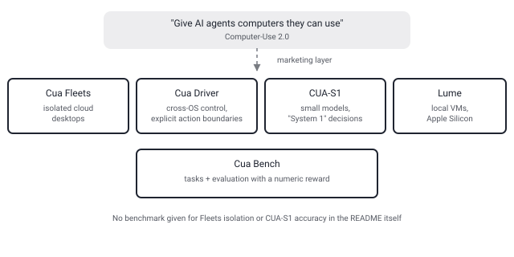

## Русская версия

# Cua: агентам дают не API, а целый компьютер — что стоит за «Computer-Use 2.0»

В сегодняшнем дайджесте [trycua/cua](https://github.com/trycua/cua) — на втором месте трендов, 24 642 звезды (+295 за день). Слоган в README простой и слегка пугающий: «Give AI agents computers they can use» — дайте ИИ-агентам компьютеры, которыми они могут пользоваться. Не API, не песочница с заранее описанными функциями, а буквально рабочий стол: мышь, клавиатура, реальные приложения.

Проект называет это «[Computer-Use 2.0](https://cua.ai/docs/concepts/what-is-computer-use)» — идея в том, что агент внутри одной задачи свободно переключается между кодом, API-вызовами и графическим интерфейсом, а не выбирает что-то одно раз и навсегда. Под вывеской скрываются пять довольно разных компонентов, и стоит развести их по отдельности, а не верить обобщающему слогану целиком.

«Cua Fleets» — изолированные облачные десктопы: код через Sandbox SDK «забирает» рабочий стол из пула, выполняет команды, делает скриншоты. «Cua Driver» — это то, что реально управляет приложениями на macOS, Windows и Linux через CLI, MCP или типизированный SDK, причём README прямо говорит про «explicit action boundaries» — явные границы того, какие действия агенту разрешено выполнять. Это ровно та формулировка, за которой стоит следить: не абстрактное «агент может пользоваться компьютером», а конкретный enforcement-слой между «модель решила» и «модель реально нажала кнопку». «CUA-S1» — семейство маленьких специализированных моделей для быстрых, ограниченных решений (авторы сравнивают это с «System 1» у человека — выбрать значение в поле формы, а не спланировать всю задачу), при этом порядок действий по-прежнему определяет приложение, а не сама модель. «Lume» — локальные macOS/Linux VM на Apple Silicon. «Cua Bench» — фреймворк для сборки задач и оценки агентов с воспроизводимым reward (в туториале — ревард ровно 1.0 за верно решённую тестовую задачу).

Что дайджест и README НЕ дают: ни одного числа о том, насколько «изолированы» облачные десктопы в Fleets в смысле реальной security-модели, ни одной метрики точности CUA-S1 на своих же «bounded decisions», ни сравнения Cua Driver с альтернативными драйверами по надёжности кликов на живых, а не тестовых интерфейсах. Проект честно называет CUA-S1 «early, source-only research release» — то есть сам не выдаёт это за готовое решение. Лицензия MIT, среди спонсоров — CodeRabbit и Zephyr Cloud IO.

### Почему вам это важно

Если вы рассматриваете computer-use агентов для автоматизации реальных рабочих столов, а не тестовых песочниц, ищите именно формулировку вроде «explicit action boundaries» в документации — это единственное место, где маркетинговое «агент управляет компьютером» превращается в проверяемый технический контракт: что агенту разрешено делать без вашего дополнительного подтверждения, а что нет.

## English version

# Cua: agents get a whole computer, not just an API — inside "Computer-Use 2.0"

Today's digest surfaces [trycua/cua](https://github.com/trycua/cua) at #2 in the trending ranking — 24,642 stars (+295 today). The README's tagline is simple and mildly unsettling: "Give AI agents computers they can use." Not an API, not a sandbox of pre-declared functions — a literal desktop: mouse, keyboard, real applications.

The project calls this "[Computer-Use 2.0](https://cua.ai/docs/concepts/what-is-computer-use)" — the idea that within a single task, an agent moves freely between code, API calls, and a graphical interface, rather than committing to one mode upfront. Behind that label sit five fairly distinct components, worth separating rather than taking the umbrella slogan at face value.

"Cua Fleets" are isolated cloud desktops: your code claims a desktop from a pool via the Sandbox SDK, runs commands, captures screenshots. "Cua Driver" is what actually operates apps on macOS, Windows, and Linux through a CLI, MCP, or typed SDK — and the README explicitly names "explicit action boundaries," the boundary that decides which actions an agent is allowed to take. That's the phrase worth watching: not the abstract "an agent can use a computer," but a concrete enforcement layer between "the model decided" and "the model actually clicked." "CUA-S1" is a family of small, specialized models for fast, bounded decisions — the authors compare it to human "System 1," picking a value for a form field rather than planning the whole task — with application code, not the model, still ordering the actions. "Lume" gives you local macOS/Linux VMs on Apple Silicon. "Cua Bench" is a framework for building tasks and evaluating agents with a reproducible reward signal (the tutorial's example: a reward of exactly 1.0 for a correctly solved test task).

What neither the digest nor the README supplies: any number on how "isolated" the Fleets cloud desktops actually are as a security model, any accuracy metric for CUA-S1 on its own "bounded decisions," or a comparison of Cua Driver against alternative drivers on click reliability against live, not test, interfaces. To its credit, the project calls CUA-S1 an "early, source-only research release" itself — it isn't pitching this as a finished product. It's MIT-licensed, with sponsors including CodeRabbit and Zephyr Cloud IO.

### Why it matters

If you're evaluating computer-use agents for automating real desktops rather than test sandboxes, look specifically for language like "explicit action boundaries" in the docs — that's the one place where the marketing claim "the agent controls the computer" turns into a checkable technical contract: what the agent may do without your extra confirmation, and what it may not.
