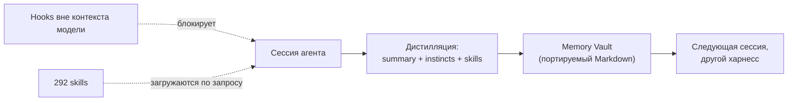
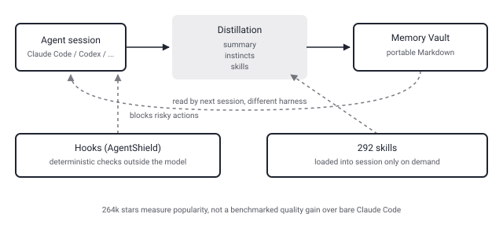

## Русская версия

# ECC: 264 тысячи звёзд за «операционную систему» для агентных харнессов — что реально внутри

Сегодня в трендах GitHub на первом месте — [affaan-m/ECC](https://github.com/affaan-m/ECC): 263 637 → 263 990 звёзд (+353 за день). Число огромное, но интереснее не оно, а то, что проект называет себя не библиотекой и не плагином, а «Agent Harness Operating System» — операционной системой для агентных харнессов, работающей поверх Claude Code, Codex, Cursor, OpenCode, Gemini и ещё восьми с лишним инструментов.

Заявленная методология — «plan → test → implement → review → verify → remember → improve», и это не просто лозунг: под каждым шагом стоит конкретный механизм. 68 специализированных агентов разбирают задачи по ролям (планирование, ревью «со свежим контекстом», security-сканирование). 292 переиспользуемых skill грузятся по требованию, а не сидят в промпте по умолчанию — ровно та экономия контекстного окна, за которой стоит следить в любом харнессе. Ещё 94 команды — точки входа вроде `/ecc:plan` или `/code-review`.

Самое любопытное — как проект решает проблему памяти между сессиями. Вместо того чтобы тащить весь транскрипт в следующий чат, ECC дистиллирует сессию в summary, «instincts» (усвоенные паттерны поведения) и skills, а результат кладёт в «Memory Vault» — переносимый Markdown-контекст, который читают Claude Code, Codex, Kimi, Hermes и другие харнессы одинаково. Формулировка из README звучит почти как манифест: «optimize the context window; persist everything else» — оптимизируйте окно контекста, всё остальное сохраняйте отдельно.

Отдельный слой — «AgentShield»: hooks, которые работают вне модели и детерминированно блокируют то, что нельзя доверять LLM-проверке, — например, `console.log` в продакшен-коде или секреты, случайно попавшие в промпт. Это именно тот паттерн границы авторизации, который в этом блоге всплывает регулярно: не «модель обещала не коммитить секреты», а жёсткий gate снаружи модели.

Чего дайджест и README не дают: ни одной независимой метрики, что 68 агентов и 292 skill'а реально ускоряют или улучшают качество кода по сравнению с голым Claude Code без надстройки. 264 тысячи звёзд — сигнал популярности инструмента, а не доказательство его эффективности; это ровно тот разрыв между «вирусный гитхаб-репозиторий» и «работает лучше» из паттерна, который здесь встречается не первый раз.

### Почему вам это важно

Если вы собираете похожий слой поверх своего агента — искать стоит не общую идею «дать агенту память», а конкретные архитектурные решения ECC: что именно уходит в контекст (skills — по требованию), что переживает сессию (instincts + summary, не сырой транскрипт) и что вынесено из-под контроля модели совсем (hooks). Это три разных ответа на вопрос «что класть в окно, а что выбрасывать», и их стоит красть по отдельности, а не как единый пакет.

## English version

# ECC: 264,000 stars for an "operating system" for agent harnesses — what's actually inside

Today's #1 on GitHub trending is [affaan-m/ECC](https://github.com/affaan-m/ECC): 263,637 → 263,990 stars (+353 today). The number is huge, but the more interesting part is that the project doesn't call itself a library or a plugin — it calls itself an "Agent Harness Operating System," running on top of Claude Code, Codex, Cursor, OpenCode, Gemini, and eight-plus other tools.

Its stated methodology is "plan → test → implement → review → verify → remember → improve," and it's not just a slogan — each step maps to a concrete mechanism. 68 specialized agents split work by role (planning, review "from a fresh context," security scanning). 292 reusable skills load on demand rather than sitting in the default prompt — exactly the context-window economy worth watching in any harness. Another 94 commands serve as entry points like `/ecc:plan` or `/code-review`.

The most interesting part is how the project handles memory across sessions. Instead of dragging the entire transcript into the next chat, ECC distills a session into a summary, "instincts" (learned behavioral patterns), and skills, then stores the result in a "Memory Vault" — a portable Markdown context that Claude Code, Codex, Kimi, Hermes, and other harnesses read the same way. The README's own phrasing reads almost like a manifesto: "optimize the context window; persist everything else."

A separate layer, "AgentShield," runs hooks outside the model that deterministically block what you shouldn't trust an LLM check to catch — a stray `console.log` in production code, or a secret that slipped into a prompt. That's exactly the authorization-boundary pattern that keeps showing up on this blog: not "the model promised not to commit secrets," but a hard gate sitting outside the model entirely.

What neither the digest nor the README gives you: any independent metric showing that 68 agents and 292 skills actually make code faster or better than bare Claude Code without the layer on top. 264,000 stars is a popularity signal for the tool, not proof of its effectiveness — exactly the gap between "viral GitHub repo" and "measurably works" that this pattern has surfaced before.

### Why it matters

If you're building a similar layer on top of your own agent, don't copy the general idea of "give the agent memory" — copy ECC's three separate, concrete answers to "what goes in the window vs. what gets discarded": skills load on demand, instincts and summaries (not raw transcripts) survive a session, and hooks remove some decisions from the model's control entirely. Those are three different answers worth stealing individually, not as one bundle.
