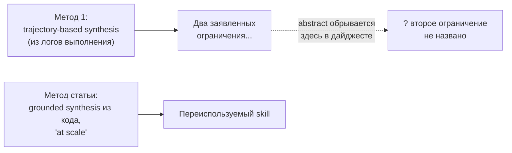
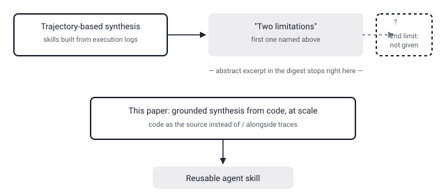

## Русская версия

# Grounded Skill Synthesis from Code at Scale: агентам предлагают учить skill'ы из кода, а не только из трасс

Ещё один сегодняшний пункт про skills для агентов — на этот раз не репозиторий, а свежая статья: [«Grounded Skill Synthesis from Code at Scale for Agentic Intelligence»](https://huggingface.co/papers/2609.05571) авторов Yongqi Tong, Pan Wang, Hang Wang, Jianshe Li, Xin Zhang и соавторов. Тема ровно та же, что у сегодняшнего ECC (264 тысячи звёзд, тоже про «292 переиспользуемых skill'а») — похоже, «skill как переносимая процедурная единица знания агента» становится темой дня, и это не совпадение: одна и та же идея одновременно всплывает в инженерном инструменте и в академической статье.

Отправная точка авторов: переиспользуемые skills дают агентам переносимое процедурное знание, а раз агентов хотят расширять за пределы того, что они уже видели, то накопление этих skill'ов должно быть масштабируемым — вручную такое не пишется. Дальше авторы называют существующие подходы ограниченными по двум пунктам, и первый — синтез skill'ов из траекторий выполнения (trajectory-based synthesis), то есть из логов того, как агент уже решал задачи.

А вот здесь стоит быть честным с вами: именно на этом месте обрывается доступный в дайджесте фрагмент абстракта. Второе ограничение существующих методов в источнике не названо — просто нет текста дальше. Заголовок статьи подсказывает общее направление: авторы предлагают синтезировать skills «grounded... from code at scale» — то есть выводить skill из реального кода, а не только из траекторий выполнения, и делать это масштабируемо. Но детали механизма — как именно код превращается в skill, что здесь означает «grounded» технически, какие бенчмарки использованы — по доступному фрагменту сказать нельзя.

Это ровно тот случай, когда честная позиция важнее красивого пересказа: приятно было бы дописать историю до конца, но источник обрывается, и додумывать за автора значило бы врать вам.

### Почему вам это важно

Если вы уже читаете статью целиком (а не только этот пересказ) — обратите внимание именно на определение «grounded»: синтез skill'ов из кода интереснее синтеза из трасс тем, что код — гораздо более компактный и однозначный источник процедурного знания, чем лог выполнения, но остаётся открытым вопрос, ловит ли метод скрытые побочные эффекты, которые видны только в трассе, но не в статическом коде.

## English version

# Grounded Skill Synthesis from Code at Scale: teaching agent skills from code, not just from execution traces

Another skills-for-agents item in today's digest — this time not a repo but a fresh paper: [«Grounded Skill Synthesis from Code at Scale for Agentic Intelligence»](https://huggingface.co/papers/2609.05571) by Yongqi Tong, Pan Wang, Hang Wang, Jianshe Li, Xin Zhang, and co-authors. It's the same theme as today's ECC story (264,000 stars, itself built around "292 reusable skills") — "skill as a portable unit of an agent's procedural knowledge" seems to be the theme of the day, and it's not a coincidence: the same idea is surfacing simultaneously in an engineering tool and in an academic paper.

The authors' starting point: reusable skills give agents transferable procedural knowledge, and since the whole point is extending agents beyond what they've already seen, acquiring those skills has to scale — you can't hand-write them one by one. The authors then say existing methods face two limitations, and the first one they name is trajectory-based synthesis — building skills out of execution traces, i.e., logs of how an agent already solved tasks.

Here's where I should be upfront with you: this is exactly where the abstract excerpt available in the digest cuts off. The source doesn't give the second limitation — there's simply no more text. The title points at the general direction: the authors propose synthesizing skills "grounded... from code at scale" — deriving a skill from real code rather than only from execution traces, and doing so in a scalable way. But the mechanism's details — how code turns into a skill, what "grounded" means technically here, which benchmarks are used — can't be answered from the available fragment.

This is exactly the case where being honest matters more than a tidy retelling: it would be nice to finish the story, but the source cuts off, and filling in the rest myself would mean making things up on your behalf.

### Why it matters

If you go read the full paper (rather than just this summary), pay close attention to what "grounded" means precisely: synthesizing skills from code is interesting because code is a far more compact, unambiguous source of procedural knowledge than an execution log — but it leaves open whether the method catches hidden side effects that only show up in a trace, not in static code.
