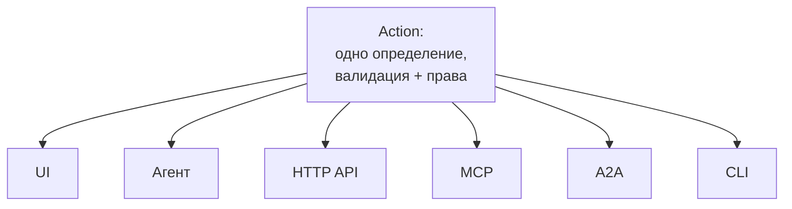
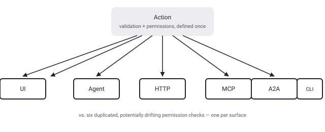

## Русская версия

# Agent-Native: одно и то же действие для UI, агента, HTTP, MCP и A2A — один слой валидации и прав

В сегодняшних трендах на втором месте — [BuilderIO/agent-native](https://github.com/BuilderIO/agent-native), TypeScript-фреймворк «для построения агентных приложений». Тут любопытно даже не описание, а цифры в самом дайджесте: заявлен рост 5 150 → 5 398 звёзд, то есть +248, но тут же указано «98 stars today». Это ровно тот разнобой между «окном роста» и «звёзд сегодня», который уже всплывал в этом блоге на карточках других репозиториев — то есть даже трендовым спискам GitHub не стоит верить буквально, не разобравшись, что именно они считают за «день».

По существу же идея Agent-Native простая и довольно точная: описываешь возможность приложения один раз как «Action» — с валидацией и правами доступа — и дальше этот же Action одинаково доступен из UI, из агента, через HTTP, через MCP, через A2A (agent-to-agent) и из CLI. Не шесть отдельных реализаций одной и той же проверки прав в шести разных слоях, а одна точка правды. Формулировка из README — «shared actions… using identical validation and permissions» — это ровно то место, где стоит проверять любой похожий фреймворк: если у агентного и у пользовательского пути разные проверки прав, рано или поздно найдётся дыра именно на стыке.

Дальше — «Shared Data» (то, что сделал агент, сразу видно в UI и наоборот) и «Shared Application State» (агент получает контекст текущей страницы или выбранных записей вместо отдельного описания состояния). Есть встроенный Agent Chat для делегирования задач агентам и ревью результатов, «Agent Teams» — совместная работа нескольких специализированных агентов в одном воркспейсе, и продакшен-бэкенд на PostgreSQL с PGlite для локальной разработки. По репозиторию: 5,4k звёзд, 502 форка, 61 открытый PR, около 5 800 коммитов.

Чего дайджест и README не дают: ни одного бенчмарка, что «единая точка валидации» реально закрывает уязвимости, которые появляются при дублировании проверки прав между UI и агентным путём — идея архитектурно разумная, но не подтверждённая цифрами на практике.

### Почему вам это важно

Если вы проектируете свой агентный слой поверх существующего приложения, идея «одно определение Action на все поверхности доступа» стоит того, чтобы её украсть отдельно от остального фреймворка: сама проблема — что агентный путь и путь пользователя UI часто получают разные, рассинхронизированные проверки прав — реальна и не зависит от того, берёте вы Agent-Native целиком или нет.

## English version

# Agent-Native: one action definition for UI, agent, HTTP, MCP, and A2A — a single validation-and-permissions layer

Today's #2 on GitHub trending is [BuilderIO/agent-native](https://github.com/BuilderIO/agent-native), a TypeScript framework "for building agentic apps." What's interesting here isn't just the description — it's the numbers in the digest itself: it reports growth from 5,150 to 5,398 stars, i.e. +248, right alongside "98 stars today." That's the exact same mismatch between "window gain" and "stars today" that's already shown up on other repo cards in this blog — a reminder that even GitHub's own trending numbers shouldn't be trusted at face value without knowing what "a day" means to whoever computed them.

The core idea of Agent-Native itself is simple and fairly sharp: you describe an app capability once as an "Action" — with validation and permissions attached — and the same Action is then reachable identically from the UI, from an agent, over HTTP, over MCP, over A2A (agent-to-agent), and from the CLI. Not six separate re-implementations of the same permission check across six layers, but one source of truth. The README's own phrasing — "shared actions… using identical validation and permissions" — is exactly the spot worth checking in any similar framework: if the agent path and the human path get different permission checks, a gap tends to show up right at that seam eventually.

On top of that: "Shared Data" (what an agent does shows up in the UI and vice versa) and "Shared Application State" (an agent gets context like the current page or selected records instead of a separately maintained state description). There's a built-in Agent Chat for delegating work to agents and reviewing results, "Agent Teams" for multiple specialist agents collaborating in one workspace, and a production PostgreSQL backend with PGlite for local development. Repo stats: 5.4k stars, 502 forks, 61 open PRs, roughly 5,800 commits.

What neither the digest nor the README gives you: any benchmark showing that a single validation point actually closes the vulnerabilities that tend to appear when permission checks are duplicated between a UI path and an agent path — the architectural idea is sound, but it isn't backed by numbers here.

### Why it matters

If you're designing your own agent layer on top of an existing app, the "one Action definition for every surface" idea is worth stealing on its own, separate from the rest of the framework: the underlying problem — that an agent's path and a UI user's path often end up with different, drifting permission checks — is real regardless of whether you adopt Agent-Native wholesale.
