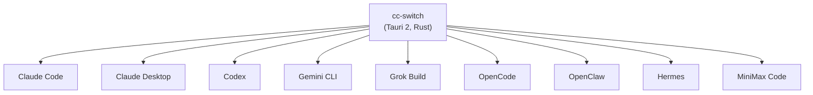
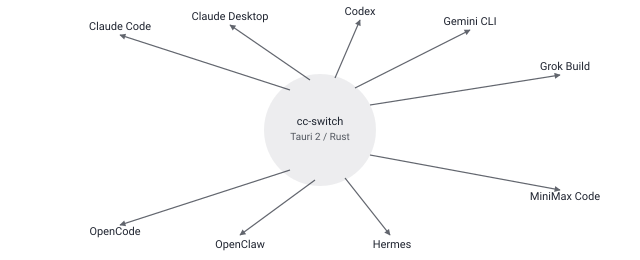

## Русская версия

# cc-switch: когда для «переключить провайдера» нужен отдельный десктопный менеджер на 9 инструментов

В категории «Claude» сегодня новая запись — [farion1231/cc-switch](https://github.com/farion1231/cc-switch), кросс-платформенное десктопное приложение на Rust и Tauri 2, помеченное дайджестом как «🆕 NEW ENTRY — Ranked #10». По README цифры немаленькие: 133 761 звезда, 9 230 форков, 2 448 коммитов — то есть под лейблом «новая запись» скрывается далеко не молодой проект, просто он впервые попал именно в эту трендовую категорию. Само по себе это полезное напоминание: «NEW ENTRY» в такой таблице значит «новый в списке», а не «новый по возрасту репозитория» — числа надо читать буквально, а не додумывать по интонации бейджа.

Задача, которую решает cc-switch, — фрагментация экосистемы агентных coding-инструментов, доведённая до абсурда: README перечисляет девять раздельных целей — Claude Code, Claude Desktop, Codex, Gemini CLI, Grok Build, OpenCode, OpenClaw, Hermes и MiniMax Code, — каждая со своим форматом конфигурации, своими MCP-серверами, своими провайдерами. Вместо ручного редактирования девяти конфигов cc-switch даёт единый визуальный дашборд и меню в трее, больше 50 готовых пресетов провайдеров и «универсальный» синк настроек между инструментами.

Из более практичных вещей: локальный прокси с горячим переключением, автоматическим failover и health-мониторингом провайдеров, единая панель MCP с двусторонней синхронизацией между поддерживаемыми приложениями, отслеживание расходов по моделям и облачная синхронизация через Dropbox, OneDrive, iCloud или WebDAV. Лицензия MIT, официальный сайт — ccswitch.io.

Чего дайджест и README не дают: ни одной независимой оценки того, насколько надёжен «auto-failover» в проде — переключение между провайдерами на лету это ровно то место, где легко потерять контекст сессии или тихо отправить запрос не туда, куда ожидалось, а таких деталей в публичном описании нет.

### Почему вам это важно

Сам факт появления такого meta-менеджера — симптом, а не решение: если для комфортной работы с агентными инструментами понадобилось отдельное приложение, синхронизирующее конфиги девяти конкурирующих CLI, это верный признак, что стандартизации форматов конфигурации в этой нише пока нет и в ближайшее время не предвидится — закладывайте это в свои инструменты уже сейчас, а не надейтесь, что кто-то договорится.

## English version

# cc-switch: when "switch providers" needs its own desktop manager for nine tools

Today's new entry in the "Claude" category is [farion1231/cc-switch](https://github.com/farion1231/cc-switch), a cross-platform desktop app built with Rust and Tauri 2, flagged by the digest as "🆕 NEW ENTRY — Ranked #10." The README's numbers aren't small: 133,761 stars, 9,230 forks, 2,448 commits — so behind the "new entry" label sits a repo that's anything but young; it just made it into this particular trending category for the first time. That's a useful reminder on its own: "NEW ENTRY" in a table like this means "new to the list," not "new by the repo's age" — read the numbers literally rather than reading intent into the badge.

The problem cc-switch solves is the coding-agent ecosystem's fragmentation taken to its logical extreme: the README lists nine separate targets — Claude Code, Claude Desktop, Codex, Gemini CLI, Grok Build, OpenCode, OpenClaw, Hermes, and MiniMax Code — each with its own config format, its own MCP servers, its own providers. Instead of hand-editing nine config files, cc-switch offers a single visual dashboard and tray menu, 50-plus built-in provider presets, and a "universal" settings sync across tools.

On the more practical side: a local proxy with hot-switching, automatic failover, and provider health monitoring; a unified MCP panel with bidirectional sync across supported apps; per-model spend tracking; and cloud sync via Dropbox, OneDrive, iCloud, or WebDAV. It's MIT-licensed, with an official site at ccswitch.io.

What neither the digest nor the README gives you: any independent assessment of how reliable that "auto-failover" actually is in production — switching providers mid-flight is exactly where a session can silently lose context or a request can end up somewhere unexpected, and none of that shows up in the public description.

### Why it matters

The existence of a meta-manager like this is a symptom, not a fix: needing a separate app just to keep nine competing CLIs' configs in sync is a solid signal that config-format standardization in this niche isn't happening any time soon — plan your own tooling around that reality instead of waiting for the ecosystem to converge.
