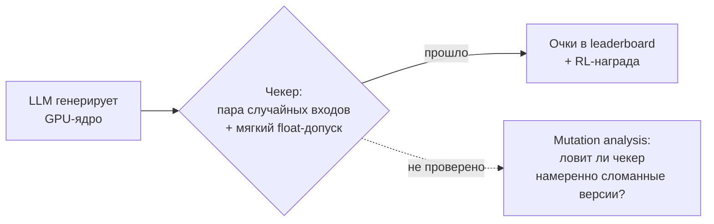
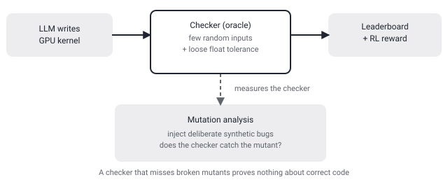

## Русская версия

# Чекер решает, что LLM написала рабочее GPU-ядро — а судит ли сам чекер кто-нибудь?

В сегодняшнем дайджесте — статья [«Measuring the Checker: Mutation Analysis for GPU-Kernel Benchmark Oracles»](https://huggingface.co/papers/2609.22220) авторов Mingzhe Du, Anh Tuan Luu, Dong Huang, See-Kiong Ng. Тема узкая, но неприятно важная для всех, кто хоть немного следит за бенчмарками генерации кода: кто проверяет проверяющего?

Схема, которую описывают авторы, знакома любому, кто гонял LLM на кодовые задачи: модель пишет GPU-ядро, а «чекер» (oracle) решает, правильное оно или нет — обычно по паре случайных входов и мягкому допуску по точности плавающей запятой. Ключевая фраза из абстракта: эти вердикты сейчас идут не только в таблицы лидеров, но и напрямую в reinforcement-learning награду. То есть если чекер слабый, модель в буквальном смысле учится обманывать именно его, а не писать корректный код — RL находит кратчайший путь к награде, и этим путём вполне может оказаться «код, который проходит именно эти случайные входы с именно этим допуском», а не «код, который действительно эквивалентен эталону».

Авторы прямо говорят: последние работы уже согласны, что такие чекеры слабые, и чинят их вручную — добавляют входные распределения, [fuz…] — и вот здесь доступный фрагмент абстракта обрывается. Что именно предлагают взамен ручных патчей сами авторы — mutation analysis, то есть методика из классического софт-тестирования: в код вносят намеренные, синтетические баги («мутанты» — например, меняют `<` на `<=` или переставляют операнды), и смотрят, ловит ли чекер испорченную версию. Доля пойманных мутантов — это оценка не программы, а самого теста: чекер, который пропускает половину явно сломанных мутантов, ничего не доказывает, даже если исходный код и правда правильный.

Из названия статьи ясно, что именно эту идею авторы применяют к GPU-ядрам — измерить, а не просто улучшить чекеры руками. Какие конкретно мутации, какой процент существующих бенчмарков проваливает такую проверку и насколько — доступный фрагмент не говорит, и додумывать эти цифры я не буду.

### Почему вам это важно

Если ваша команда использует авто-сгенерированный код (GPU-ядра или любой другой) с оценкой «прошёл/не прошёл» на паре тестов, стоит спросить не «сколько тестов проходит код», а «сколько намеренно сломанных версий кода тесты ловят». Это ровно та проверка, которую сложно подделать хайпом — и именно её описывают авторы.

## English version

# A checker decides whether the LLM wrote a working GPU kernel — but who's checking the checker?

Today's digest surfaces [«Measuring the Checker: Mutation Analysis for GPU-Kernel Benchmark Oracles»](https://huggingface.co/papers/2609.22220) by Mingzhe Du, Anh Tuan Luu, Dong Huang, and See-Kiong Ng. It's a narrow topic, but an uncomfortably important one for anyone paying attention to code-generation benchmarks: who verifies the verifier?

The setup the authors describe is familiar to anyone who has run LLMs on coding tasks: the model writes a GPU kernel, and a "checker" (oracle) decides whether it's correct — usually against a handful of random inputs and a loose floating-point tolerance. The key line from the abstract: those verdicts now feed not just leaderboards but reinforcement-learning rewards directly. Which means a weak checker doesn't just mis-score a leaderboard entry — it teaches the model to game that specific checker rather than write genuinely correct code. RL finds the shortest path to reward, and that path can easily be "code that passes exactly these random inputs at exactly this tolerance," not "code that's actually equivalent to the reference."

The authors state plainly that recent work already agrees these checkers are weak, and patches them by hand — extra input distributions, [fuzz…] — and this is exactly where the available abstract excerpt cuts off. What the authors themselves propose instead of manual patches is named right in the title: mutation analysis, a technique borrowed from classic software testing. You inject deliberate, synthetic bugs ("mutants") into code — swap `<` for `<=`, flip an operand order — and check whether the checker catches the broken version. The fraction of mutants caught scores not the program, but the test itself: a checker that lets half of obviously broken mutants slide proves nothing, even when the original code really is correct.

The title makes clear this is exactly the lens the authors turn on GPU kernels — measuring checkers, not just hand-patching them. Which specific mutations, what fraction of existing benchmarks fail this test, and by how much — the available excerpt doesn't say, and I won't guess at those numbers.

### Why it matters

If your team scores auto-generated code (GPU kernels or anything else) as pass/fail against a handful of tests, the question worth asking isn't "how many tests does the code pass" but "how many deliberately broken versions of the code do the tests actually catch." That's precisely the check that's hard to fake with hype — and it's exactly what the authors describe measuring.
