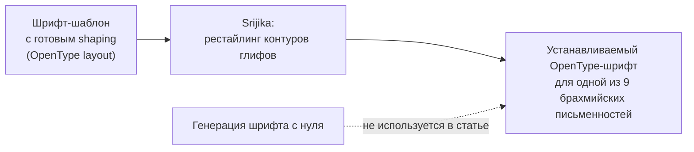
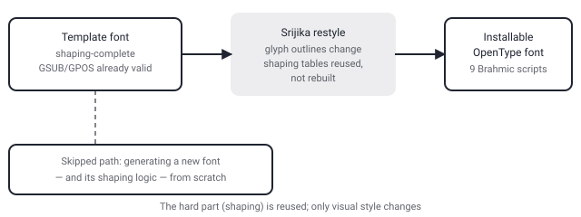

## Русская версия

# Srijika: девять индийских шрифтовых систем без единого нарисованного глифа с нуля

Сегодняшний дайджест принёс не только про агентов — есть и статья из совсем другой области, шрифтового инжиниринга: [«Srijika: OpenType-Layout-Reusing Font Restyling for Nine Indic Scripts»](https://huggingface.co/papers/2609.05661) за авторством Anil Pai. Тема нишевая, но метод стоит того, чтобы в нём разобраться — потому что решает проблему, которая в NLP-контексте вечно недооценена.

Авторы описывают систему для производства устанавливаемых OpenType-шрифтов сразу для девяти брахмийских письменностей: деванагари, тамильского, бенгальского, телугу, каннада, малаялам, гуджарати, гурмукхи и ория. Если вы не занимались шрифтами для этих систем письма — вот в чём боль: в отличие от латиницы, где буква плюс диакритика почти всегда просто накладываются друг на друга, брахмийские скрипты используют сложные лигатуры, переупорядочивание гласных вокруг согласных и контекстные формы букв. Вся эта логика в OpenType-шрифте зашита в таблицах shaping (GSUB/GPOS, если говорить техническим языком) — и её написание с нуля для каждого нового шрифта — это отдельная, трудоёмкая инженерная задача, не имеющая почти ничего общего с рисованием самих букв.

Ключевая идея Srijika сформулирована в названии: вместо генерации шрифта с нуля система «рестайлит» контуры глифов из уже готовых, «shaping-complete» шрифтов-шаблонов. То есть таблицы shaping — то, что действительно сложно сделать правильно, — берутся готовыми и проверенными, а меняется именно визуальный стиль букв: толщина штриха, засечки, общий силуэт. Абстракт обрывается сразу после этого на словах «It pr…» — что именно предлагается дальше (алгоритм переноса контуров, метрика качества, число готовых шаблонов), текст не раскрывает, и я не буду это додумывать.

Даже без деталей механизма сама идея честная: если самая дорогая часть работы — не рисование, а корректный shaping, то система, которая переиспользует shaping и меняет только форму, экономит именно ту часть труда, которую сложнее всего автоматизировать правильно.

### Почему вам это важно

Если ваш продукт работает с текстом на индийских (или вообще любых «сложных» с точки зрения shaping) языках — TTS, OCR, генерация UI, — стоит помнить, что «просто добавить шрифт» здесь редко бывает тривиальным действием: shaping-логика и визуальный стиль — это два независимых слоя, и Srijika — конкретный пример того, что их можно развязывать.

## English version

# Srijika: nine Indic writing systems without drawing a single glyph from scratch

Today's digest isn't all agents — there's also a paper from an entirely different field, font engineering: [«Srijika: OpenType-Layout-Reusing Font Restyling for Nine Indic Scripts»](https://huggingface.co/papers/2609.05661) by Anil Pai. It's a niche topic, but the method is worth understanding, because it solves a problem that's chronically underrated in NLP-adjacent work.

The authors describe a system for producing installable OpenType fonts for nine Brahmic scripts at once: Devanagari, Tamil, Bengali, Telugu, Kannada, Malayalam, Gujarati, Gurmukhi, and Odia. If you haven't worked with fonts for these scripts, here's the pain point: unlike Latin, where a letter and a diacritic almost always just stack, Brahmic scripts use complex ligatures, vowels that reorder around consonants, and context-dependent letter forms. That entire logic lives inside an OpenType font's shaping tables (GSUB/GPOS, in the technical vocabulary) — and writing those tables from scratch for every new font is a substantial engineering task that has almost nothing to do with drawing the letters themselves.

Srijika's core idea is spelled out right in the title: instead of generating a font from scratch, the system restyles glyph outlines from already-complete, "shaping-complete" template fonts. In other words, the shaping tables — the genuinely hard part to get right — are taken ready-made and already validated, while what actually changes is the visual style of the letterforms: stroke weight, serifs, overall silhouette. The abstract cuts off right after this, at "It pr…" — what comes next (the outline-transfer algorithm, a quality metric, how many template fonts are available) isn't in the available text, and I won't guess at it.

Even without the mechanism's details, the core idea is sound: if the most expensive part of the work isn't drawing but getting shaping right, a system that reuses shaping and only changes shape saves exactly the part of the labor that's hardest to automate correctly.

### Why it matters

If your product handles text in Indic (or any shaping-heavy) languages — TTS, OCR, UI generation — it's worth remembering that "just add a font" is rarely a trivial action there: shaping logic and visual style are two independent layers, and Srijika is a concrete example of decoupling them.
