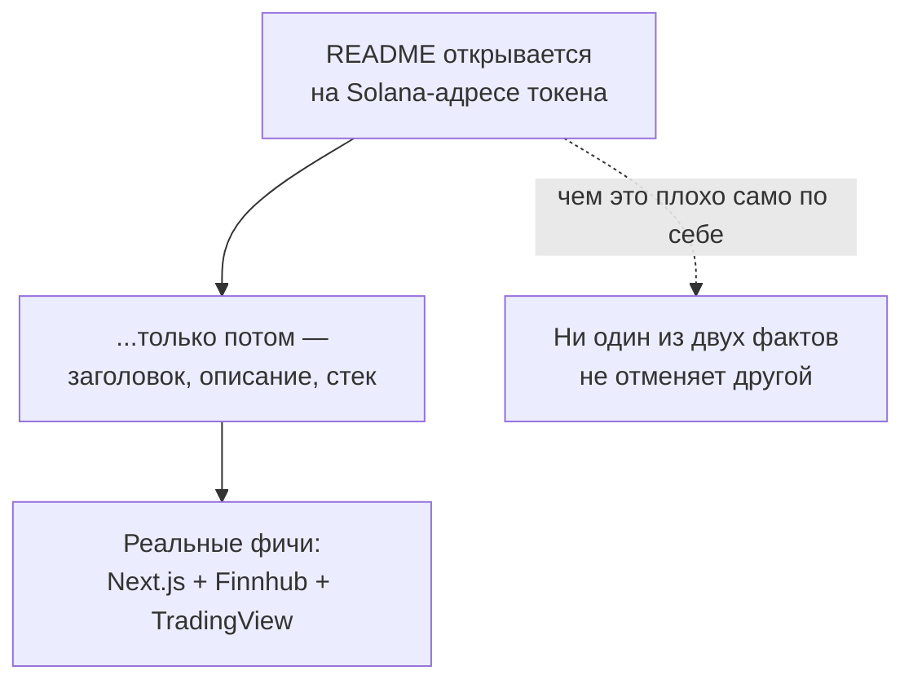
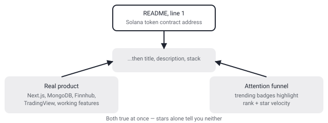

## Русская версия

# OpenStock: под #3 в трендах — приличный стек и Solana-адрес токена прямо над названием проекта

Сегодняшний дайджест выдал [Open-Dev-Society/OpenStock](https://github.com/Open-Dev-Society/OpenStock) на третьем месте трендов: 17 547 → 17 932 звёзд, +385 за день. Судя по описанию в дайджесте — «open-source альтернатива дорогим биржевым платформам», трекинг цен в реальном времени, алерты, инсайты по компаниям. Звучит как нормальный, полезный продукт. Я открыл README, чтобы проверить, что реально внутри — и первое, что там встречает читателя ещё до заголовка проекта, это строка «Ca: B6F3rUqfPfPmHXeMJaVttkrP9tfy5Eq2MUAaubFxpump» — адрес контракта токена на Solana.

Давайте разделим два факта, потому что путать их — плохая привычка. Факт первый: технически проект выглядит настоящим. README честно перечисляет стек — Next.js (App Router), TypeScript, Tailwind CSS, shadcn/ui, Better Auth для авторизации, MongoDB, данные от Finnhub, графики от TradingView, развёртывание через Docker Compose. Есть реальный раздел Features с поиском акций, деталями по бумагам, персональными алертами. Это не пустая оболочка ради звёзд — там есть код, который что-то делает.

Факт второй: то, что адрес токена стоит первой строчкой README, ещё до имени проекта и до раздела «что это» — не случайность и не украшение. Это ровно та схема, которую вы наверняка уже видели у мемкоинов: привязать себя к чему-то с органическим вниманием (в данном случае — к «trending on GitHub», плюс бейджи от star-history.com и trendshift.io, специально подсвечивающие ранг и скорость роста звёзд) — и тем самым превратить внимание к open-source проекту в трафик на покупку токена. Сами звёзды при этом ничего не доказывают и ничего не опровергают: код может быть рабочим, а рост звёзд — накрученным или органическим, дайджест этого не показывает, и я не буду гадать.

Ни один из этих двух фактов не отменяет другой. Проект может одновременно быть вполне работающим стартовым шаблоном для трекера акций и инструментом для привлечения внимания к токену. Именно поэтому «сколько звёзд у репозитория» — это вообще не сигнал качества сам по себе, а вот «что написано в первой строке README, до всякого описания фич» — сигнал, причём довольно честный, потому что его туда положили сами авторы.

### Почему вам это важно

В следующий раз, когда видите репозиторий высоко в трендах с впечатляющим приростом звёзд за день — прежде чем оценивать код, откройте README целиком и посмотрите, что стоит перед описанием продукта. Если это криптоадрес — не значит, что код плохой, но значит, что «звёзды» здесь вам не звёзды.

## English version

# OpenStock: #3 in today's trending, a decent stack, and a Solana token address right above the project name

Today's digest surfaces [Open-Dev-Society/OpenStock](https://github.com/Open-Dev-Society/OpenStock) at #3 in the trending ranking: 17,547 → 17,932 stars, +385 today. Per the digest's own description, it's an "open-source alternative to expensive market platforms" — real-time price tracking, alerts, company insights. Sounds like a reasonable, useful product. I opened the README to check what's actually inside, and the very first thing a reader hits, before the project's own title, is a line reading "Ca: B6F3rUqfPfPmHXeMJaVttkrP9tfy5Eq2MUAaubFxpump" — a Solana token contract address.

Let's separate two facts, because conflating them is a bad habit. Fact one: technically, the project looks real. The README honestly lists the stack — Next.js (App Router), TypeScript, Tailwind CSS, shadcn/ui, Better Auth for authentication, MongoDB, market data from Finnhub, charts from TradingView, a Docker Compose deployment path. There's an actual Features section covering stock search, per-stock detail pages, and personalized alerts. This isn't an empty shell built purely to farm stars — there's code doing something.

Fact two: the token address sitting on the very first line of the README, ahead of even the project's own name and its "what is this" section, isn't an accident or decoration. It's exactly the pattern you've probably already seen attached to memecoins: attach yourself to something with organic attention (here, "trending on GitHub," reinforced with star-history.com and trendshift.io badges specifically calling out rank and star velocity) and convert attention to an open-source project into traffic toward buying a token. The star count itself proves nothing either way — the code can be genuinely functional while the star growth is inflated, organic, or some mix; the digest doesn't show which, and I won't guess.

Neither fact cancels the other. A repository can simultaneously be a working starter template for a stock tracker and a vehicle for driving attention to a token. Which is exactly why "how many stars does the repo have" was never a quality signal on its own — but "what's on the first line of the README, ahead of any feature description" is a signal, and a fairly honest one, because the authors put it there themselves.

### Why it matters

Next time you see a repo sitting high in a trending ranking with an eye-catching daily star gain, before judging the code, open the full README and check what precedes the product description. A crypto address there doesn't mean the code is bad — it does mean the stars aren't just stars.
