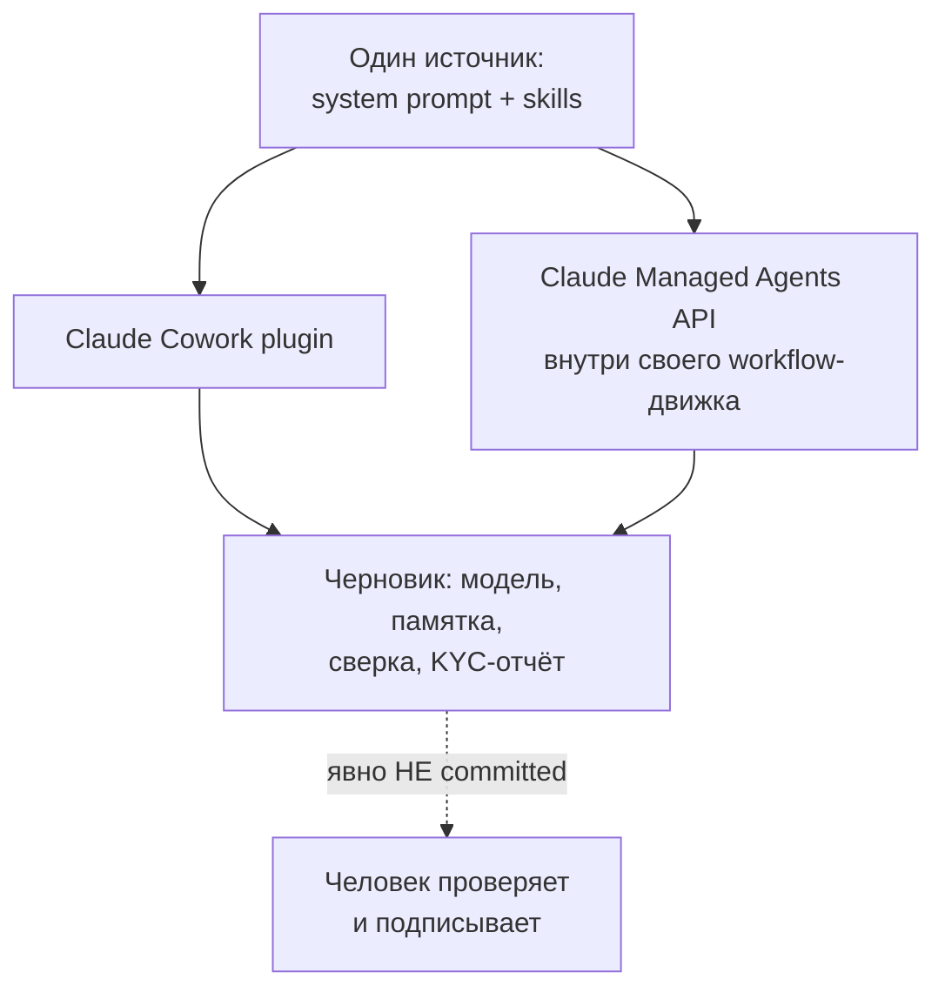
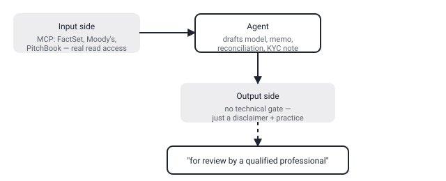

## Русская версия

# Anthropic выложила референс-агентов для финансов: один код — и Cowork-плагин, и Managed Agents API

Сегодня в трендах GitHub на первом месте — [anthropics/financial-services](https://github.com/anthropics/financial-services): 36 289 → 36 505 звёзд, +216 за день. Это референсная реализация агентов Claude под финансовую индустрию — 11 именованных агентов, сгруппированных по четырём направлениям: Coverage & Advisory (Pitch Agent, Meeting Prep Agent), Research & Modeling (Market Researcher, Earnings Reviewer, Model Builder), Fund Admin & Finance Ops (Valuation Reviewer, GL Reconciler, Month-End Closer, Statement Auditor) и Operations & Onboarding (KYC Screener). К ним прилагаются 7 отраслевых пакетов навыков и 11 MCP-коннекторов к реальным источникам данных — Daloopa, Morningstar, S&P Global, FactSet, Moody's, LSEG, PitchBook.

Архитектурно интересна одна деталь, прямо процитированная в README: «всё здесь доступно двумя способами из одного источника: установить как плагин Claude Cowork или развернуть через Claude Managed Agents API внутри своего workflow-движка. Тот же system prompt, те же skills — вы выбираете, где это работает». То есть один и тот же набор промптов и навыков можно запустить и как интерактивного помощника в рабочем чате, и как встроенный в чужую оркестрацию бэкенд-сервис — без раздвоения кодовой базы. Плюс подкупающая простота: «всё файл-based — markdown и JSON, без шага сборки».

А теперь ключевая строчка, ради которой стоило открывать README до конца: «ничто в этом репозитории не является инвестиционной, юридической, налоговой или бухгалтерской консультацией. Эти агенты готовят рабочие материалы аналитика — модели, памятки, исследовательские заметки, сверки — для проверки квалифицированным специалистом». Формально это именно тот самый рубеж «модель предложила → человек утвердил», о котором стоит думать при любой автоматизации в регулируемой сфере. Но обратите внимание, где именно проходит эта граница: агенты через MCP-коннекторы имеют реальный доступ на чтение к живым данным FactSet, Moody's, PitchBook и остальных — то есть входная сторона технически полноценна. А выходная граница — то, что превращает «черновик модели» в «решение компании» — держится не на техническом гейте внутри репозитория, а на текстовой оговорке и организационной практике «для проверки специалистом». Это не изъян дизайна — так и должно быть для инструмента, который сознательно не претендует на автономные решения. Но это значит, что дисциплина проверки целиком ложится на процесс на стороне того, кто это развернёт, а не на код.

### Почему вам это важно

Если вы разворачиваете подобных агентов у себя — стоит отдельно спросить не «что агент может прочитать», а «что физически мешает результату агента попасть в продакшен без человека в цепочке». В этом репозитории ответ — «ничего технического, только договорённость», и это абсолютно нормально для reference-реализации, но нужно осознанно закрывать этот зазор на своей стороне, если ставки выше черновика.

## English version

# Anthropic ships reference finance agents: one codebase, two ways to run it

Today's #1 GitHub trending slot goes to [anthropics/financial-services](https://github.com/anthropics/financial-services): 36,289 → 36,505 stars, +216 today. It's a reference implementation of Claude agents for financial services — 11 named agents grouped into four verticals: Coverage & Advisory (Pitch Agent, Meeting Prep Agent), Research & Modeling (Market Researcher, Earnings Reviewer, Model Builder), Fund Admin & Finance Ops (Valuation Reviewer, GL Reconciler, Month-End Closer, Statement Auditor), and Operations & Onboarding (KYC Screener). Alongside them: 7 vertical skill bundles and 11 MCP connectors to real data sources — Daloopa, Morningstar, S&P Global, FactSet, Moody's, LSEG, PitchBook.

One architectural detail is worth quoting directly from the README: "everything here is available two ways from one source: install it as a Claude Cowork plugin, or deploy it through the Claude Managed Agents API behind your own workflow engine. Same system prompt, same skills — you choose where it runs." So the same prompts and skills can run either as an interactive assistant in a chat surface, or as a backend service embedded in someone else's orchestration — no forked codebase. There's also a disarmingly simple detail: "everything is file-based — markdown and JSON, no build step."

Then there's the line worth reading the README all the way to find: "nothing in this repository constitutes investment, legal, tax, or accounting advice. These agents draft analyst work product — models, memos, research notes, reconciliations — for review by a qualified professional." Formally, that's exactly the "model proposed → human approved" boundary worth thinking about for any automation touching a regulated domain. But notice precisely where that boundary sits. On the input side, agents have real read access to live data through MCP connectors — FactSet, Moody's, PitchBook, and the rest — so that side is technically full-fledged. On the output side, what turns a "model's draft" into "the firm's decision" isn't a technical gate inside the repository — it's a text disclaimer and an organizational practice of "review by a specialist." That's not a design flaw; it's the correct shape for a tool that explicitly doesn't claim autonomous decision-making. But it does mean the review discipline lives entirely in whoever deploys this, not in the code itself.

### Why it matters

If you're deploying agents like this, it's worth asking not just "what can the agent read" but "what physically stops the agent's output from reaching production without a human in the loop." In this repository, the answer is "nothing technical, just an agreement" — which is entirely reasonable for a reference implementation, but it's a gap you need to close deliberately on your own side once the stakes go past a draft.
