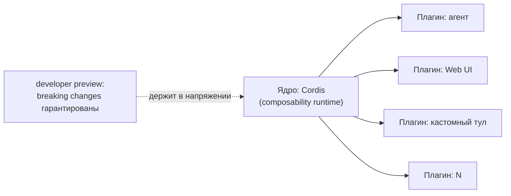
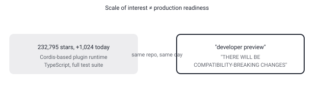

## Русская версия

# deepseek-harness: 232 тысячи звёзд у фреймворка, который сам предупреждает о breaking changes

В сегодняшнем дайджесте [deepseek-ai/deepseek-harness](https://github.com/deepseek-ai/deepseek-harness) прибавил 231 771 → 232 795 звёзд (+1 024 за день) — абсолютное число одно из самых крупных среди всего, что попадает в трендовые дайджесты. Идея репозитория укладывается в один заголовок README: «Everything is a Plugin». Функциональность — агенты, Web UI (по умолчанию поднимается на `127.0.0.1:3080`), кастомные тулы — всё это дискретные, компонуемые плагины поверх общего рантайма, а не монолитное приложение с зашитой архитектурой.

Технически это не собственное изобретение DeepSeek с нуля: движок под капотом — [Cordis](https://github.com/cordiverse/cordis), и README прямо ссылается на статью, описывающую его дизайн — «A Programming Paradigm for Spatiotemporal Composability». Название статьи подсказывает, о чём вообще идёт спор в архитектуре плагинных систем: не просто «можно добавлять модули», а именно композиция во времени (плагины подключаются и отключаются в рантайме, без пересборки) и в пространстве (плагины изолированы друг от друга, но могут декларативно зависеть друг от друга). Это отдельная, обжитая область программирования — микроядерные архитектуры, hot-reload плагинных систем, — и то, что агентный фреймворк опирается именно на неё, а не изобретает свою систему плагинов заново, само по себе говорящая деталь.

А теперь то, ради чего стоило открыть README целиком, а не только звёздный график: прямо в статусе проекта написано — «DeepSeek Harness находится в _developer preview_ и быстро итерируется. **БУДУТ ЛОМАЮЩИЕ СОВМЕСТИМОСТЬ ИЗМЕНЕНИЯ**» (капс — авторский). То есть проект с почти четвертью миллиона звёзд, TypeScript/Node.js стеком, pnpm-монорепо и полноценной тестовой инфраструктурой (unit, e2e, perf, snapshot — судя по конфигам) сам, открытым текстом, предупреждает: то, что вы построите на этом сегодня, может не собраться завтра. Здесь нет противоречия — быстрый рост звёзд и предупреждение о нестабильности прекрасно сосуществуют, когда проект молод, а бренд DeepSeek уже большой. Но это ровно тот сигнал, который «просто число звёзд» никогда не покажет: масштаб интереса — это не то же самое, что готовность к продакшену.

### Почему вам это важно

Если вы оцениваете плагинный фреймворк для своих агентов по звёздам на GitHub — открывайте не только README целиком, но конкретно раздел Status/Roadmap. «232k звёзд» и «developer preview, breaking changes гарантированы» — это два факта об одном и том же репозитории, и решение «встраивать это в прод сейчас» должно опираться на второй, а не на первый.

## English version

# deepseek-harness: 232,000 stars on a framework that warns you about breaking changes itself

Today's digest shows [deepseek-ai/deepseek-harness](https://github.com/deepseek-ai/deepseek-harness) gaining 231,771 → 232,795 stars (+1,024 for the day) — one of the largest absolute numbers among anything that shows up in a trending digest. The repository's whole idea fits in one README heading: "Everything is a Plugin." Functionality — agents, a Web UI (spun up on `127.0.0.1:3080` by default), custom tools — is all discrete, composable plugins on top of a shared runtime, rather than a monolithic app with a baked-in architecture.

Technically, this isn't a from-scratch invention by DeepSeek: the engine underneath is [Cordis](https://github.com/cordiverse/cordis), and the README links directly to the paper describing its design — "A Programming Paradigm for Spatiotemporal Composability." The paper's title hints at what the actual debate in plugin-system architecture is about: not just "you can add modules," but composability across time (plugins attach and detach at runtime, no rebuild) and across space (plugins stay isolated from each other while being able to declare dependencies on one another). That's an established area of programming — microkernel architectures, hot-reloadable plugin systems — and the fact that an agent framework builds on that lineage instead of reinventing its own plugin system from scratch is a telling detail on its own.

Now, here's what makes opening the whole README worth it, beyond the star graph: the project's own status section states, in plain text, "DeepSeek Harness is in _developer preview_ and iterating rapidly. **THERE WILL BE COMPATIBILITY-BREAKING CHANGES**" (the caps are the authors'). So a project with nearly a quarter-million stars, a TypeScript/Node.js stack, a pnpm monorepo, and a full test setup (unit, e2e, perf, snapshot, judging by the configs) is telling you, openly, that whatever you build on it today might not build tomorrow. There's no contradiction here — fast star growth and an instability warning coexist just fine when a project is young and the DeepSeek brand is already huge. But it's exactly the kind of signal that "raw star count" never surfaces on its own: scale of interest isn't the same thing as production readiness.

### Why it matters

If you're evaluating a plugin framework for your own agents by GitHub stars, read past the README's top and specifically check the Status/Roadmap section. "232k stars" and "developer preview, breaking changes guaranteed" are two facts about the same repository, and the decision to build production infrastructure on it now should rest on the second one, not the first.
