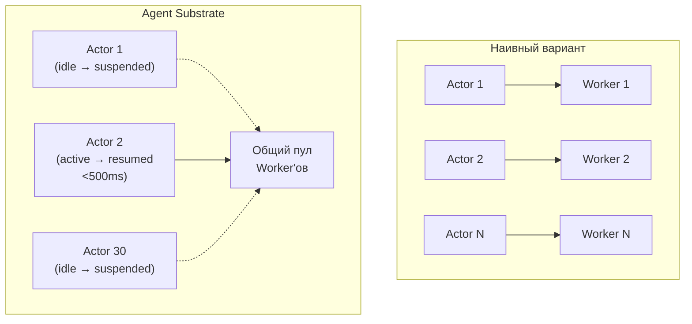
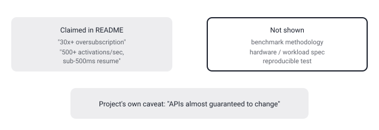

## Русская версия

# Agent Substrate: 30x переподписка на воркеры через suspend/resume — и куда девается состояние

Второе место в сегодняшних GitHub-трендах — [agent-substrate/substrate](https://github.com/agent-substrate/substrate): 2 923 → 3 087 звёзд, +164 за день, судя по дайджесту — «Agent Substrate: the core system», на Go. Открыв README, вижу, что это не агентный фреймворк в привычном смысле, а рантайм для запуска чужих агентов на Kubernetes — «sandboxed execution runtime для автономных агентов и stateful-нагрузок». Заявленная фишка — «high-density multiplexing» с оверсабскрипшеном «30x+»: множество stateful-«акторов» (агентских приложений) размещаются поверх меньшего числа физических «worker»-подов за счёт того, что неактивные акторы приостанавливаются, а не держат ресурсы вхолостую.

Идея опирается на реальное наблюдение об агентных сессиях: большую часть времени долгоживущая агентская сессия простаивает — ждёт ответа пользователя, ждёт результата внешнего тула, ждёт следующего шага пайплайна. Держать под каждую такую сессию отдельный выделенный под — это платить за простой. Substrate вместо этого приостанавливает актор (сохраняя состояние — «volatile RAM и файловую систему» — через hibernation), освобождает физический worker для чужого активного актора, а при возврате активности восстанавливает состояние. По README — «свыше 500 suspend/resume-активаций в секунду» и резюм быстрее 500ms. Изоляция реализуется через gVisor (microVM-песочницы), а архитектурно система разбита на управляющий API-сервер (`ateapi`), демон-супервизор на узле (`atelet`) и сетевой контроллер (`atenet`) — то есть отдельный control plane поверх Kubernetes, не просто набор скриптов. Заявлена framework-agnostic поддержка — LangChain, Claude Code, ADK и другие стеки могут запускаться поверх одного и того же субстрата.

Что важно держать в голове: и «30x+», и «500 активаций в секунду» — это цифры из README проекта о самом себе, без ссылки на методологию бенчмарка, железо или условия измерения в том фрагменте, что я видел. Возможно, это честные и воспроизводимые числа — возможно, лучший случай на специфической нагрузке. Дайджест этого не показывает, и дайджест — не то место, где стоит принимать архитектурные решения на веру. Отдельно авторы сами предупреждают: проект в ранней разработке, «API почти гарантированно изменятся» — то есть даже если цифры честные, интерфейсы, на которых они получены, нестабильны.

### Почему вам это важно

Если вы планируете инфраструктуру под много одновременных долгоживущих агентских сессий — идея «суспендить простаивающих, переиспользовать воркеры под активных» разумна сама по себе и решает реальную проблему стоимости простоя. Но прежде чем закладывать «30x» в capacity planning, стоит требовать воспроизводимый бенчмарк на своей нагрузке, а не брать маркетинговое число из README как данность.

## English version

# Agent Substrate: 30x worker oversubscription via suspend/resume — and where the state actually goes

Today's #2 GitHub trending slot is [agent-substrate/substrate](https://github.com/agent-substrate/substrate): 2,923 → 3,087 stars, +164 today, tagged in the digest as "Agent Substrate: the core system," written in Go. Opening the README, this isn't an agent framework in the usual sense — it's a runtime for running *other* agents on Kubernetes, described as "a sandboxed execution runtime for autonomous agents and stateful workloads." Its headline feature is "high-density multiplexing" with claimed "30x+" oversubscription: many stateful "actors" (agent applications) get packed onto fewer physical "worker" pods, because idle actors get suspended instead of holding resources for nothing.

The idea rests on a real observation about agent sessions: a long-lived agent session spends most of its time idle — waiting on a user reply, waiting on an external tool call, waiting on the next pipeline step. Keeping a dedicated pod alive per session means paying for idle time. Substrate instead suspends the actor (preserving state — "volatile RAM and filesystem state" — through hibernation), frees the physical worker for someone else's active actor, and restores state when activity resumes. Per the README, that's "over 500 suspend/resume activations per second," with resumes faster than 500ms. Isolation runs through gVisor (microVM sandboxes), and architecturally the system splits into a control-plane API server (`ateapi`), a node-level supervisor daemon (`atelet`), and a networking controller (`atenet`) — a real control plane on top of Kubernetes, not a script collection. It claims framework-agnostic support: LangChain, Claude Code, ADK, and other stacks can all run on the same substrate.

What's worth keeping in mind: both "30x+" and "500 activations per second" are numbers from the project's own README about itself, with no benchmark methodology, hardware spec, or measurement conditions visible in what I read. They might be honest, reproducible figures — or a best case under a specific workload. The digest doesn't show which, and a digest is not the place to make architecture decisions on faith. The authors themselves add a caveat worth taking seriously: the project is in early development, and its "APIs [are] almost guaranteed to change" — so even if the numbers are honest, the interfaces they were measured on aren't stable.

### Why it matters

If you're planning infrastructure for many concurrent, long-lived agent sessions, "suspend the idle ones, reuse workers for the active ones" is a sound idea that addresses a real idle-cost problem. But before you bake "30x" into capacity planning, ask for a reproducible benchmark against your own workload rather than taking a marketing number from a README at face value.
