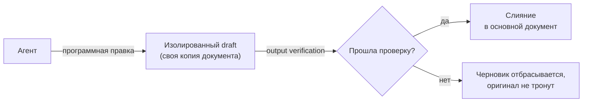
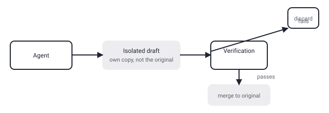

## Русская версия

# Univer: «Office Harness for AI Agents» — с изолированным черновиком вместо прямой правки

Третье место в сегодняшних трендах GitHub — [dream-num/univer](https://github.com/dream-num/univer): 15 328 → 15 734 звёзды, +406 за день, TypeScript. Своя формулировка проекта из README: «The Office Harness for AI Agents — Spreadsheets, Docs, Slides, Canvas, Relational Tables, and PDF in one runtime». Важно сразу отметить, что это не готовое приложение вроде Google Sheets, а open-source SDK — набор строительных блоков для встраивания редакторов таблиц, документов и презентаций внутрь своего продукта, с единым Facade API, одинаково работающим и в браузере, и headless в Node.js.

Технически интересна архитектура: рендеринг на canvas (не DOM) для больших редактируемых поверхностей, плагинная система, где каждая фича — таблицы, документы, презентации, «Bases» (структурированные данные), «Boards», заявленный PDF — можно добавить, убрать, заменить или лениво подгрузить. Но самая содержательная строчка для этого блога — из раздела про AI-workflow: «программная правка, верификация вывода и изолированное черновое взаимодействие (isolated draft collaboration) для агентов». Это ровно тот технический механизм авторизации, о котором стоит спрашивать у любого инструмента, дающего агенту доступ на запись в документ: агент правит не сам документ напрямую, а изолированную копию-черновик; результат проходит верификацию; и только после этого (предположительно) сливается с оригиналом. Сравните это с сегодняшним постом про [финансовых агентов Anthropic](https://github.com/anthropics/financial-services), где граница «черновик → решение» держится на текстовой оговорке в README, а не на технической изоляции — здесь, судя по формулировке, граница именно техническая, встроенная в рантайм.

Оговорка обязательна: у меня нет доступа к полному описанию механизма верификации внутри README — фраза «output verification» может означать что угодно от «схема данных валидна» до «полноценный дифф с ревью». Стек вокруг — React 18, pnpm-монорепо, Vite, Turbo, поддержка Chrome 88+ и Node.js 18.17+ — говорит о зрелом проекте с нормальной инженерной дисциплиной, но не подтверждает конкретную реализацию verification-слоя.

### Почему вам это важно

Если вы даёте агенту право редактировать «живые» офисные документы (таблицы с реальными формулами, документы, от которых зависят другие процессы), сам факт наличия «изолированного черновика» в архитектуре — это не то же самое, что гарантия безопасности. Стоит выяснить конкретно: что именно проверяет verification-шаг перед слиянием, и может ли агент обойти его, вызвав API напрямую.

## English version

# Univer: an "Office Harness for AI Agents" — with an isolated draft instead of direct edits

Today's #3 GitHub trending slot is [dream-num/univer](https://github.com/dream-num/univer): 15,328 → 15,734 stars, +406 today, written in TypeScript. The project's own framing from the README: "The Office Harness for AI Agents — Spreadsheets, Docs, Slides, Canvas, Relational Tables, and PDF in one runtime." Worth flagging up front: this isn't a finished app like Google Sheets, it's an open-source SDK — building blocks for embedding spreadsheet, document, and presentation editors inside your own product, with a unified Facade API that works the same in the browser and headless in Node.js.

The architecture is genuinely interesting: canvas-based rendering (not DOM) for large editable surfaces, and a plugin system where every feature — sheets, documents, presentations, "Bases" (structured data), "Boards," a stated PDF capability — can be added, removed, swapped, or lazy-loaded. But the line that matters most for this blog is from the AI-workflow section: "programmatic editing, output verification, and isolated draft collaboration" for agents. That's exactly the technical authorization mechanism worth asking about from any tool that gives an agent write access to a document: the agent doesn't edit the document directly — it edits an isolated draft copy; the result gets verified; and only then, presumably, merges into the original. Compare this with today's earlier post on [Anthropic's finance agents](https://github.com/anthropics/financial-services), where the "draft → decision" boundary rests on a text disclaimer in the README rather than technical isolation. Here, going by the wording, the boundary is technical, built into the runtime itself.

A necessary caveat: I don't have access to a full description of the verification mechanism inside the README — the phrase "output verification" could mean anything from "the data schema is valid" to "a full reviewed diff." The stack around it — React 18, a pnpm monorepo, Vite, Turbo, support for Chrome 88+ and Node.js 18.17+ — signals a mature project with normal engineering discipline, but it doesn't confirm the specific implementation of the verification layer.

### Why it matters

If you're giving an agent write access to live office documents — spreadsheets with real formulas, documents other processes depend on — the mere existence of an "isolated draft" in the architecture isn't the same thing as a safety guarantee. Worth confirming specifically: what does the verification step actually check before merging, and can an agent bypass it by calling the underlying API directly.
