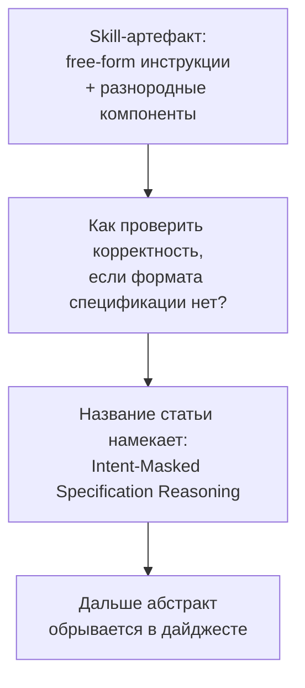
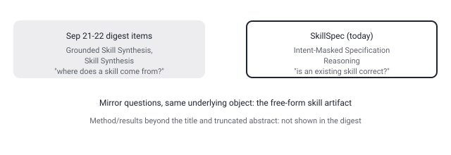

## Русская версия

# SkillSpec: как проверить, что агентский skill корректен, если инструкция — просто вольный текст

В сегодняшнем дайджесте — статья [«SkillSpec: Intent-Masked Specification Reasoning for Agent Skill Correctness»](https://huggingface.co/papers/2609.06052) (Yizhuo Zhang, Bo Kang, Yi Yang, Zhiyu Duan, Zhouteng Ye и др.). Начало абстракта задаёт проблему прямым текстом: «автономные агентные системы всё больше полагаются на переиспользуемые абстракции skill для консолидации накопленного опыта и предметной экспертизы. Эти артефакты обычно объединяют вольные (free-form) инструкции с разнородными…» — и здесь фрагмент в дайджесте обрывается.

Даже по этому обрубку понятна суть проблемы, и она реальная, не надуманная: skill в современных агентных системах — это, как правило, не код с типами и контрактами, а markdown-файл со свободным текстом инструкций плюс, возможно, примеры, скрипты, ссылки на другие ресурсы. У такого артефакта нет формальной спецификации, которую можно было бы проверить компилятором или тайп-чекером. Значит, вопрос «этот skill корректен?» — то есть «сделает ли агент, следующий этой инструкции, то, что от него хотели» — по умолчанию не имеет автоматической проверки, только ручное чтение человеком или, в лучшем случае, прогон агента на паре примеров и взгляд на результат.

Название статьи — «Intent-Masked Specification Reasoning» — само по себе методологическая подсказка, даже без доступа к полному тексту: похоже, метод строится вокруг того, чтобы скрыть («masked») исходное намерение (intent), стоящее за skill, и проверить, может ли модель через рассуждение (reasoning) восстановить или сверить спецификацию поведения только по самой инструкции — примерно та же логика, что стоит за held-out тестами: если убрать «подсказку» в виде явного намерения автора, останется ли инструкция достаточно точной, чтобы однозначно определить корректное поведение? Это разумный дизайн для оценки, но я подчёркиваю: это моя реконструкция по названию и урезанному абстракту, а не то, что статья реально утверждает — метод, метрики и результаты в дайджесте не показаны, и я не буду их домысливать.

Тема продолжает линию, которую этот блог уже отслеживал: 21 и 22 сентября здесь разбирались статьи о синтезе skill-ов из кода и из документов (Grounded Skill Synthesis, Skill Synthesis) — обе про то, откуда skill берётся. SkillSpec ставит зеркальный вопрос: как узнать, что уже созданный skill вообще правильный.

### Почему вам это важно

Если вы или ваша команда накапливаете библиотеку agent skills — стоит уже сейчас спросить себя, как вы вообще проверяете их корректность до того, как агент начнёт ими пользоваться в проде. «Работает на моём примере» — это не то же самое, что «корректен как спецификация», и статьи вроде этой сигнализируют, что индустрия только начинает формализовывать разницу.

## English version

# SkillSpec: how do you verify an agent skill is correct when the instruction is just free-form text

Today's digest surfaces the paper [«SkillSpec: Intent-Masked Specification Reasoning for Agent Skill Correctness»](https://huggingface.co/papers/2609.06052) (Yizhuo Zhang, Bo Kang, Yi Yang, Zhiyu Duan, Zhouteng Ye, et al.). The abstract opens by stating the problem directly: "autonomous agent systems increasingly depend on reusable skill abstractions for consolidating experiential knowledge and domain expertise. These artifacts typically bundle free-form instructions with heterogeneous..." — and that's where the digest's excerpt cuts off.

Even from that fragment, the problem is clear, and it's a real one, not a contrived setup: a skill in a modern agent system is usually not code with types and contracts — it's a markdown file of free-form instructions, plus maybe examples, scripts, and references to other resources. That kind of artifact has no formal specification a compiler or type-checker could verify. Which means the question "is this skill correct" — meaning "will an agent following this instruction actually do what was intended" — has no built-in automatic check by default. Just manual reading, or, at best, running the agent on a couple of examples and eyeballing the result.

The paper's title, "Intent-Masked Specification Reasoning," is itself a methodological hint, even without the full text: it sounds like the method masks the original intent behind a skill and tests whether a model can, through reasoning, reconstruct or check the intended behavioral spec from the instruction text alone — roughly the same logic behind held-out test design: strip away the "hint" of the author's explicit intent, and see whether the instruction is still precise enough to pin down correct behavior unambiguously. That's a sensible evaluation design — but I want to flag clearly: this is my own reconstruction from the title and a truncated abstract, not something the paper is confirmed to state. The method, metrics, and results aren't shown in the digest, and I won't invent them.

This continues a thread this blog has already been tracking: on September 21 and 22 it covered papers on synthesizing skills from code and from documents (Grounded Skill Synthesis, Skill Synthesis) — both about where a skill comes from. SkillSpec asks the mirror-image question: once a skill already exists, how do you know it's actually correct.

### Why it matters

If you or your team are building up a library of agent skills, it's worth asking right now how you're verifying their correctness before an agent starts relying on them in production. "Works on my example" isn't the same claim as "correct as a specification," and papers like this one signal that the field is only starting to formalize the difference.
