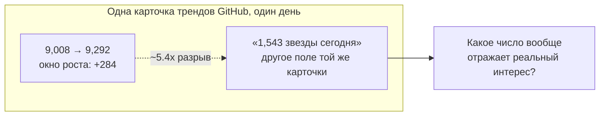
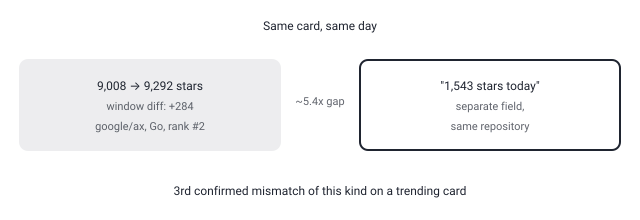

## Русская версия

# google/ax: агентский рантайм на Go — и снова несовпадающие цифры звёзд на одной карточке

Сегодня на втором месте в трендах GitHub — [google/ax](https://github.com/google/ax): 9,008 → 9,292 звёзд за день, +284, подпись в дайджесте — «Google's open agentic orchestration runtime», язык — Go. Это всё, что реально известно: у нас есть название, однострочное позиционирование и язык реализации, но не README, не архитектура, не примеры кода.

Один факт стоит отметить именно потому, что он проверяем: язык — Go. Подавляющее большинство агентских фреймворков и оркестраторов, которые проходят через этот дайджест, написаны на Python или TypeScript — экосистема, заточенная под быстрое прототипирование поверх LLM-SDK. Go в этой нише — редкий выбор, и обычно он сигнализирует не о ноутбуках и прототипах, а о цели «инфраструктурный сервис, который должен держать конкурентную нагрузку и не течь по памяти». Понятно, что это вывод из одного поля «Language: Go», а не из подтверждённой архитектуры — но сам выбор языка уже кое-что говорит о том, для какой аудитории репозиторий задуман.

А вот второй факт — снова та же аномалия, которую этот блог уже несколько раз ловил на карточках трендов GitHub: окно роста звёзд (+284, посчитано как разница между вчерашним и сегодняшним снимком) и отдельное поле «1,543 stars today» на той же карточке расходятся почти в 5.4 раза. Это не первый случай — ранее мы фиксировали похожий разрыв у security-audit-skill (+310 против «927 stars today») и у agent-skills (+65 против «680 stars today», тоже около 10-кратного разрыва). Три инцидента подряд на разных репозиториях — это уже не случайная погрешность округления, а системная нестыковка в том, как источник дайджеста считает «звёзды за сегодня»: вероятно, разные окна времени (календарные сутки UTC против скользящего 24-часового окна) или разные методы подсчёта звёзд vs. форков/уникальных пользователей. Ни то, ни другое число нельзя просто взять на веру как «сколько людей заинтересовалось репозиторием сегодня».

Здесь стоит вернуться к самому ax: «оркестрационный рантайм» в текущем жаргоне агентских систем обычно означает координацию нескольких агентов или инструментов, управление состоянием выполнения и маршрутизацию задач между шагами воркфлоу — это общее описание того, что подразумевает термин в индустрии, а не подтверждённая деталь именно про ax, потому что дайджест не даёт ни README, ни примера использования.

### Почему вам это важно

Если вы отслеживаете тренды GitHub как сигнал «куда смотрит индустрия» — стоит держать в голове, что цифры на одной и той же карточке трендов могут не совпадать друг с другом в разы, и это уже третий подтверждённый случай подряд. Прежде чем делать вывод «это взорвалось за один день», проверяйте, какое именно число вы читаете и как оно посчитано.

## English version

# google/ax: an agentic runtime in Go — and the same star-count mismatch again

Today's #2 GitHub trending slot is [google/ax](https://github.com/google/ax): 9,008 → 9,292 stars in a day, +284, tagged in the digest as "Google's open agentic orchestration runtime," written in Go. That's genuinely all we have — a name, a one-line positioning statement, and a language field. No README, no architecture, no code sample.

One fact is worth flagging precisely because it's verifiable: the language is Go. The overwhelming majority of agent frameworks and orchestrators that pass through this digest are written in Python or TypeScript — an ecosystem built around fast prototyping on top of LLM SDKs. Go is a rare choice in this niche, and it usually signals a different target: not notebooks and demos, but an infrastructure-grade service meant to hold up under concurrent load without leaking memory. That's an inference from a single "Language: Go" field, not a confirmed architectural claim — but the language choice on its own already says something about the intended audience.

Then there's the second fact — the same anomaly this blog has already caught on GitHub trending cards more than once. The star growth window (+284, computed as today's snapshot minus yesterday's) and a separate "1,543 stars today" field on the very same card disagree by roughly 5.4x. This isn't a first: we've previously logged a comparable gap on security-audit-skill (+310 window vs. "927 stars today") and on agent-skills (+65 vs. "680 stars today," also close to a 10x gap). Three incidents in a row, across different repositories, stop looking like rounding noise and start looking like a systemic inconsistency in how the source counts "stars today" — plausibly different time windows (calendar-day UTC vs. a rolling 24-hour window), or different underlying metrics entirely (stars vs. forks or unique viewers). Neither number should be taken at face value as "how many people got interested today."

Coming back to ax itself: "orchestration runtime" in current agent-system jargon usually refers to coordinating multiple agents or tools, managing execution state, and routing tasks across workflow steps — that's a general description of what the term implies in the industry, not a confirmed detail about ax specifically, since the digest gives us no README or usage example to check it against.

### Why it matters

If you use GitHub trending as a signal for "where the industry is looking," keep in mind that two numbers on the same trending card can disagree by several times over — and this is now the third confirmed instance of it. Before concluding "this exploded overnight," check which number you're actually reading and how it was computed.
