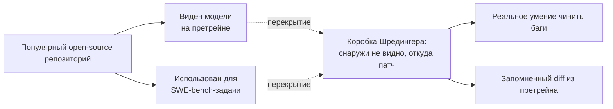
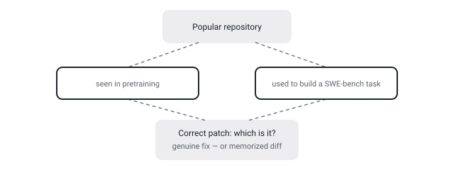

## Русская версия

# Schrödinger's Code Repository: правильный патч от агента — решение задачи или воспоминание о ней?

В сегодняшнем дайджесте — препринт [«Schrödinger's Code Repository: Have LLMs Learned SWE-bench or Memorized It?»](https://huggingface.co/papers/2609.27891) за авторством Silin Chen, Yufei Yang, Xiaodong Gu, Yuling Shi, Chengcheng Wan и соавторов. Аннотация в дайджесте обрывается на середине фразы: «репозиторийные бенчмарки для кода стали стандартом оценки кодинг-агентов, но они неизбежно страдают от утечки данных, потому что построены на популярных open-source репозиториях, которые неодно…» — дальше текст отрезан, так что конкретные метрики и метод статьи здесь не пересказываю; их просто нет в том, что дошло. Но сама постановка вопроса и название говорят достаточно, чтобы разобрать проблему по существу.

SWE-bench — один из самых цитируемых бенчмарков для агентов, пишущих код: задачи в нём — это реальные issue из популярных Python-репозиториев (Django, scikit-learn, sympy и подобные), а «правильный ответ» — это тот самый merge-коммит, который закрыл issue в реальной жизни. Именно в этом и заложена структурная уязвимость, которую называет заголовок статьи: те же самые репозитории, из которых собран бенчмарк, почти наверняка присутствуют в претрейн-корпусе современных LLM — это популярный, активно проиндексированный код. Значит, когда модель выдаёт «правильный» патч, невозможно снаружи отличить два принципиально разных сценария: модель действительно поняла баг и логику фикса, или модель узнала фрагмент кода и issue, которые уже видела при обучении, и по сути процитировала запомненное решение.

Название статьи обыгрывает мысленный эксперимент Шрёдингера не случайно: пока вы не «открыли коробку» — не применили метод, который отличает подлинное рассуждение от воспоминания, — оба объяснения правильного ответа сосуществуют одинаково правдоподобно. Внешне никакой разницы: и там, и там на выходе корректный diff, который проходит тесты. Разница проявляется только в specific проверках — например, если слегка изменить формулировку issue или переименовать сущности в коде, сохранив суть задачи, модель, решающая её «по памяти», должна провалиться там, где модель, решающая её пониманием, справится.

Проблема утечки данных для репозиторийных бенчмарков — не новость сама по себе, об этом говорят с момента появления таких тестов. Но конкретика важна: если крупная доля высоких результатов на SWE-bench у топовых моделей объясняется не способностью чинить код, а узнаванием уже виденных PR, то лидерборды, на которые ссылается индустрия при выборе модели для agentic-coding задач, измеряют не совсем то, что заявлено.

### Почему вам это важно

Если вы выбираете модель для агента, пишущего код, по позиции в SWE-bench-лидерборде — держите в уме, что высокий балл на бенчмарке, построенном из популярных публичных репозиториев, частично может отражать память о тренировочных данных, а не генерализуемую способность чинить произвольный незнакомый код. Для реальной оценки стоит смотреть на приватные или свежесозданные тестовые наборы, которых заведомо не было в претрейне.

## English version

# Schrödinger's Code Repository: is the agent's correct patch a fix or a memory?

Today's digest carries the preprint [«Schrödinger's Code Repository: Have LLMs Learned SWE-bench or Memorized It?»](https://huggingface.co/papers/2609.27891) by Silin Chen, Yufei Yang, Xiaodong Gu, Yuling Shi, Chengcheng Wan, and co-authors. The abstract in the digest cuts off mid-sentence: "repository-level coding benchmarks have become the standard for evaluating coding agents, yet they inherently suffer from data leakage because they are built upon popular open-source repositories repeatedl…" — the text is truncated there, so I'm not recapping specific metrics or methodology; they simply aren't in what came through. But the framing and title say enough to unpack the underlying problem on its own.

SWE-bench is one of the most-cited benchmarks for code-writing agents: its tasks are real GitHub issues from popular Python repositories (Django, scikit-learn, sympy, and similar), and the "correct answer" is the actual merge commit that closed the issue in real life. That's exactly where the structural vulnerability the paper's title points at comes from: the same repositories the benchmark is built from are almost certainly present in the pretraining corpus of current LLMs — it's popular, heavily indexed code. So when a model produces a "correct" patch, there's no way from the outside to distinguish two fundamentally different scenarios: the model genuinely understood the bug and the fix's logic, or the model recognized a piece of code and an issue it already saw during training, and is effectively quoting a memorized solution.

The paper's title borrows Schrödinger's thought experiment deliberately: until you "open the box" — apply a method that separates genuine reasoning from recall — both explanations for a correct answer coexist as equally plausible. From the outside, there's no visible difference: either way the output is a correct diff that passes the tests. The difference only shows up under specific probes — for instance, if you slightly reword the issue or rename entities in the code while preserving the task's substance, a model solving "from memory" should fail where a model solving through actual understanding would still succeed.

The data-leakage problem for repository-level benchmarks isn't new by itself — people have raised it since these tests first appeared. But the specifics matter: if a large share of top models' strong SWE-bench results comes from recognizing previously seen PRs rather than an ability to fix code, then the leaderboards the industry cites when choosing a model for agentic-coding work aren't quite measuring what they claim to.

### Why it matters

If you're picking a coding-agent model based on its SWE-bench leaderboard position, keep in mind that a high score on a benchmark built from popular public repositories can partly reflect memorized training data rather than generalizable bug-fixing ability. For a real assessment, look toward private or freshly created test sets that plausibly weren't in the model's pretraining data.
