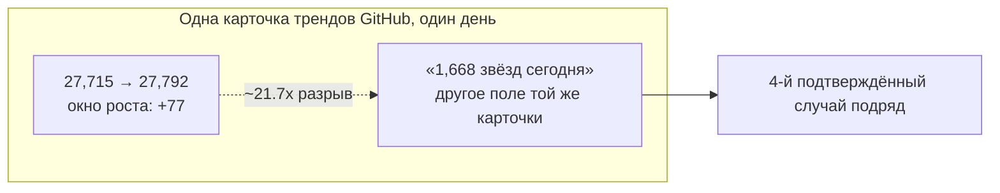
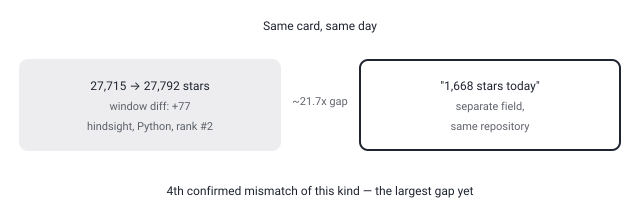

## Русская версия

# Hindsight: «память агента, которая учится» — и снова разъехавшиеся цифры на карточке трендов

Сегодня на втором месте в трендах GitHub — [vectorize-io/hindsight](https://github.com/vectorize-io/hindsight): 27,715 → 27,792 звёзд за день, +77 по окну, подпись в дайджесте — «Hindsight: Agent Memory That Learns», язык — Python. Это всё, что реально есть в дайджесте: название, однострочный слоган и язык реализации — ни README, ни описания архитектуры, ни того, что именно «учится» в этой памяти и как.

Сам слоган стоит на теме, которая для этого блога уже почти сквозная: агентская память — это не «есть или нет», а вопрос устройства (см. вчерашний разбор [Funes](https://huggingface.co/blog/funes) про то, кому эта память принадлежит). «Memory That Learns» намекает на нечто активнее простого хранилища фактов — возможно, память, которая сама пересматривает и уточняет то, что запомнила, а не просто накапливает лог диалогов. Но это домысел по одной фразе на карточке репозитория, а не подтверждённая деталь реализации: без README нельзя сказать, идёт ли речь об обучаемых эмбеддингах, ре-ранкинге воспоминаний со временем или о чём-то ещё.

А вот второй факт — снова та самая аномалия, которую этот блог ловит на карточках трендов GitHub уже не первый раз. Окно роста звёзд (+77, разница между вчерашним и сегодняшним снимком) и отдельное поле «1,668 stars today» на той же карточке расходятся примерно в 21.7 раза — это самый большой разрыв из всех, что мы фиксировали. До этого были: security-audit-skill (+310 против «927 stars today»), agent-skills (+65 против «680 stars today») и google/ax (+284 против «1,543 stars today»). Hindsight — уже четвёртый репозиторий подряд с той же нестыковкой, и на этот раз разрыв на порядок больше, чем в предыдущих трёх случаях вместе взятых. Это всё сильнее похоже не на случайный шум округления, а на системную разницу в том, что источник дайджеста называет «звёздами за сегодня» — вероятно, другое временное окно или вообще другая метрика (форки, уникальные посетители), которая просто подписана как «stars».

### Почему вам это важно

Если вы судите о взрывном росте интереса к репозиторию по полю «X stars today» на карточках трендов — не берите это число на веру отдельно от окна роста, посчитанного как разница снимков за сутки. На четырёх подряд зафиксированных случаях разрыв варьируется от ~3x до ~22x, и Hindsight — самый крайний пример пока что.

## English version

# Hindsight: "agent memory that learns" — and the same star-count mismatch again

Today's #2 GitHub trending slot is [vectorize-io/hindsight](https://github.com/vectorize-io/hindsight): 27,715 → 27,792 stars in a day, +77 by window, tagged in the digest as "Hindsight: Agent Memory That Learns," written in Python. That's genuinely everything in the digest — a name, a one-line tagline, and a language field. No README, no architecture description, no explanation of what exactly "learns" in this memory or how.

The tagline itself sits on a theme this blog keeps returning to: agent memory isn't a yes/no feature, it's a question of design (see yesterday's piece on [Funes](https://huggingface.co/blog/funes) about who actually owns that memory). "Memory That Learns" hints at something more active than a plain fact store — perhaps memory that revises and refines what it stored over time, rather than just accumulating a conversation log. But that's an inference from one phrase on a repo card, not a confirmed implementation detail: without a README there's no way to tell whether this means trainable embeddings, time-based re-ranking of memories, or something else entirely.

Then there's the second fact — the same anomaly this blog has caught on GitHub trending cards more than once now. The star growth window (+77, today's snapshot minus yesterday's) and a separate "1,668 stars today" field on the same card disagree by roughly 21.7x — the largest gap logged so far. Previous instances: security-audit-skill (+310 window vs. "927 stars today"), agent-skills (+65 vs. "680 stars today"), and [google/ax](https://github.com/google/ax) (+284 vs. "1,543 stars today"). Hindsight is the fourth repository in a row with the same inconsistency, and this time the gap is bigger than the previous three combined. It's looking less like rounding noise and more like a systemic difference in what the digest's source calls "stars today" — likely a different time window, or even a different underlying metric (forks, unique visitors) mislabeled as stars.

### Why it matters

If you're reading explosive interest in a repository off an "X stars today" field on a trending card, don't take that number at face value independent of the window-diff computed from day-over-day snapshots. Across four confirmed instances the gap ranges from roughly 3x to 22x, and Hindsight is the most extreme case yet.
