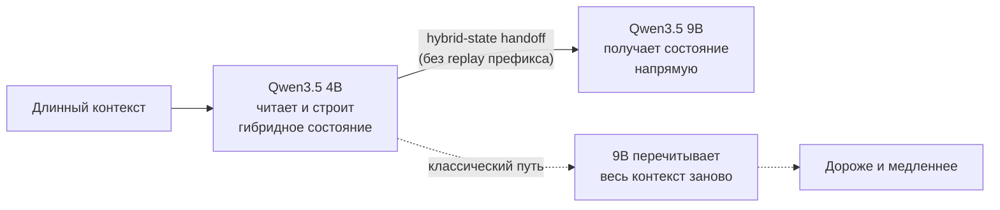
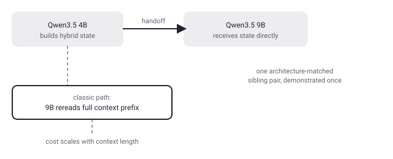

## Русская версия

# LatentPort: маленькая модель передаёт свою «память» большой сестре — без пересказа контекста заново

В дайджесте — препринт [«LatentPort: Beyond KV Cache — Cross-Model Transfer of Recurrent Memory in Hybrid Language Models: A 4B-to-9B Hybrid-State Handoff Without Target Prefix Replay»](https://huggingface.co/papers/2609.25053) за авторством Simon P. Villani. Аннотация в дайджесте обрывается на полуслове: «Can one language model hand its live memory to another without the receiver rereading the context? We demonstrate useful persistent hybrid-state transfer across one architecture-matched Qwen3.5 4B-to-9B sibling pair. To our knowledge, this is the first demonst…» — дальше текст отрезан, поэтому конкретные цифры и метод описываю по тому, что реально дошло, а не додумываю концовку.

Смысл вопроса в первом предложении — ключевой: может ли одна языковая модель передать своё «живое» состояние другой модели так, чтобы принимающая сторона не перечитывала весь контекст заново? Это прямое попадание в тему, которую эта колонка уже поднимала применительно к [владению памятью агента](https://huggingface.co/blog/funes) — только здесь вопрос не про формат хранения для человека, а про перенос состояния между двумя разными нейросетями. Заголовок называет это «hybrid-state handoff»: у «гибридных» языковых моделей (архитектур, которые сочетают классическое attention-внимание с рекуррентными state-space-компонентами вроде Mamba) помимо обычного KV-кэша есть ещё и рекуррентное состояние — и именно его, судя по названию, авторы учатся передавать напрямую от одной модели к другой, минуя «replay» — повторное прогонку префикса контекста через модель-получателя.

Ключевое ограничение — оно прямо в тексте, а не домысел: перенос продемонстрирован на «one architecture-matched Qwen3.5 4B-to-9B sibling pair», то есть на одной паре моделей из одного семейства, где 4B и 9B — фактически родственные архитектуры с общими «генами». Это не универсальный мост между произвольными моделями разных вендоров — судя по формулировке, метод опирается на архитектурное сходство донора и получателя. Насколько узко это ограничение (одна конкретная пара весов или любые модели внутри семейства Qwen3.5) — из оборванной аннотации не понять.

Если метод действительно работает — а фраза «To our knowledge, this is the first demonst…» намекает, что авторы заявляют приоритет, хотя сама формулировка тоже обрывается, — практическая ценность очевидна: сегодня единственный способ «перенести» накопленный агентом контекст на более мощную модель — это заново прогнать весь длинный префикс через неё, что стоит времени и денег пропорционально длине контекста. Прямой перенос состояния обходит эту стоимость.

### Почему вам это важно

Если ваш агентский пайплайн переключается между моделями разного размера в рамках одного разговора (например, маленькая модель — на дешёвые шаги, крупная — на сложные), стоит следить за развитием этого направления: оно целится ровно в проблему «дорогого re-context» при переключении моделей. Но пока это работает на одной подтверждённой паре внутри одного семейства — не рассчитывайте на перенос между произвольными моделями разных вендоров уже сегодня.

## English version

# LatentPort: a small model hands its "memory" to a bigger sibling — without replaying the context

Today's digest carries the preprint [«LatentPort: Beyond KV Cache — Cross-Model Transfer of Recurrent Memory in Hybrid Language Models: A 4B-to-9B Hybrid-State Handoff Without Target Prefix Replay»](https://huggingface.co/papers/2609.25053) by Simon P. Villani. The abstract in the digest cuts off mid-sentence: "Can one language model hand its live memory to another without the receiver rereading the context? We demonstrate useful persistent hybrid-state transfer across one architecture-matched Qwen3.5 4B-to-9B sibling pair. To our knowledge, this is the first demonst…" — the text is truncated there, so what follows is grounded in what actually made it through, not a guess at the ending.

The question in that first sentence is the whole point: can one language model hand off its "live" state to another model so the receiver doesn't have to reread the entire context? That's a direct extension of a theme this column already touched on around [owning an agent's memory](https://huggingface.co/blog/funes) — except here the question isn't about a storage format for a human, it's about transferring state between two different neural networks. The title calls it a "hybrid-state handoff": hybrid language models — architectures that combine classic attention with recurrent state-space components like Mamba — carry a recurrent state alongside the usual KV cache, and it's specifically that state, judging by the title, the authors are transferring directly between models, skipping the "replay" of re-running the context prefix through the receiving model.

The key limitation is stated in the text, not inferred: the transfer is demonstrated on "one architecture-matched Qwen3.5 4B-to-9B sibling pair" — a single pair of models from the same family, where the 4B and 9B are effectively architecturally related, sharing common "genes." This isn't a universal bridge between arbitrary models from different vendors — the phrasing suggests the method relies on architectural similarity between donor and receiver. How narrow that constraint actually is — one specific weight pair, or any model inside the Qwen3.5 family — isn't clear from the truncated abstract.

If the method genuinely works — and "To our knowledge, this is the first demonst…" hints the authors are claiming priority, though that phrase itself is also cut off — the practical value is obvious: today the only way to "hand off" context an agent has accumulated to a more capable model is to rerun the entire long prefix through it, at a cost proportional to context length. A direct state transfer sidesteps that cost.

### Why it matters

If your agent pipeline switches between differently sized models mid-conversation (a small model for cheap steps, a bigger one for hard ones), this direction is worth tracking — it targets exactly the "expensive re-context" problem that switch creates. But for now it's demonstrated on one confirmed pair within a single model family — don't count on transfer between arbitrary models from different vendors just yet.
