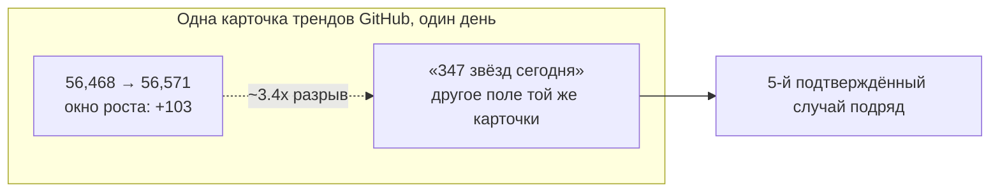
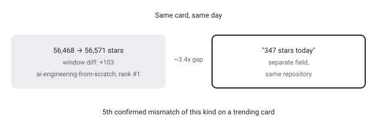

## Русская версия

# ai-engineering-from-scratch: репозиторий №1 в трендах — и та же нестыковка звёзд, уже пятый раз

Сегодня на первом месте в трендах GitHub — [rohitg00/ai-engineering-from-scratch](https://github.com/rohitg00/ai-engineering-from-scratch): 56,468 → 56,571 звёзд за день, +103 по окну, подпись в дайджесте — «Learn it. Build it. Ship it for others.», язык — Python. Как и в большинстве случаев в этом дайджесте, у нас есть только название, слоган и язык — ни оглавления курса, ни структуры материала.

Сам слоган — «изучи это, построй это, отгрузи это для других» — прямо называет жанр: это образовательный репозиторий про инженерию вокруг AI-систем «с нуля», без готовых фреймворков-прослоек. Судя по позиции #1 в трендах и абсолютным 56 с лишним тысячам звёзд, спрос на такой формат — «понять, как это работает изнутри, а не просто вызвать API» — остаётся высоким даже спустя годы после первой волны LLM-хайпа. Это разумно: слой абстракций (агентские фреймворки, оркестраторы, готовые RAG-пайплайны) в индустрии меняется быстрее, чем фундаментальные принципы под ним — отсюда и вектор «churn watch» в роадмапе этого блога: то, что было дефолтом полгода назад, часто уже легаси, а «инженерия с нуля» не устаревает так быстро.

И снова та самая нестыковка чисел, которую этот блог теперь ловит на пятой карточке трендов подряд. Окно роста (+103, разница снимков за сутки) и отдельное поле «347 stars today» на той же карточке расходятся примерно в 3.4 раза. Предыдущие случаи: security-audit-skill (+310 против «927»), agent-skills (+65 против «680»), google/ax (+284 против «1,543») и вчерашний hindsight (+77 против «1,668», разрыв ~21.7x — самый большой из всех). На фоне вчерашнего экстремума разрыв у ai-engineering-from-scratch выглядит скромно, но сам факт пятого подряд несовпадения на разных, ничем не связанных репозиториях всё увереннее говорит о системной проблеме подсчёта на стороне источника, а не о случайности одной карточки.

### Почему вам это важно

Если образовательный контент по AI-инженерии — то, что вы ищете, позиция #1 в трендах с устойчивым дневным приростом (+103 по окну, а не по сомнительному полю «347») — довольно надёжный сигнал реального интереса сообщества, даже без доступа к содержимому курса. А цифры «stars today» на карточках трендов GitHub — уже пятый раз подряд не берите буквально: считайте сами по разнице снимков.

## English version

# ai-engineering-from-scratch: the #1 trending repo — and the same star mismatch, a fifth time

Today's #1 GitHub trending slot is [rohitg00/ai-engineering-from-scratch](https://github.com/rohitg00/ai-engineering-from-scratch): 56,468 → 56,571 stars in a day, +103 by window, tagged in the digest as "Learn it. Build it. Ship it for others.," written in Python. As with most entries in this digest, that's genuinely all we have — a name, a tagline, and a language field, no course outline or content structure.

The tagline itself — "learn it, build it, ship it for others" — names the genre directly: an educational repository about the engineering underneath AI systems, built "from scratch" rather than on top of ready-made framework layers. Judging by the #1 trending position and the 56-thousand-plus absolute star count, demand for this format — "understand how it works internally, not just call an API" — remains strong even years into the first LLM hype wave. That tracks: the abstraction layer on top (agent frameworks, orchestrators, pre-built RAG pipelines) churns faster in this industry than the fundamentals underneath it — which is exactly this blog's "churn watch" vector: what was the default six months ago is often already legacy, while "from scratch" engineering doesn't age out nearly as fast.

And once again, the same number mismatch this blog is now catching for the fifth trending card in a row. The growth window (+103, day-over-day snapshot diff) and a separate "347 stars today" field on the same card disagree by roughly 3.4x. Prior instances: security-audit-skill (+310 vs. "927"), agent-skills (+65 vs. "680"), [google/ax](https://github.com/google/ax) (+284 vs. "1,543"), and yesterday's [hindsight](https://github.com/vectorize-io/hindsight) (+77 vs. "1,668," a ~21.7x gap — the largest yet). Against yesterday's extreme, ai-engineering-from-scratch's gap looks modest, but a fifth consecutive mismatch across unrelated repositories keeps pointing more confidently at a systemic counting issue on the source side, not one-off noise on a single card.

### Why it matters

If AI-engineering educational content is what you're after, a #1 trending position with a solid day-over-day gain (+103 by window, not the questionable "347" field) is a reasonably reliable signal of real community interest, even without access to the course content itself. And the "stars today" figures on GitHub trending cards — for the fifth time running — shouldn't be taken at face value: compute your own diff from the snapshots.
