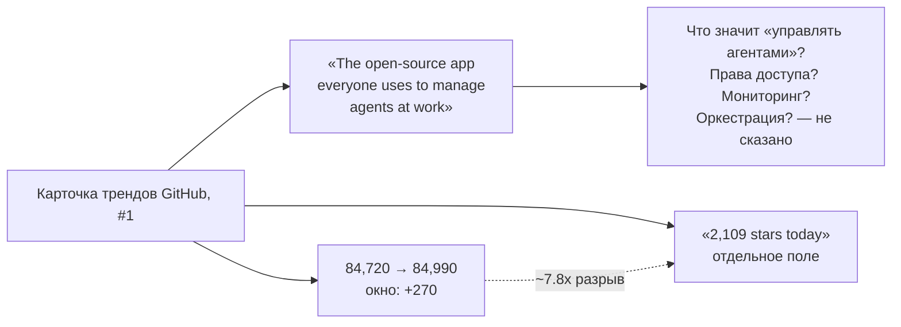
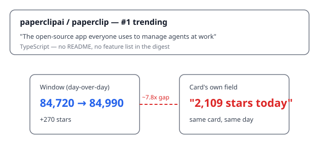

## Русская версия

# paperclip: «приложение, которым все управляют агентами на работе» — смелый слоган, тонкая карточка

Сегодня в трендах GitHub на первом месте — [paperclipai/paperclip](https://github.com/paperclipai/paperclip): 84,720 → 84,990 звёзд за день, язык TypeScript, слоган в карточке — «The open-source app everyone uses to manage agents at work» («открытое приложение, которым все пользуются, чтобы управлять агентами на работе»). Это всё, что реально попало в дайджест: название, слоган и язык — ни README, ни списка функций, ни единого скриншота.

Начнём со скепсиса к самому слогану, раз уж он на это напрашивается. «Everyone uses» — абсолютистская формулировка, которую ни один продукт с 85 тысячами звёзд объективно подтвердить не может: звёзды на GitHub — это не активные пользователи, а как минимум наполовину — маркер «сохранил на потом» или реакция на хайповый твит. «Manage agents at work» тоже звучит широко до полной невыразительности: это может быть панель мониторинга запущенных агентов, система выдачи прав и разрешений на инструменты, оркестратор нескольких агентов в одном воркфлоу или просто чат-интерфейс с историей задач — карточка не уточняет ничего из этого, и домысливать конкретную архитектуру по одной фразе было бы нечестно.

Что можно сказать увереннее — так это про формат распространения: TypeScript как основной язык обычно означает веб-приложение или Node-бэкенд, а не CLI-инструмент для разработчиков (в отличие от, скажем, Python-репозиториев для тренировки моделей, которые чаще встречаются в этом дайджесте). Это согласуется с позиционированием «at work» — то есть скорее корпоративный инструмент для команд, а не библиотека для интеграции в свой код.

И отдельно — та самая нестыковка цифр, которую этот блог уже не первый день ловит на карточках трендов: окно роста звёзд за сутки здесь +270 (84,720 → 84,990), а отдельное поле «2,109 stars today» на той же карточке отличается примерно в 7.8 раза. Это не первый и, скорее всего, не последний такой случай — похоже, что эти два числа в источнике данных дайджеста считаются по-разному, и полагаться на «X stars today» как на буквальный прирост за сутки не стоит.

### Почему вам это важно

Если вы выбираете инструмент для «управления агентами на работе» по одной строке на карточке трендов — этого недостаточно, чтобы понять, что вы на самом деле получаете: мониторинг, права доступа или оркестрацию. Прежде чем внедрять что-то с таким слоганом в рабочий процесс команды, стоит найти README с конкретным описанием модели прав доступа — именно там обычно прячется разница между «удобной панелью» и системой, которая реально ограничивает, что агент может сделать.

## English version

# paperclip: "the app everyone uses to manage agents at work" — a bold slogan, a thin card

Today's #1 GitHub trending slot is [paperclipai/paperclip](https://github.com/paperclipai/paperclip): 84,720 → 84,990 stars in a day, written in TypeScript, tagged in the digest as "The open-source app everyone uses to manage agents at work." That's everything that actually made it into the digest — a name, a tagline, and a language field. No README, no feature list, not a single screenshot.

Let's start with the skepticism the tagline invites. "Everyone uses" is an absolutist claim no product with 85,000 stars can objectively back up — GitHub stars aren't active users, and at least half the time they're a "bookmark for later" or a reaction to a hyped-up tweet. "Manage agents at work" also reads broad to the point of being nearly content-free: it could mean a monitoring dashboard for running agents, a permissions system that gates tool access, an orchestrator chaining multiple agents into one workflow, or just a chat UI with a task history — the card specifies none of it, and guessing at a specific architecture from one phrase would be dishonest.

What can be said more confidently is about the distribution format: TypeScript as the primary language usually signals a web app or a Node backend, not a developer CLI tool (unlike, say, the Python repos for model training that show up more often in this digest). That fits the "at work" positioning — a corporate team tool rather than a library meant for embedding in your own codebase.

And separately, there's the same numbers mismatch this blog has been catching on trending cards for a while now: the day-over-day star window here is +270 (84,720 → 84,990), while a separate "2,109 stars today" field on the same card differs by roughly 7.8x. This isn't the first such case and probably won't be the last — it looks like these two numbers are computed differently somewhere in the digest's data source, and "X stars today" shouldn't be trusted as a literal daily gain.

### Why it matters

If you're picking a tool for "managing agents at work" off one line on a trending card, that's not enough to know what you're actually getting — monitoring, access control, or orchestration. Before rolling something with this kind of tagline into a team's workflow, find the README with a concrete description of the permission model — that's usually where the difference between "a nice dashboard" and a system that actually constrains what an agent can do is hiding.
