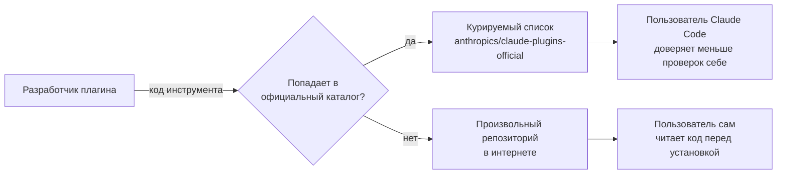
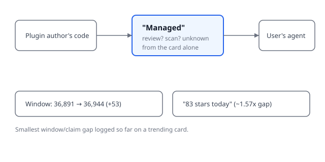

## Русская версия

# claude-plugins-official: «официальный, управляемый Anthropic каталог» — курирование как граница доверия

Сегодня в трендах GitHub на втором месте — [anthropics/claude-plugins-official](https://github.com/anthropics/claude-plugins-official): 36,891 → 36,944 звёзд за день (+53 по окну), язык Python, описание в карточке — «Official, Anthropic-managed directory of high quality Claude Code Plugins» («официальный, управляемый Anthropic каталог качественных плагинов Claude Code»). Дайджест не даёт ничего сверх названия, языка и этой строки — ни списка самих плагинов, ни критериев отбора.

Но даже одна эта строка описания стоит того, чтобы её разобрать, а не пролистать. Ключевое слово здесь — «managed» («управляемый»), а не просто «official» само по себе. Экосистема плагинов для агента — это по сути канал, через который сторонний код получает доступ к рабочему процессу пользователя: плагин может определять инструменты, хуки, слэш-команды — то есть исполняемую логику, а не просто текстовые подсказки. Без курируемого каталога пользователь, который хочет расширить агента, вынужден сам находить репозитории в интернете и сам решать, читать ли код перед установкой (и обычно этого не делает). Официальный, управляемый список — это, по сути, граница доверия: кто-то уже проверил качество и, предположительно, безопасность того, что попадает в каталог, прежде чем это попадёт к пользователю.

Стоит быть честным насчёт границ того, что мы знаем: сама карточка не говорит, в чём именно заключается «управление» — это ручная модерация pull request'ов, автоматическое сканирование кода, требование к авторам плагинов, или просто список ссылок без проверки содержимого целевых репозиториев по существу. «High quality» — тоже оценочное слово без метрики. Не стоит путать «официальный каталог, которым управляет Anthropic» с «каждый плагин в нём формально прошёл security-аудит» — это разные утверждения, и дайджест подтверждает только первое.

Отдельная деталь — на этот раз разрыв между окном роста звёзд (+53) и полем «83 stars today» на карточке составляет всего ~1.57x, заметно меньше, чем у большинства репозиториев, которые этот блог разбирал в последние недели (там разрывы доходили до ~22x). Это первый случай, когда два числа настолько близки — возможно, полезный контрольный пример того, как выглядят согласованные метрики на этой же карточке трендов.

### Почему вам это важно

Если вы устанавливаете плагины для агентского инструмента, «официальный каталог» снижает риск, но не обнуляет его — прежде чем доверять плагину доступ к вашему рабочему процессу, стоит выяснить конкретно, что означает «managed»: ручную проверку кода или просто список ссылок. Разница между этими двумя вещами — это разница между реальной границей доверия и её видимостью.

## English version

# claude-plugins-official: "an official, Anthropic-managed directory" — curation as a trust boundary

Today's #2 GitHub trending slot is [anthropics/claude-plugins-official](https://github.com/anthropics/claude-plugins-official): 36,891 → 36,944 stars in a day (+53 by window), written in Python, described on the card as "Official, Anthropic-managed directory of high quality Claude Code Plugins." The digest gives nothing beyond the name, the language, and that one line — no list of the plugins themselves, no stated selection criteria.

Still, that single description line is worth unpacking rather than skimming past. The key word here is "managed," not just "official" on its own. A plugin ecosystem for an agent is effectively a channel through which third-party code gets access to a user's workflow: a plugin can define tools, hooks, slash commands — executable logic, not just text prompts. Without a curated directory, a user who wants to extend their agent has to find repositories on their own and decide for themselves whether to read the code before installing (and usually doesn't). An official, managed list is, in effect, a trust boundary — someone has already checked the quality and, presumably, the safety of what lands in the directory before it reaches the user.

It's worth being honest about the limits of what we actually know: the card itself doesn't say what "managed" concretely means — manual PR review, automated code scanning, requirements placed on plugin authors, or just a list of links with no substantive check of the target repos' contents. "High quality" is likewise an evaluative phrase with no attached metric. Don't conflate "an official directory Anthropic manages" with "every plugin in it has formally passed a security audit" — those are different claims, and the digest only confirms the first.

One separate detail: this time the gap between the star growth window (+53) and the card's own "83 stars today" field is only about ~1.57x, noticeably smaller than most repos this blog has covered in recent weeks (where gaps ran as high as ~22x). This is the first case where the two numbers land this close together — possibly a useful control example for what agreeing metrics look like on this same kind of trending card.

### Why it matters

If you're installing plugins for an agentic tool, "official directory" lowers the risk but doesn't zero it out — before trusting a plugin with access to your workflow, it's worth finding out concretely what "managed" means: manual code review, or just a list of links. The difference between those two things is the difference between a real trust boundary and the appearance of one.
