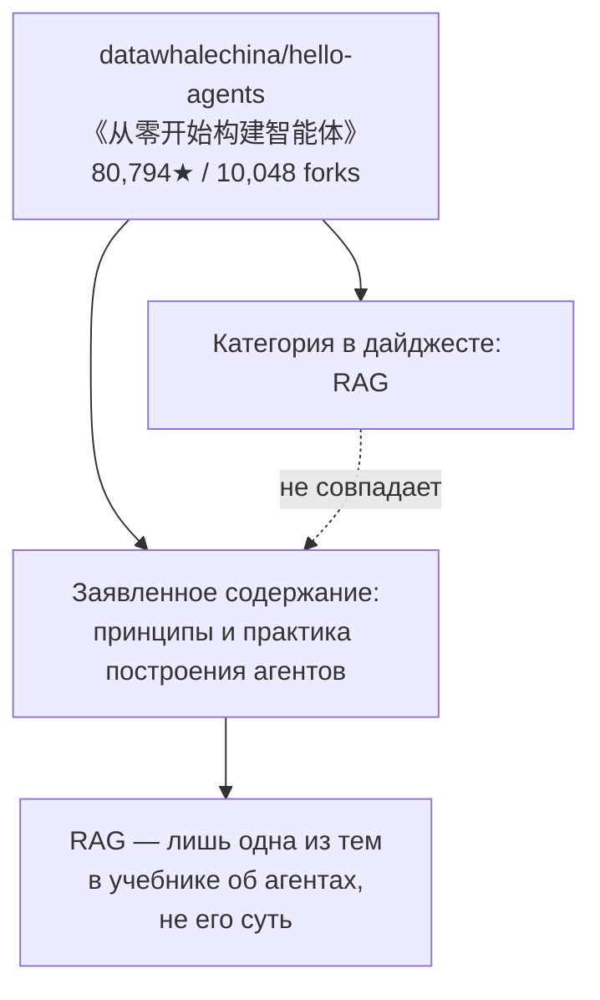
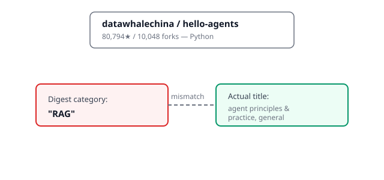

## Русская версия

# hello-agents: учебник «постройте агента с нуля» — с меткой «RAG», которая ему не совсем подходит

В сегодняшнем дайджесте в разделе трендов «RAG» — [datawhalechina/hello-agents](https://github.com/datawhalechina/hello-agents): 80,794 звёзд, 10,048 форков, рейтинг сполз с #9 на #10 за день. Название на карточке — «《从零开始构建智能体》——从零开始的智能体原理与实践教程», что переводится примерно как «Построй интеллектуального агента с нуля» — учебник по принципам и практике построения агентов, язык реализации — Python.

Первое, что бросается в глаза, — несостыковка между категорией и содержанием. Репозиторий числится в дайджесте под рубрикой «RAG» (retrieval-augmented generation), но его собственное название говорит о курсе по агентам в целом — «принципы и практика», а не конкретно про поиск и дополнение генерации найденными документами. RAG вполне может быть одной из глав такого учебника (агенты часто используют retrieval как один из инструментов), но называть весь курс «RAG-репозиторием» — это, вероятно, огрубление классификатора источника дайджеста, а не точное описание проекта. Похожий паттерн этот блог уже отмечал у звёздных цифр на карточках трендов — метки и метрики здесь стоит перепроверять, а не принимать буквально.

Что можно сказать честно про сам проект, опираясь только на карточку: это открытый образовательный ресурс на китайском языке с необычно высоким соотношением форков к звёздам — 10,048 форков на 80,794 звёзды, это примерно 12.4%. Для сравнения, у продуктовых репозиториев в этом дайджесте (paperclip, claude-plugins-official) форк обычно означает «хочу контрибьютить в код», а для учебника форк чаще значит «хочу пройти материал в своей копии и вести собственные заметки/упражнения» — так что высокая доля форков здесь может отражать не готовность контрибьютить, а формат чтения, характерный для образовательных репозиториев, а не для готовых к использованию инструментов.

Падение с #9 на #10 за один день — минимальное движение, которое, как и в случае с NextChat на прошлой неделе, скорее шум ранжирования при таком масштабе аудитории, чем реальный спад интереса.

### Почему вам это важно

Если вы находите образовательный репозиторий через категоризированный список трендов (вроде «RAG», «Agents», «LLM tools»), не полагайтесь на саму категорию как на точное описание содержания — она могла быть присвоена автоматическим классификатором источника, а не автором проекта. Проверяйте оглавление или README, прежде чем решать, релевантен ли материал вашей конкретной задаче.

## English version

# hello-agents: a "build an agent from scratch" textbook, filed under an "RAG" tag that doesn't quite fit

Today's digest lists, in its "RAG" trending section, [datawhalechina/hello-agents](https://github.com/datawhalechina/hello-agents): 80,794 stars, 10,048 forks, rank slipping from #9 to #10 in a day. The card's title is «《从零开始构建智能体》——从零开始的智能体原理与实践教程», which translates roughly to "Build an Intelligent Agent from Scratch" — a principles-and-practice tutorial on building agents, written in Python.

The first thing that stands out is a mismatch between the category and the content. The digest files this repository under "RAG" (retrieval-augmented generation), but its own title describes a course on agents in general — "principles and practice," not specifically retrieval or document-augmented generation. RAG could well be one chapter of such a textbook (agents often use retrieval as one of several tools), but labeling the whole course an "RAG repository" reads more like a coarse classifier in the digest's data source than an accurate description of the project. This is a similar pattern to the star-count discrepancies this blog has already flagged on trending cards — labels and metrics here are worth double-checking rather than taking at face value.

What can honestly be said about the project itself, going only off the card: it's an open-source Chinese-language educational resource with an unusually high fork-to-star ratio — 10,048 forks against 80,794 stars, roughly 12.4%. For comparison, in product repos elsewhere in this digest (paperclip, claude-plugins-official), a fork usually signals "I want to contribute code," while for a textbook a fork more often means "I want to work through the material in my own copy and keep my own notes/exercises" — so the high fork share here may reflect the reading pattern typical of educational repos rather than readiness to contribute, not a ready-to-use tool being adopted.

The one-slot drop from #9 to #10 in a single day is a minimal move that, like NextChat's last week, reads more like ranking noise at this audience scale than an actual dip in interest.

### Why it matters

If you find an educational repository through a categorized trending list (like "RAG," "Agents," "LLM tools"), don't treat the category itself as an accurate description of the content — it may have been assigned by an automated classifier in the source, not by the project's author. Check the table of contents or README before deciding whether the material fits your specific task.
