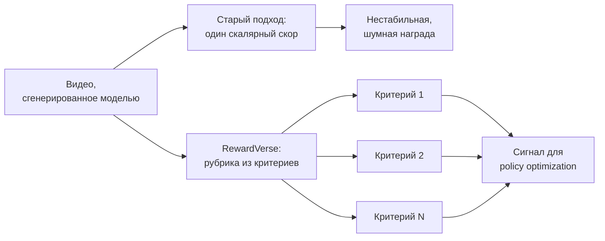
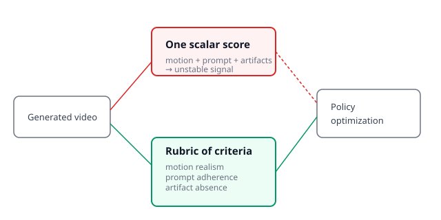

## Русская версия

# RewardVerse: если один скалярный скор для видео-RL нестабилен, замените его рубрикой

В дайджесте — препринт [«RewardVerse: Rubric-Guided Policy Optimization for Video Reward Modeling»](https://huggingface.co/papers/2609.22947) за авторством Zhenchen Tang, Yang Li, Songlin Yang, Bo Peng, Xiaotong Zhao и соавторов. Аннотация обрывается на фразе «existing video reward models often produce unstable scalar sco…» — то есть авторы констатируют проблему («нестабильные скалярные...»), но текст обрывается до конца слова. Дальше — честная реконструкция из того, что реально дано: заголовка метода и уцелевшего куска аннотации, без домысливания конкретных цифр или архитектурных деталей, которых в дайджесте нет.

Отправная точка понятна и без полного текста: RL — важный инструмент дообучения моделей генерации видео, а качество этого дообучения упирается в качество reward-модели (RM), которая говорит алгоритму, насколько хорош тот или иной сгенерированный ролик. Оборванная фраза указывает на конкретную проблему существующих подходов: reward-модели часто выдают «unstable scalar sco[res]» — нестабильные скалярные оценки. Одно число на выходе (условно, «эта видео получает 0.73 из 1.0») звучит просто, но на практике страдает от классической проблемы скалярных наград: оно сжимает много разных измерений качества — реализм движения, соответствие промпту, отсутствие артефактов, композицию кадра — в единственное значение, и шум по любому из этих измерений напрямую портит сигнал для RL.

Здесь и вступает часть заголовка «Rubric-Guided» — судя по названию метода, авторы предлагают заменить один скаляр на рубрику: набор отдельных, явно сформулированных критериев, по каждому из которых видео оценивается отдельно, а затем эти частные оценки как-то объединяются в сигнал для policy optimization. Это концептуально похоже на то, как человек-эксперт оценивает работу по чек-листу, а не выставляет одну общую оценку «на глаз» — раздельные критерии легче интерпретировать, легче отлаживать (какой конкретно аспект видео проседает), и, предположительно, устойчивее к шуму отдельно взятого критерия, чем единственное скалярное число. Но важно: сама механика агрегации рубрики в обучающий сигнал, метрики стабильности и результаты сравнения со скалярным подходом — за пределами того, что попало в дайджест, и утверждать конкретные цифры улучшения было бы нечестно.

### Почему вам это важно

Если вы проектируете reward-модель для RL — не только для видео, эта же логика применима к тексту, коду, изображениям — стоит спросить себя: не сжимаете ли вы несколько независимых измерений качества в одно число раньше, чем это необходимо? Разбиение на явную рубрику критериев обычно стоит дополнительной сложности в агрегации, но выигрывает в интерпретируемости и, предположительно, в устойчивости сигнала — именно тот компромисс, на который, судя по всему, указывает название этой работы.

## English version

# RewardVerse: if one scalar score is unstable for video RL, swap it for a rubric

Today's digest carries the preprint [«RewardVerse: Rubric-Guided Policy Optimization for Video Reward Modeling»](https://huggingface.co/papers/2609.22947) by Zhenchen Tang, Yang Li, Songlin Yang, Bo Peng, Xiaotong Zhao, and co-authors. The abstract cuts off at "existing video reward models often produce unstable scalar sco…" — the authors state a problem ("unstable scalar...") but the text breaks off before the word finishes. What follows is an honest reconstruction from what's actually given: the method's title and the surviving abstract fragment, without inventing specific numbers or architectural details that aren't in the digest.

The starting point is clear even without the full text: RL is an important tool for fine-tuning video generation models, and the quality of that fine-tuning hinges on the reward model (RM) that tells the algorithm how good a given generated clip is. The truncated sentence points to a specific problem with existing approaches: reward models often produce "unstable scalar sco[res]." A single output number (say, "this video gets 0.73 out of 1.0") sounds simple, but in practice it suffers from the classic problem with scalar rewards: it compresses many distinct quality dimensions — motion realism, prompt adherence, absence of artifacts, frame composition — into one value, and noise along any of those dimensions directly corrupts the signal RL trains on.

That's where the "Rubric-Guided" part of the title comes in — going by the method's name, the authors propose replacing a single scalar with a rubric: a set of separate, explicitly stated criteria, each scoring the video independently, which are then somehow combined into a signal for policy optimization. This is conceptually similar to how a human expert grades work against a checklist rather than issuing one overall "gut feel" score — separate criteria are easier to interpret, easier to debug (which specific aspect of the video is weak), and presumably more robust to noise in any single criterion than one scalar number. But it's important to flag: the actual mechanics of aggregating the rubric into a training signal, the stability metrics, and comparisons against a scalar baseline are beyond what made it into the digest, and claiming specific improvement numbers here would be dishonest.

### Why it matters

If you're designing a reward model for RL — not just for video, the same logic applies to text, code, images — it's worth asking yourself: are you collapsing several independent quality dimensions into one number earlier than you need to? Splitting into an explicit rubric of criteria usually costs extra complexity in aggregation, but gains in interpretability and, presumably, signal stability — exactly the tradeoff this paper's title appears to be pointing at.
