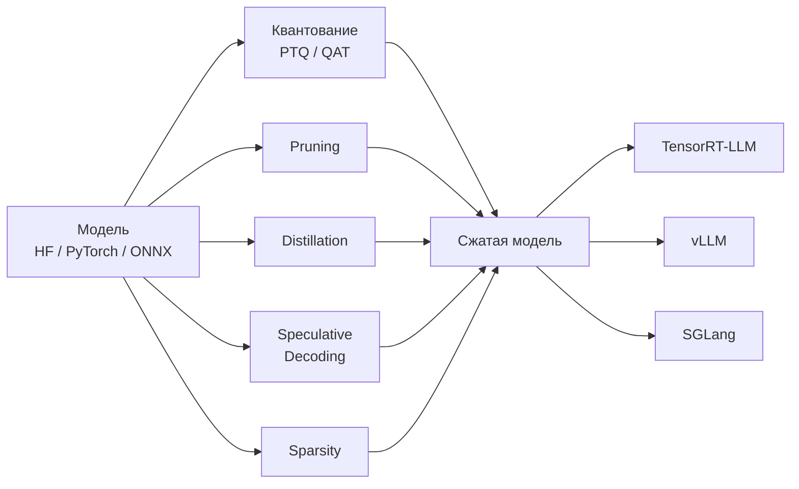
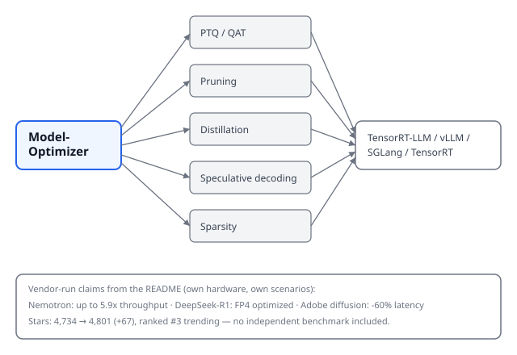

## Русская версия

# NVIDIA Model-Optimizer: один инструмент, шесть способов сжать модель — и чьи бенчмарки это подтверждают

Сегодня в трендах GitHub на третьем месте — [NVIDIA/Model-Optimizer](https://github.com/NVIDIA/Model-Optimizer): 4,734 → 4,801 звёзд за день (+67 по окну). В карточке: «унифицированная библиотека SOTA-техник оптимизации моделей — квантование, дистилляция, pruning, neural architecture search, speculative decoding и другое», которая сжимает модели для последующего развёртывания в фреймворках вроде TensorRT.

Библиотека принимает модели в трёх форматах — Hugging Face, PyTorch, ONNX — и предлагает не одну технику, а шесть на выбор: post-training quantization (PTQ, заявлено «2-4x сжатие модели с сохранением качества»), quantization-aware training (QAT, дообучение поверх уже квантованной модели для восстановления точности), pruning (удаление лишних весов), distillation (обучение модели поменьше имитировать модель побольше), speculative decoding (обучение «черновой» подмодели предсказывать несколько токенов вперёд) и sparsity (хранение только ненулевых параметров). На выходе — совместимость с TensorRT-LLM, vLLM, SGLang и TensorRT напрямую.

Дальше идут цифры, и вот тут стоит притормозить. В README упоминаются: ускорение инференса моделей Nemotron до 5.9x, оптимизация DeepSeek-R1 в FP4, и снижение latency диффузионных моделей у Adobe на 60%. Все три цифры звучат впечатляюще — и все три посчитаны и опубликованы самой NVIDIA (или в партнёрстве с ней) на её собственном железе и её собственных сценариях. Это не значит, что цифры неверны — но это значит, что «до 5.9x» и «на 60%» описывают конкретный кейс в конкретных условиях, а не гарантированный результат для произвольной модели, которую сожмёте вы. Библиотека open source с января 2025 года, на Hugging Face выложены уже готовые квантованные чекпоинты — так что часть пути можно пройти вообще без собственных экспериментов, но тогда вы наследуете чужой выбор техники и чужие компромиссы по качеству.

Ещё одна деталь, которую стоит держать в голове: шесть техник в одной библиотеке — это шесть разных осей компромисса между размером модели, скоростью инференса и итоговым качеством, и универсального «лучшего» выбора между ними README не называет. PTQ быстрее внедрить, но может просадить точность там, где QAT её вытянет ценой дополнительного обучения; pruning и distillation решают похожую задачу «сделать модель меньше» принципиально разными способами. Выбор между ними — это по-прежнему инженерное решение под конкретную задачу, а не кнопка «оптимизировать».

### Почему вам это важно

Если вы разворачиваете LLM или диффузионную модель в проде и упираетесь в latency или память на GPU, эта библиотека — разумная стартовая точка: она собирает шесть техник сжатия под одним API вместо шести разных инструментов. Но воспринимайте цифры «5.9x» и «60%» как ориентир, а не обещание: прогоните собственный бенчмарк на своей модели, своём железе и своих реальных запросах, прежде чем закладывать эти цифры в план.

## English version

# NVIDIA Model-Optimizer: one toolkit, six ways to compress a model — and whose benchmarks back that up

Today's #3 GitHub trending slot is [NVIDIA/Model-Optimizer](https://github.com/NVIDIA/Model-Optimizer): 4,734 → 4,801 stars in a day (+67 by window). The card describes it as "a unified library of SOTA model optimization techniques like quantization, distillation, pruning, neural architecture search, speculative decoding, etc.," compressing deep learning models for downstream deployment frameworks like TensorRT.

The library accepts models in three formats — Hugging Face, PyTorch, ONNX — and offers not one technique but six to pick from: post-training quantization (PTQ, claimed "2-4x model compression while preserving quality"), quantization-aware training (QAT, further training on top of an already-quantized model to recover accuracy), pruning (removing unnecessary weights), distillation (training a smaller model to mimic a larger one), speculative decoding (training a small "draft" model to predict several tokens ahead), and sparsity (storing only non-zero parameters). Output-side, it plugs into TensorRT-LLM, vLLM, SGLang, and TensorRT directly.

Then come the numbers, and this is where it's worth slowing down. The README cites: up to 5.9x higher inference throughput on Nemotron models, FP4 optimization of DeepSeek-R1, and a 60% latency reduction on Adobe's diffusion models. All three figures sound impressive — and all three were measured and published by NVIDIA itself (or in partnership with it), on its own hardware, in its own scenarios. That doesn't make them false — it means "up to 5.9x" and "60%" describe one specific case under specific conditions, not a guaranteed outcome for whatever model you compress. The library has been open source since January 2025, and pre-quantized checkpoints are already up on Hugging Face — so part of the path can be walked without running your own experiments at all, but then you inherit someone else's choice of technique and someone else's quality trade-offs.

One more thing worth keeping in mind: six techniques in one library means six different trade-off axes between model size, inference speed, and resulting quality, and the README doesn't name a universal "best" pick among them. PTQ is faster to adopt but can lose more accuracy where QAT would hold it at the cost of extra training; pruning and distillation both shrink a model but by fundamentally different means. Choosing among them stays an engineering decision for your specific case, not a one-click "optimize" button.

### Why it matters

If you're deploying an LLM or a diffusion model in production and hitting latency or GPU memory limits, this library is a sensible starting point — it bundles six compression techniques under one API instead of six separate tools. But treat "5.9x" and "60%" as a reference point, not a promise: run your own benchmark on your own model, your own hardware, and your own real traffic before you build those numbers into a plan.
