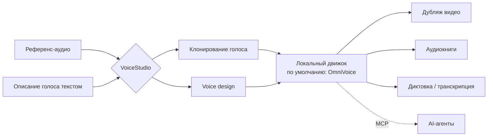
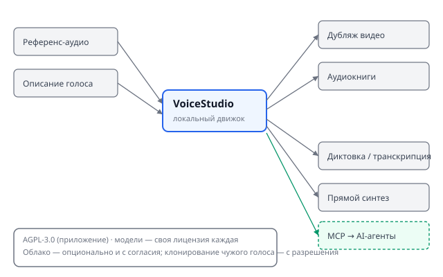

## Русская версия

# VoiceStudio: локальная замена ElevenLabs — и что значит «локальная» на самом деле

Сегодня в трендах GitHub на третьем месте — [debpalash/VoiceStudio](https://github.com/debpalash/VoiceStudio): 39,962 → 40,212 звёзд за день (+250 по окну, 3,086 звёзд «сегодня» по счётчику репозитория). Позиционирование прямое: «open-source, полностью локальная альтернатива ElevenLabs» — клонирование голоса, voice design, дубляж видео, диктовка, транскрипция и создание аудиокниг на 646 языках.

«Клонирование» и «дизайн» здесь — два разных пути к одному результату. В первом случае вы даёте референсное аудио, и модель синтезирует голос, похожий на образец. Во втором — описываете нужный голос текстом («хриплый, уставший, мужской, лет 50»), и модель собирает его с нуля, без реального прототипа. По умолчанию за синтез отвечает движок OmniVoice (k2-fsa/OmniVoice), но приложение поддерживает несколько движков — с локальной установкой моделей под каждый.

Слово «локально» здесь не декоративное: основной пайплайн работает целиком на вашем железе, без обязательного похода во внешний сервис. Облачные воркеры и аналитика — опциональны и включаются только с согласия пользователя. Это и есть содержательное отличие от ElevenLabs как облачного API: данные (в том числе голос конкретного человека) по умолчанию не покидают вашу машину. Приложение написано на Electron (Tauri использовался раньше, но был заменён), лицензия — AGPL-3.0, а вот модели внутри — не под общей лицензией проекта: у каждой своя, и перед коммерческим использованием её стоит читать отдельно. Отдельно в README подчёркнуто: клонирование голоса требует согласия владельца оригинального голоса — авторы явно называют это условием использования, а не мелким шрифтом.

Ещё одна деталь, которая роднит проект с остальным контентом этого блога: у VoiceStudio есть локальный API и поддержка MCP (Model Context Protocol) — то есть синтез голоса можно подключить как инструмент к AI-агенту напрямую, без облачного посредника. Это следующий шаг в паттерне, который мы уже видели у других локальных open-source альтернатив коммерческим SaaS-инструментам: сначала open source закрывает разрыв в качестве, потом добавляет агентную интеграцию как стандартную фичу, а не надстройку.

### Почему вам это важно

Если вы сейчас платите за облачный TTS/voice-cloning API и упираетесь в цену за токен или в вопрос «куда уходят голосовые данные», VoiceStudio — повод посмотреть на локальный вариант: 646 языков и MCP-интеграция закрывают большинство практических сценариев. Но перед продакшеном проверьте лицензию конкретной модели, которую вы ставите (она не наследуется от AGPL-3.0 самого приложения), и убедитесь, что у вас есть подтверждённое согласие на клонирование любого голоса, который не является вашим собственным.

## English version

# VoiceStudio: a local ElevenLabs alternative — and what "local" actually means here

Today's #3 GitHub trending slot is [debpalash/VoiceStudio](https://github.com/debpalash/VoiceStudio): 39,962 → 40,212 stars in a day (+250 by window, 3,086 stars "today" per the repo's own counter). The positioning is direct: "the open-source, fully-local ElevenLabs alternative" — voice cloning, voice design, video dubbing, dictation, transcription, and audiobook creation across 646 languages.

"Cloning" and "design" are two different paths to the same output. With cloning, you supply reference audio and the model synthesizes a voice matching that sample. With design, you describe the voice you want in natural language ("raspy, tired, male, around 50") and the model builds it from scratch, with no real-world source. The default synthesis engine is OmniVoice (k2-fsa/OmniVoice), but the app supports multiple engines, each with its own locally installed models.

"Local" isn't decorative marketing here: the core pipeline runs entirely on your own hardware, with no mandatory round trip to an external service. Remote workers and analytics are opt-in only, gated behind explicit user consent. That's the substantive difference from ElevenLabs as a cloud API — by default, data (including a specific person's voice) never leaves your machine. The app itself is built on Electron (it used to run on Tauri, which was replaced), and is licensed AGPL-3.0 — but the models it runs are not covered by that same license; each carries its own terms, worth reading before any commercial use. The README is explicit on one more point: voice cloning requires permission from the original voice's owner — stated as a condition of use, not buried in fine print.

One more detail ties this project to the rest of what this blog tracks: VoiceStudio ships a local API and MCP (Model Context Protocol) support — meaning voice synthesis can be wired directly into an AI agent as a tool, with no cloud intermediary. That's the next step in a pattern we've already seen from other local open-source alternatives to commercial SaaS tools: open source first closes the quality gap, then ships agent integration as a standard feature rather than a bolt-on.

### Why it matters

If you're currently paying for a cloud TTS/voice-cloning API and running into per-token cost or "where does my voice data go" questions, VoiceStudio is worth a look as a local option — 646 languages and MCP integration cover most practical use cases. But before production, check the license of whichever model you install (it doesn't inherit the app's AGPL-3.0), and make sure you have confirmed consent to clone any voice that isn't your own.
