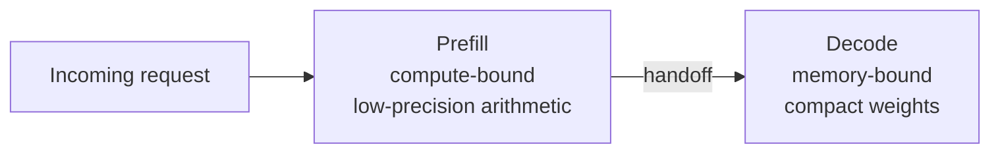
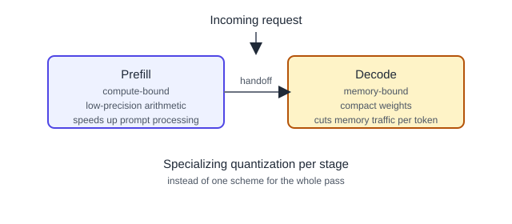

## Русская версия

# Disaggregated Quantization: почему prefill и decode заслуживают разного сжатия

Когда LLM обрабатывает ваш запрос, она проходит через две принципиально разные фазы. Сначала — prefill: модель разом «переваривает» весь входной промпт, это упирается в вычисления (compute-bound). Потом — decode: модель генерирует токены один за другим, и здесь узкое место — не вычисления, а то, как быстро можно перегонять веса и KV-кэш из памяти (memory-bound). Индустрия годами квантовала модель одним и тем же способом на обе фазы, как будто это одна задача.

Новая работа [Disaggregated Quantization: Specializing LLM Prefill and Decode](https://huggingface.co/papers/2609.26333) (Andrei Panferov, Maximilian Kleinegger, Sweta Priyadarshi, Tijmen Blankevoort, Dan Alistarh) прямо называет то, что давно напрашивалось: prefill и decode «вознаграждают» разные подходы к квантованию. Для prefill выгодна низкоточная арифметика — она ускоряет именно обработку промпта, где вы упираетесь в FLOPS. Для decode выгодны компактные веса — они снижают трафик памяти на каждый генерируемый токен, где вы упираетесь в пропускную способность памяти, а не в вычисления.

Смысл в том, что единая схема квантования — компромисс, который никого не устраивает полностью: она либо недожимает на decode (тратя память впустую), либо недоиспользует потенциал ускорения на prefill. Разделяя (disaggregating) квантование по фазам — то есть буквально подбирая разную стратегию сжатия для prefill-сервера и decode-сервера, — можно выжать больше из каждой фазы отдельно, вместо того чтобы искать средний по больнице компромисс.

Это логичное продолжение более широкого тренда последних лет — дизаггрегированного serving, где prefill и decode вообще разносят на разные машины или кластеры (потому что у них разный профиль нагрузки). Квантование до сих пор часто оставалось «общим», хотя вся остальная инфраструктура serving уже давно разделена по фазам. Эта работа закрывает этот пробел логически, а не только архитектурно.

### Почему вам это важно

Если вы деплоите LLM в проде и оптимизируете инференс, стоит спросить: используете ли вы одну и ту же схему квантования для prefill и decode? Если да — вы, вероятно, оставляете производительность на столе в обеих фазах одновременно.

## English version

# Disaggregated Quantization: Why Prefill and Decode Deserve Different Compression

When an LLM handles your request, it moves through two fundamentally different phases. First, prefill: the model chews through the entire input prompt at once, and that's compute-bound — you're limited by raw FLOPS. Then decode: the model generates tokens one at a time, and here the bottleneck isn't compute but how fast weights and the KV cache can move through memory — memory-bound. For years, the industry quantized the same model the same way for both phases, as if they were one task.

A new paper, [Disaggregated Quantization: Specializing LLM Prefill and Decode](https://huggingface.co/papers/2609.26333) (Andrei Panferov, Maximilian Kleinegger, Sweta Priyadarshi, Tijmen Blankevoort, Dan Alistarh), names something that's been overdue: prefill and decode reward different quantization approaches. Prefill benefits from low-precision arithmetic, which accelerates exactly the compute-bound prompt-processing step. Decode benefits from compact weights, which cut memory traffic per generated token — where you're limited by memory bandwidth, not compute.

The upshot: a single quantization scheme is a compromise nobody fully likes — it either under-compresses for decode (wasting memory) or leaves speedup on the table for prefill. By disaggregating quantization across phases — literally choosing a different compression strategy for the prefill server versus the decode server — you can squeeze more out of each phase separately instead of settling for a lowest-common-denominator tradeoff.

This is a natural continuation of a broader trend: disaggregated serving, where prefill and decode already run on separate machines or clusters because their load profiles differ so much. Quantization, oddly, stayed "unified" even after the rest of the serving stack split by phase. This paper closes that gap logically, not just architecturally.

### Why it matters

If you're deploying LLMs in production and tuning inference, ask yourself: are you using the same quantization scheme for prefill and decode? If so, you're likely leaving performance on the table in both phases at once.
