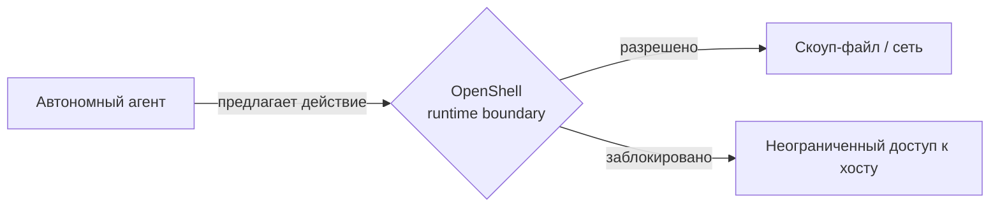
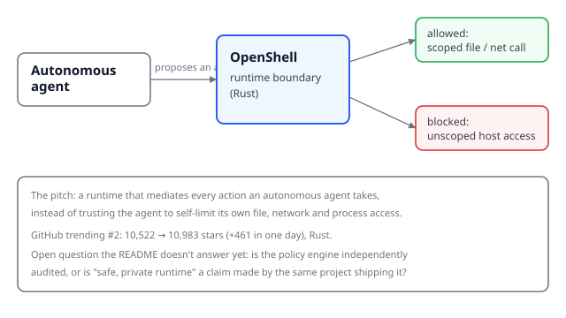

## Русская версия

# NVIDIA выпустила «песочницу» для автономных агентов — и это не первый заход индустрии

Пока одни компании учат агентов планировать и вызывать инструменты, другие тихо занимаются менее эффектной, но куда более насущной задачей: что делать, если агент решит вызвать не тот инструмент? Именно этим занимается новый репозиторий [NVIDIA/OpenShell](https://github.com/NVIDIA/OpenShell) — «безопасный, приватный рантайм для автономных ИИ-агентов», написанный на Rust и за сутки в трендах GitHub набравший 461 звезду (10 522 → 10 983, #2 в рейтинге).

Идея простая и правильная: не доверять агенту самоограничение. Вместо того чтобы полагаться на системный промпт («пожалуйста, не удаляй файлы вне рабочей директории»), рантайм физически встаёт между агентом и хостовой системой и решает, какие действия пропускать, а какие — блокировать. Это старая как мир идея операционных систем — привилегии, песочницы, capability-based security — просто применённая к новому классу процессов, которые сами решают, что делать дальше.

И здесь стоит быть честным скептиком, а не восторженным ретранслятором пресс-релиза. Название «OpenShell» и формулировка «safe, private runtime» — это заявление проекта о самом себе, а не независимый аудит. README трендового репозитория обычно не отвечает на вопросы вроде: как устроен политики-движок изнутри? Кто проверял, что песочница действительно непроницаема, а не просто выглядит так на happy path? Насколько сложно агенту (или атакующему, подсунувшему агенту вредоносный промпт) найти дыру в границах дозволенного? Это уже третий или четвёртый подобный проект в трендах за последний месяц — идея явно назрела, но зрелость идеи не равна зрелости конкретной реализации.

Показательно, что это делает именно NVIDIA — компания, для которой автономные агенты, бегающие на её же железе без присмотра, это прямой репутационный и инфраструктурный риск. Когда агенты начинают массово получать доступ к файловой системе, сети и процессам, граница между «модель предложила действие» и «действие реально произошло» — это ровно то место, где стоит вкладываться в инженерию, а не в промпты.

### Почему вам это важно

Если вы запускаете агентов с доступом к реальным ресурсам — файлам, API, деньгам, — вопрос не «доверяете ли вы модели», а «что произойдёт, когда модель ошибётся или её обманут». Runtime-уровня изоляция вроде OpenShell — правильное направление, но прежде чем полагаться на конкретный инструмент, проверьте, кто и как тестировал его границы, а не только сколько звёзд он набрал за ночь.

## English version

# NVIDIA Ships a Sandbox for Autonomous Agents — And It Won't Be the Last

While some teams focus on teaching agents to plan and call tools, others are quietly working on the less flashy but more urgent question: what happens when the agent calls the wrong tool? That's what [NVIDIA/OpenShell](https://github.com/NVIDIA/OpenShell) is going after — a "safe, private runtime for autonomous AI agents," written in Rust, which picked up 461 stars in a single day on GitHub's trending page (10,522 → 10,983, ranked #2).

The idea is simple and correct: don't trust the agent to self-limit. Instead of relying on a system prompt ("please don't delete files outside the working directory"), the runtime physically sits between the agent and the host system and decides which actions to allow and which to block. This is old news in operating-system design — privileges, sandboxes, capability-based security — just applied to a new class of process that decides its own next move.

Worth staying skeptical here rather than just relaying the pitch. "OpenShell" and "safe, private runtime" are the project's own claims about itself, not an independent audit. A trending README rarely answers the questions that actually matter: how is the policy engine built? Who verified the sandbox is actually impermeable rather than just looking that way on the happy path? How hard would it be for an agent — or an attacker feeding it a malicious prompt — to find a gap in the boundary? This is at least the third or fourth project like this to trend in the past month, which tells you the problem is real, but a popular problem statement doesn't make any specific implementation mature.

It's telling that NVIDIA is the one shipping this — a company for which unsupervised autonomous agents running on its own hardware are a direct reputational and infrastructure risk. Once agents start getting routine access to the filesystem, the network, and processes, the line between "the model proposed an action" and "the action actually happened" is exactly where engineering effort belongs, not prompt wording.

### Why it matters

If you're running agents with access to real resources — files, APIs, money — the question isn't "do you trust the model" but "what happens when the model gets it wrong or gets fooled." Runtime-level isolation like OpenShell is the right direction, but before you rely on any specific tool, check who tested its boundaries and how, not just how many stars it picked up overnight.
