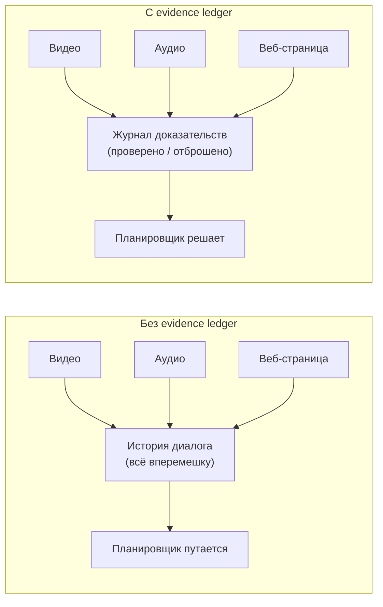
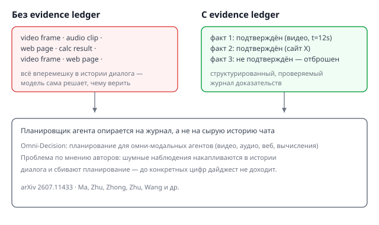

## Русская версия

# Агенту мало «видеть» видео, аудио и веб — ему нужно куда-то это записывать

Модный термин «омни-модальный агент» звучит как апгрейд — теперь агент не просто читает текст, а смотрит видео, слушает аудио, лазит по вебу и что-то вычисляет, чтобы ответить на ваш вопрос. Но чем больше источников данных, тем острее встаёт старая проблема: куда девать всё, что агент насобирал по дороге? Этому и посвящена новая работа [Omni-Decision: Evidence-Ledger Planning for Omni-Modal Agents](https://huggingface.co/papers/2607.11433) (Ming Ma, Yi Zhu, Yiran Zhong, Feida Zhu, Yuhao Wang и другие).

Авторы называют вещи своими именами: главное узкое место омни-модальных агентов — не восприятие (модели уже неплохо распознают видео и аудио), а планирование. Шумные мультимодальные наблюдения накапливаются прямо в истории диалога и начинают её захламлять и сбивать с толку. Представьте контекстное окно, где вперемешку лежат кадр из видео, обрывок транскрипта, скриншот веб-страницы и результат вычисления — и модели на каждом шаге нужно заново разбираться, что из этого правда, что устарело, а что вообще было домыслено на предыдущем шаге.

Решение, судя по названию, — «evidence ledger», журнал доказательств: вместо того чтобы сваливать сырые наблюдения в общую историю, система ведёт структурированную, отслеживаемую запись подтверждённых фактов, на которую и опирается планировщик. Это прямое родство с темой, которую мы уже разбирали на этой неделе в контексте LoRA и памяти агентов: проблема современных агентных систем всё чаще не «может ли модель это сделать», а «что именно модель держит в поле зрения в конкретный момент, и откуда она знает, чему верить».

К сожалению, дайджест обрывается до конкретных цифр — сколько именно ошибок планирования исчезает благодаря journaling, на каких бенчмарках это проверялось. Так что судить, насколько идея работает на практике, а не только звучит убедительно на бумаге, пока рано.

### Почему вам это важно

Если вы строите агента, который тянет данные из нескольких модальностей одновременно (видео + веб + вычисления, например), проблема «куда девать доказательства» встанет перед вами раньше, чем проблема «как это всё распознать». Держать сырую историю как единственный источник правды — путь к деградации планирования с ростом числа шагов; структурированный журнал фактов — один из ответов, который стоит держать в уме при проектировании.

## English version

# Omni-Modal Agents Don't Just Need to "See" Video, Audio, and the Web — They Need a Place to Write It Down

"Omni-modal agent" sounds like an upgrade: the agent doesn't just read text anymore, it watches video, listens to audio, browses the web, and runs computations to answer your question. But more data sources means an old problem gets sharper: where does everything the agent gathers along the way actually go? That's the subject of a new paper, [Omni-Decision: Evidence-Ledger Planning for Omni-Modal Agents](https://huggingface.co/papers/2607.11433) (Ming Ma, Yi Zhu, Yiran Zhong, Feida Zhu, Yuhao Wang, and others).

The authors name the bottleneck plainly: it isn't perception — models are already decent at parsing video and audio — it's planning. Noisy multimodal observations pile up directly in the conversation history and start cluttering and confusing it. Picture a context window where a video frame, a transcript fragment, a webpage screenshot, and a computation result are all mixed together — and at every step the model has to re-figure out what's still true, what's stale, and what was actually just a guess from an earlier step.

The fix, going by the name, is an "evidence ledger": instead of dumping raw observations into a shared history, the system keeps a structured, trackable record of verified facts, and the planner works off that record instead. That's directly related to a theme we've touched on this week around LoRA and agent memory: the bottleneck in modern agent systems increasingly isn't "can the model do this" but "what exactly does the model have in view at a given moment, and how does it know what to trust."

Unfortunately, the digest excerpt cuts off before the numbers — how many planning errors the ledger actually removes, and on which benchmarks. So it's too early to judge how well the idea holds up in practice versus how convincing it sounds on paper.

### Why it matters

If you're building an agent that pulls from multiple modalities at once (video plus web plus computation, say), the "where do the facts live" problem will hit you before the "how do we recognize all this" problem does. Treating raw history as the single source of truth is a recipe for planning quality degrading as the number of steps grows; a structured evidence ledger is one answer worth keeping in mind at design time.
