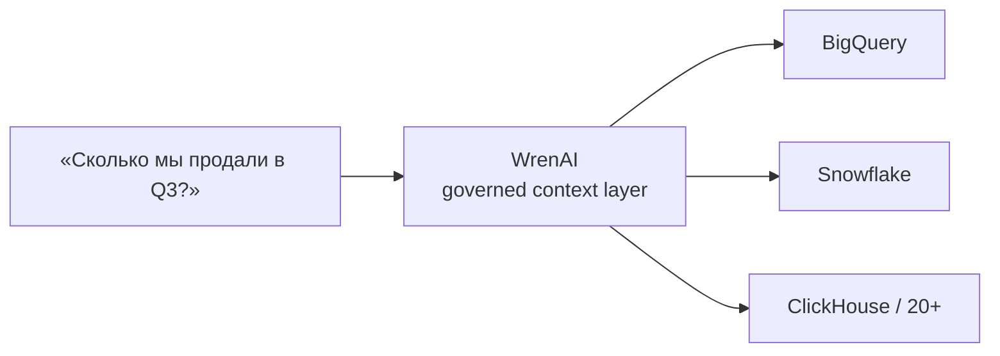
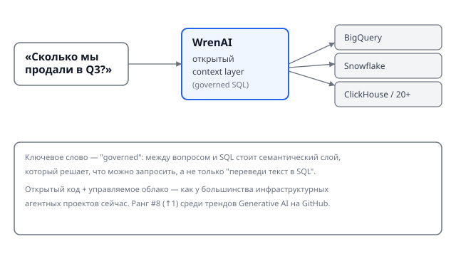

## Русская версия

# Text-to-SQL снова в трендах — но на этот раз со словом «governed»

Идея «спросите базу данных человеческим языком» не нова: попытки скрестить LLM и SQL идут с тех пор, как появились первые достаточно умные модели. Обычно это заканчивалось одинаково — модель либо генерировала синтаксически кривой SQL, либо, что хуже, синтаксически верный, но семантически неправильный запрос, который тихо считал не ту метрику. Сегодня в трендах GitHub поднялся (#9 → #8) проект [Canner/WrenAI](https://github.com/Canner/WrenAI), который пытается решить именно эту, вторую, более коварную проблему.

Ключевое слово в описании проекта — «governed» (управляемый). WrenAI позиционируется не просто как переводчик «текст → SQL», а как открытый контекстный слой, через который проходит вопрос, прежде чем превратиться в запрос к одному из 20+ источников данных — BigQuery, Snowflake, PostgreSQL, ClickHouse и другим. Смысл в том, чтобы между вопросом пользователя и реальной базой стоял не голый промпт с описанием схемы таблиц, а структурированный семантический слой: явные определения метрик, связей между таблицами, бизнес-логики — то, что в классическом BI называется semantic layer.

Это важное отличие от «просто дайте LLM схему и пусть пишет SQL». Голая схема таблиц не знает, что «выручка» в одной таблице считается без НДС, а в другой — с ним, и что «активный клиент» в маркетинговом отчёте и в биллинге — это два разных фильтра. Семантический слой — это место, где такие определения фиксируются один раз и переиспользуются, вместо того чтобы модель каждый раз угадывала их заново по именам колонок.

При этом стоит держать в голове, что открытый код здесь соседствует с платным облаком — обычная модель для инфраструктурных агентных проектов в 2026 году: ядро open-source, монетизация — в managed-версии. И как всегда с генеративным BI: доверие к автоматически сгенерированному дашборду должно быть пропорционально тому, насколько тщательно был описан семантический слой под капотом, а не тому, насколько гладко звучит ответ.

### Почему вам это важно

Если вы строите или оцениваете text-to-SQL/BI-агента для своей компании, ключевой вопрос — не «умеет ли модель писать SQL» (умеет, давно), а «откуда агент знает бизнес-определения ваших метрик». Без явного, поддерживаемого семантического слоя любой text-to-SQL агент рано или поздно выдаст красивый, уверенный и неверный ответ на простой вопрос про выручку.

## English version

# Text-to-SQL Trends Again — This Time With the Word "Governed"

"Ask your database in plain language" is not a new idea — people have been trying to bolt LLMs onto SQL since the first models got good enough to attempt it. It usually ended the same way: the model produced syntactically broken SQL, or worse, syntactically valid SQL that quietly computed the wrong metric. Today, [Canner/WrenAI](https://github.com/Canner/WrenAI) climbed GitHub's trending list (#9 → #8), and it's specifically going after that second, trickier failure mode.

The key word in the project's description is "governed." WrenAI positions itself not as a plain text-to-SQL translator but as an open context layer that a question passes through before it becomes a query against one of 20+ data sources — BigQuery, Snowflake, PostgreSQL, ClickHouse, and others. The point is to put something more than a bare table-schema prompt between the user's question and the real database: an explicit semantic layer — metric definitions, relationships between tables, business logic — the same concept classic BI tools call a semantic layer.

That's a meaningful difference from "just hand the LLM the schema and let it write SQL." A raw schema doesn't know that "revenue" is pre-tax in one table and post-tax in another, or that "active customer" means one filter in a marketing report and a different one in billing. A semantic layer is where those definitions get fixed once and reused, instead of the model re-guessing them from column names every single time.

Worth keeping in mind: open source here sits next to a paid cloud offering, the standard pattern for infrastructure-grade agent projects in 2026 — open core, monetization in the managed tier. And as always with generative BI, trust in an auto-generated dashboard should scale with how carefully the semantic layer underneath was actually defined, not with how confident the answer sounds.

### Why it matters

If you're building or evaluating a text-to-SQL/BI agent for your company, the real question isn't "can the model write SQL" (it can, and has for a while) — it's "where does the agent get your business's metric definitions from." Without an explicit, maintained semantic layer, any text-to-SQL agent will eventually give you a confident, polished, and wrong answer to a simple revenue question.
