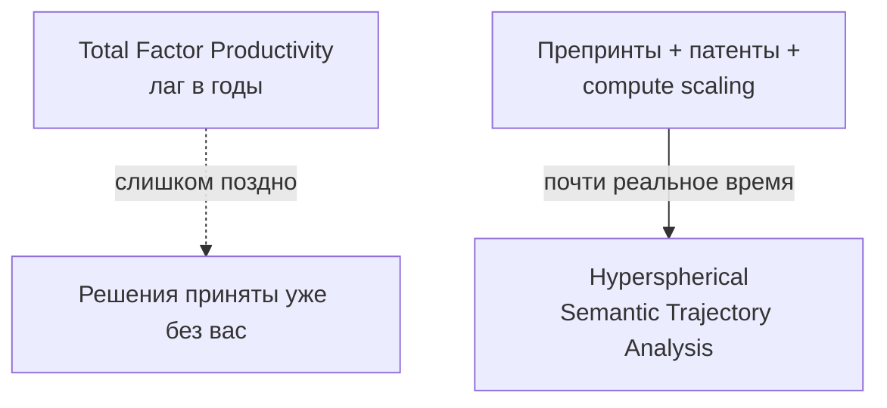
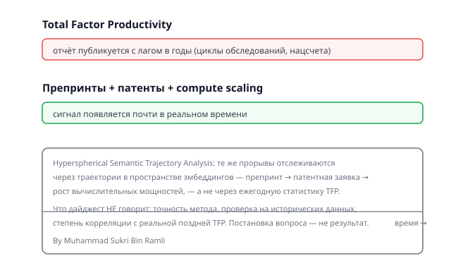

## Русская версия

# Пока Total Factor Productivity доедет до отчёта, прорыв уже три года как случился

Есть занятный парадокс в том, как экономисты меряют технологический прогресс: главная официальная метрика — Total Factor Productivity (TFP) — фиксирует технологические прорывы с лагом в годы. Причина скучная и бюрократическая: циклы административных обследований, интервалы национальной статистики, конвенции учёта. Проще говоря — пока индустрия уже вовсю строит бизнес вокруг новой технологии, официальная статистика только-только «узнаёт», что что-то произошло.

Именно этот разрыв атакует новая работа [Hyperspherical Semantic Trajectory Analysis: Mapping Technological Diffusion across Academic Preprints, Patent Signals, and Compute Scaling](https://huggingface.co/papers/2609.35845) (Muhammad Sukri Bin Ramli). Идея — заменить (или дополнить) запаздывающую макростатистику сигналами, которые появляются почти в реальном времени: препринты научных статей, заявки на патенты и рост вычислительных мощностей. Все три источника обновляются на порядки быстрее, чем национальные счета, и, по идее, должны предсказывать то же самое явление — распространение технологии — но задолго до того, как это увидит TFP.

Слово «hyperspherical» в названии намекает на метод: вероятно, авторы отслеживают не сами тексты и патенты напрямую, а их траектории в пространстве эмбеддингов — как семантическое содержание области смещается со временем, кластеризуется, расходится или сходится с другими областями. Это стандартный приём для количественного анализа больших текстовых корпусов, применённый к необычной задаче — экономическому измерению технологической диффузии, а не к более привычным NLP-задачам вроде кластеризации новостей.

Стоит сразу быть честным: в дайджесте нет ни одной цифры о точности метода, ни валидации на исторических данных, ни ответа на очевидный вопрос — насколько хорошо траектория препринтов реально коррелирует с последующей TFP, когда та наконец публикуется. Постановка проблемы убедительна сама по себе (задержка официальной статистики — реальная и хорошо задокументированная беда), но решение пока остаётся гипотезой на уровне названия статьи.

### Почему вам это важно

Если вы занимаетесь стратегией, инвестициями или просто пытаетесь понять, где на самом деле находится фронтир технологии прямо сейчас, а не три года назад, — идея измерять диффузию через препринты, патенты и compute scaling звучит разумно даже до всякой валидации. Но методологию, которая обещает опередить официальную статистику, стоит проверять особенно придирчиво: именно там, где ставки высоки, соблазн выдать красивую корреляцию за причинно-следственную связь тоже выше обычного.

## English version

# By the Time Total Factor Productivity Reports It, the Breakthrough Already Happened Three Years Ago

There's an odd paradox in how economists measure technological progress: the headline official metric — Total Factor Productivity (TFP) — registers technological breakthroughs with a multi-year lag. The reason is dull and bureaucratic: administrative survey cycles, national accounting intervals, reporting conventions. Put plainly, by the time official statistics catch up to a breakthrough, the industry has usually already built a business around it.

That's the gap a new paper, [Hyperspherical Semantic Trajectory Analysis: Mapping Technological Diffusion across Academic Preprints, Patent Signals, and Compute Scaling](https://huggingface.co/papers/2609.35845) (Muhammad Sukri Bin Ramli), goes after. The idea is to replace, or supplement, lagging macro statistics with signals that update near real time: academic preprints, patent filings, and compute-scaling data. All three move orders of magnitude faster than national accounts and, in theory, should be tracking the same underlying phenomenon — technology diffusion — long before TFP ever sees it.

The word "hyperspherical" in the title hints at the method: the authors are likely tracking not the raw texts and patents themselves but their trajectories in embedding space — how a field's semantic content shifts over time, clusters, diverges from or converges with other fields. That's a fairly standard technique for quantitative analysis of large text corpora, applied here to an unusual target — economic measurement of technological diffusion rather than the more familiar NLP tasks like news clustering.

Worth being upfront: the digest carries no accuracy numbers for the method, no validation against historical data, and no answer to the obvious question of how well a preprint trajectory actually correlates with the TFP figure that eventually gets published. The problem statement is compelling on its own (the reporting lag in official statistics is real and well documented), but the solution is still a hypothesis at the level of the paper's title.

### Why it matters

If you work in strategy, investing, or simply want to know where the technology frontier actually is right now rather than three years ago, measuring diffusion through preprints, patents, and compute scaling sounds sensible even before any validation. But a methodology that promises to beat official statistics to the punch deserves extra scrutiny precisely where the stakes are highest — that's exactly where a nice-looking correlation is most tempting to mistake for causation.
